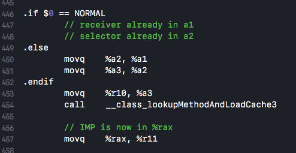
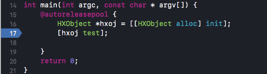
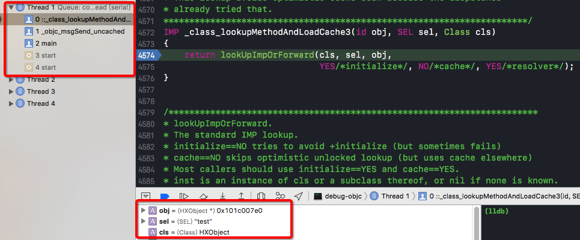
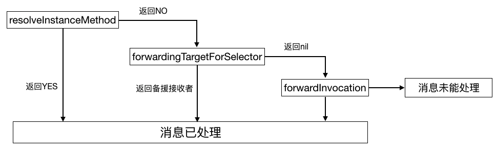

在对象上调用方法是Objective-C中经常使用的功能，用专业的术语讲这叫做“发送消息”，当初学objc的时候并不懂这是什么意思，只是把"[]"当做简单的方法调用。

c语言使用“静态绑定”，在编译器就能决定运行时应调用的函数。在objective-c中，如果向某对象传递消息，就会使用动态绑定机制来决定需要调用的方法，虽然在底层所有方法都是c函数，但是对象收到消息后要调用哪个方法完全由运行期决定，甚至可以在运行时改变。

给对象发消息一般这样写：

```objective-c
[receiver message];

[receiver message:parameter];
```
receiver叫做接收者，message叫做选择子（方法的名字），选择子与参数合称“消息”。“[]”方法调用会被编译器转变为一个c函数调用：

```c
objc_msgSend(receiver, @selector(message), arg1, arg2, ...);
```

`objc_msgSend`是消息传递机制中的核心函数，原型如下：第一个参数表示接收者，第二个参数表示选择子，之后的参数表示消息中的参数。

```cpp
OBJC_EXPORT id objc_msgSend(id self, SEL op, ...)
    OBJC_AVAILABLE(10.0, 2.0, 9.0, 1.0);
```

`objc_msgSend`会在接收者所属的类中搜索它的“方法列表”，如果能找到与选择子名称相符的方法，就跳至其实现代码；如果找不到就沿着继承体系向上查找，找到就跳转实现，找不到就转发消息，如果转发依旧没法处理，程序crash。

除了`objc_msgSend`还有几个长得很像的函数：`objc_msgSend_stret`、`objc_msgSendSuper`、`objc_msgSendSuper_stret`。本文中仅讨论`objc_msgSend`。
- objc_msgSend_stret 返回值为结构体类型
- objc_msgSendSuper 向父类发消息，返回值为id类型
- objc_msgSendSuper_stret 向父类发消息，返回值为结构体
- objc_msgSend_fpret 返回值类型为floating-point

## 一、数据结构

### SEL
`objc_msgSend`函数的第二个参数类型是SEL， `typedef struct objc_selector *SEL;`。SEL是选择子的类型。

SEL其实就是一个映射到方法的c字符串，可以用objc编译器命令`@selector()`或者runtime的`sel_registerName`函数来获得。即使参数变量类型不同，不同类中相同名字的方法所对应的SEL是相同的（所以objc不支持方法重载..）。

### IMP
```cpp
typedef void (*IMP)(void /* id, SEL, ... */ ); 
```

IMP实际上是一个函数指针，它指向了方法的实现。

###Method

```cpp
typedef struct method_t *Method;

struct method_t {
    SEL name;
    const char *types;
    IMP imp;

    struct SortBySELAddress :
        public std::binary_function<const method_t&,
                                    const method_t&, bool>
    {
        bool operator() (const method_t& lhs,
                         const method_t& rhs)
        { return lhs.name < rhs.name; }
    };
};
```
Method是方法结构体指针。

method_t存储了方法名、方法类型和方法实现。方法名类型为SEL。方法类型是个char*，存储着方法的参数类型和返回值类型。方法实现就是IMP。

## 二、消息发送objc_msgSend

`objc_msgSend`的具体实现并没有开源，它是用汇编来写的，针对不同架构有不同的实现。使用汇编的原因，在[这篇文章-Objective-C 消息发送与转发机制原理](http://yulingtianxia.com/blog/2016/06/15/Objective-C-Message-Sending-and-Forwarding/)中写到：
> 在 objc-msg-x86_64.s 中包含了多个版本的 `objc_msgSend` 方法，它们是根据返回值的类型和调用者的类型分别处理的：`objc_msgSendSuper`:向父类发消息，返回值类型为 id；`objc_msgSend_stret`:返回值为结构体；`objc_msgSend_fpret`:返回值类型为 `floating-point`。
> 
> 因为单独一个方法定义满足不了多种类型返回值，有的方法返回 id，有的返回 int。考虑到不同类型参数返回值排列组合映射不同方法签名（method signature）的问题，那 switch 语句得老长了。。。这些原因可以总结为 Calling Convention，也就是说函数调用者与被调用者必须约定好参数与返回值在不同架构处理器上的存取规则，比如参数是以何种顺序存储在栈上，或是存储在哪些寄存器上。除此之外还有其他原因，比如其可变参数用汇编处理起来最方便，因为找到 IMP 地址后参数都在栈上。要是用 C++ 传递可变参数那就悲剧了，prologue 机制会弄乱地址（比如 i386 上为了存储 ebp 向后移位 4byte），最后还要用 epilogue 打扫战场。而且汇编程序执行效率高，在 Objective-C Runtime 中调用频率较高的函数好多都用汇编写的。

在x86_64架构下的源码（objc_msg-x86_64.s文件）：

```
//	1.-------------------_objc_msgSend
	ENTRY _objc_msgSend
	UNWIND _objc_msgSend, NoFrame
	MESSENGER_START

	NilTest	NORMAL			//判断被发送消息的对象是否为nil。

	GetIsaFast NORMAL		// r10 = self->isa 快速获取对象的isa
	CacheLookup NORMAL, CALL	// calls IMP on success 在缓存中查找selector对应的IMP

	NilTestReturnZero NORMAL

	GetIsaSupport NORMAL

// cache miss: go search the method lists
LCacheMiss:
	// isa still in r10
	MESSENGER_END_SLOW
	jmp	__objc_msgSend_uncached

	END_ENTRY _objc_msgSend
	
	
//	2.-------------------__objc_msgSend_uncached
	STATIC_ENTRY __objc_msgSend_uncached
	UNWIND __objc_msgSend_uncached, FrameWithNoSaves
	
	// THIS IS NOT A CALLABLE C FUNCTION
	// Out-of-band r10 is the searched class

	// r10 is already the class to search
	MethodTableLookup NORMAL	// r11 = IMP
	jmp	*%r11			// goto *imp

	END_ENTRY __objc_msgSend_uncached
```
根据编译文件中的注释：

`NilTest` 判断发送消息的对象是否为nil，如果为nil，就直接返回nil。所以在oc中可以对nil发送消息。

`GetIsaFast` 快速获取对象的isa。

`CacheLookup` 在类的缓存中查找selector对应的IMP并执行，如果没有命中缓存，就要去方法列表中查找了。

`MethodTableLookup` 没有命中缓存时在方法列表中查找IMP。在`MethodTableLookup`的汇编实现中，主要调用了`_class_lookupMethodAndLoadCache3`函数查找IMP。

找到IMP后回到`objc_msgSend`（实际上是`_objc_msgSend_uncached `）中调用IMP。

#### 验证

先在`[hxoj test]`这里打一个断点，运行代码，到了这一行时再去 `_class_lookupMethodAndLoadCache3` 函数中添加一个断点。


留意以下调用栈，确实是和上述过程一致。而且变量区域的SEL为`test`，对应的类是`HXObject`，确实是调用`[hxoj test]`执行的函数。


## lookUpImpOrForward 查找IMP
在 `_class_lookupMethodAndLoadCache3` 函数中只调用了`lookUpImpOrForward`，所以接下来重点研究这个函数。（注释中写，如果不想进行方法转发就使用`lookUpImpOrNil`函数）

```cpp
IMP _class_lookupMethodAndLoadCache3(id obj, SEL sel, Class cls)
{
    return lookUpImpOrForward(cls, sel, obj, 
                              YES/*initialize*/, NO/*cache*/, YES/*resolver*/);
}
```

说白了这个函数就是根据SEL选择子来找到对应的IMP。函数的具体实现比较长，先配合注释大概看看总体实现。

```cpp
IMP lookUpImpOrForward(Class cls, SEL sel, id inst, 
                       bool initialize, bool cache, bool resolver)
{
    IMP imp = nil;
    bool triedResolver = NO;

    runtimeLock.assertUnlocked();//runtimeLock 是对Darwin提供的线程读写锁pthread_rwlock_t的封装

    //无锁的缓存查找
    // Optimistic cache lookup
    if (cache) {
        imp = cache_getImp(cls, sel); //cache_getImp是用汇编写的 从缓存查找IMP
        if (imp) return imp;
    }

    //runtimeLock在isRealized和isInitialized检查期间被保持，以防止竞争对手并发实现。

    //在方法搜索期间保持runtimeLock，保证方法查找以及缓存填充（cache-fill）的原子性，保证在运行以下代码时不会有新方法添加导致缓存被冲洗（flush）。
    //加锁
    runtimeLock.read();//读操作加锁

    //类的实现和初始化
    if (!cls->isRealized()) {
        runtimeLock.unlockRead();
        runtimeLock.write();

        realizeClass(cls);

        runtimeLock.unlockWrite();
        runtimeLock.read();
    }

    //第一次用到这个类且initialize参数=YES，需要进行初始化工作
    if (initialize  &&  !cls->isInitialized()) {
        runtimeLock.unlockRead();
        _class_initialize (_class_getNonMetaClass(cls, inst));
        runtimeLock.read();
        //即使sel是initialize也没关系
    }

    
 retry:    
    runtimeLock.assertReading();

    //在当前类中查找实现
    imp = cache_getImp(cls, sel);//汇编 从缓存查找IMP
    if (imp) goto done;//第一次调用方法时，无缓存，不会跳到done

    {
        //在当前类中的方法列表中查找（根据sel找Method，获取IMP）
        Method meth = getMethodNoSuper_nolock(cls, sel);
        if (meth) {
            //把IMP填入缓存
            log_and_fill_cache(cls, meth->imp, sel, inst, cls);//cache_fill_nolock方法
            imp = meth->imp;
            goto done;
        }
    }

    //在父类中寻找实现
    {
        unsigned attempts = unreasonableClassCount();
        //遍历找父类
        for (Class curClass = cls;
             curClass != nil;
             curClass = curClass->superclass)
        {
            // 继承链中有环
            if (--attempts == 0) {
                _objc_fatal("Memory corruption in class list.");
            }
            
            imp = cache_getImp(curClass, sel);//找缓存
            if (imp) {
                //_objc_msgForward_impcache汇编程序入口，缓存中消息转发的标记，如果在缓存中找到了IMP，但内容却是_objc_msgForward_impcache就停止在继承层次中递归查找
                if (imp != (IMP)_objc_msgForward_impcache) {
                    log_and_fill_cache(cls, imp, sel, inst, curClass);
                    goto done;
                }
                else {
                    // Found a forward:: entry in a superclass.
                    // Stop searching, but don't cache yet; call method 
                    // resolver for this class first.
                    break;
                }
            }
            
            //在方法列表中查找
            Method meth = getMethodNoSuper_nolock(curClass, sel);
            if (meth) {
                log_and_fill_cache(cls, meth->imp, sel, inst, curClass);
                imp = meth->imp;
                goto done;
            }
        }
    }

    //在当前类和父类中都没有找到选择子的实现
    //方法决议
    //resolver参数为YES且是第一次走到这一步（第一次triedResolver=NO），动态解析方法。是消息转发前的最后一次机会。
    if (resolver  &&  !triedResolver) {
        runtimeLock.unlockRead();//解放读入锁，不会缓存结果
        _class_resolveMethod(cls, sel, inst);//_class_resolveInstanceMethod、_class_resolveClassMethod
        runtimeLock.read();
        triedResolver = YES;
        goto retry;
    }

    //没找到IMP也没法动态解析
    imp = (IMP)_objc_msgForward_impcache;//将_objc_msgForward_impcache当做IMP写入缓存
    cache_fill(cls, sel, imp, inst);

 done:
    runtimeLock.unlockRead();

    return imp;//返回之前找到的IMP
}
```

接下来将会分成几个部分对这个函数进行具体分析。

### 1.无锁的缓存优化查找
```
runtimeLock.assertUnlocked();//runtimeLock 是对Darwin提供的线程读写锁pthread_rwlock_t的封装

//无锁的缓存查找
// Optimistic cache lookup
if (cache) {
    imp = cache_getImp(cls, sel); //cache_getImp是用汇编写的 从缓存查找IMP
    if (imp) return imp;
}
```
untimeLock 是对Darwin提供的线程读写锁pthread_rwlock_t的封装。

如果参数`cache = YES`使用缓存，就调用`cache_getImp`函数从缓存中查找IMP。`cache_getImp`也是使用汇编实现的，也是用到了objc_msgSend汇编实现中提到过的`CacheLookup`进行查找。

```
	STATIC_ENTRY _cache_getImp
// do lookup
	movq	%a1, %r10		// move class to r10 for CacheLookup
	CacheLookup NORMAL, GETIMP	// returns IMP on success
LCacheMiss:
// cache miss, return nil
	xorl	%eax, %eax
	ret
	END_ENTRY _cache_getImp
```

但是在`_class_lookupMethodAndLoadCache3`传入的`cache = NO`，所以这一步跳过，因为在`objc_msgSend`中使用汇编做过同样的事情了。

### 2.上锁
```
runtimeLock.read();//读操作加锁
```
根据源码中的英文注释：
由于运行时类中的方法可能会增加，在方法搜索期间保持runtimeLock，保证方法查找以及缓存填充（cache-fill）的原子性，保证在运行代码时不会有新方法添加导致缓存被冲洗（flush）。

锁会在接下来检查类是否已经实现和初始化的过程中一直保持。

### 3.类的实现和初始化
1.检查类的实现

```cpp
if (!cls->isRealized()) {
    runtimeLock.unlockRead();
    runtimeLock.write();

    realizeClass(cls);

    runtimeLock.unlockWrite();
    runtimeLock.read();
}
```
在objc运行时初始化时会对其中的类进行第一次初始化执行`realizeClass`方法。

此处先检查类的实现，如果类还没有实现则解开读操作锁然后给写操作加锁，接着再调用`realizeClass`函数。在[Rumtime源码中的类和对象](https://github.com/huixinHu/Personal-blog/blob/master/content/About%20Runtime/Rumtime源码中的类和对象.md)中已经简要分析过 `realizeClass` 函数，它会给 `class_rw_t` 结构体分配空间，设置 `class_rw_t->ro` ，将类编译期 `class_ro_t` 的方法、属性和遵循的协议加载到`class_rw_t `的 methods、 properties 和 protocols 列表中，添加 category等等。

2.类的初始化

```cpp
//第一次用到这个类且initialize参数=YES，需要进行初始化工作
if (initialize  &&  !cls->isInitialized()) {
    runtimeLock.unlockRead();
    _class_initialize (_class_getNonMetaClass(cls, inst));
    runtimeLock.read();
    //即使sel是initialize也没关系
}
```


### 4.在当前类中查找
```cpp
imp = cache_getImp(cls, sel);//汇编 从缓存查找IMP
if (imp) goto done;//第一次调用方法时，无缓存，不会跳到done

{
    //在当前类中的方法列表中查找（根据sel找Method，获取IMP）
    Method meth = getMethodNoSuper_nolock(cls, sel);
    if (meth) {
        //把IMP填入缓存
        log_and_fill_cache(cls, meth->imp, sel, inst, cls);//cache_fill_nolock方法
        imp = meth->imp;
        goto done;
    }
}
```
首先也是调用`cache_getImp`从缓存中查找IMP，如果命中缓存就跳到`done`标签处。因为这里是第一次调用`[hxoj test]`，所以没有缓存。然后在当前的类的方法列表中查找IMP：根据`SEL`找到`Method`，如果找得到就取出`Method`中的`IMP`并填入缓存，最后跳到`done`标签。

首先是通过调用`getMethodNoSuper_nolock`函数查找到对应的方法的结构体指针`method_t *`也即`Method`：

```cpp
static method_t *getMethodNoSuper_nolock(Class cls, SEL sel)
{
    runtimeLock.assertLocked();
    assert(cls->isRealized());
    
    //查找对应的方法的结构体指针method_t
    for (auto mlists = cls->data()->methods.beginLists(), 
              end = cls->data()->methods.endLists(); 
         mlists != end;
         ++mlists)
    {
        method_t *m = search_method_list(*mlists, sel);//对有序方法列表进行二分查找,对无序列表进行线性探测
        if (m) return m;
    }

    return nil;
}
```
这里遍历整个方法列表(`class_rw_t`中的`method_array_t methods`成员实际上相当于是一个二维数组)，通过调用`search_method_list`函数查找到SEL对应的方法结构体指针。

```cpp
static method_t *search_method_list(const method_list_t *mlist, SEL sel)
{
    int methodListIsFixedUp = mlist->isFixedUp();
    int methodListHasExpectedSize = mlist->entsize() == sizeof(method_t);
    //对有序方法列表进行二分查找，返回方法结构体method_t
    if (__builtin_expect(methodListIsFixedUp && methodListHasExpectedSize, 1)) {
        return findMethodInSortedMethodList(sel, mlist);
    } else {
        //对未排序列表进行线性探测
        for (auto& meth : *mlist) {
            if (meth.name == sel) return &meth;
        }
    }
    return nil;
}
```

找到了`Method`就会调用`log_and_fill_cache`函数把IMP填入缓存，最终是通过`cache_fill_nolock`函数来实现的。如果缓存中的已有内容大于容量的3/4就会扩充缓存（翻倍），找到第一个空的bucket_t，以(SEL,IMP)键值对形式填充。

### 5.在继承体系中递归向父类查找
```cpp
unsigned attempts = unreasonableClassCount();
//遍历找父类
for (Class curClass = cls;
     curClass != nil;
     curClass = curClass->superclass)
{
    // Halt if there is a cycle in the superclass chain.继承链中有环
    if (--attempts == 0) {
        _objc_fatal("Memory corruption in class list.");
    }
    
    // Superclass cache.
    imp = cache_getImp(curClass, sel);//找缓存
    if (imp) {
        //_objc_msgForward_impcache汇编程序入口，缓存中消息转发的标记，如果在缓存中找到了IMP，但内容却是_objc_msgForward_impcache就停止在继承层次中递归查找
        if (imp != (IMP)_objc_msgForward_impcache) {
            log_and_fill_cache(cls, imp, sel, inst, curClass);
            goto done;
        }
        else {
            break;
        }
    }
    
    //在方法列表中查找
    Method meth = getMethodNoSuper_nolock(curClass, sel);
    if (meth) {
        log_and_fill_cache(cls, meth->imp, sel, inst, curClass);
        imp = meth->imp;
        goto done;
    }
}
```

在实现上和上一步差不多，都是先在缓存中找如果没找到然后在方法列表中找，如果找到就跳去done。但会通过一个for循环对继承链上每一个祖先类都进行查找，一直找到NSObject为止（NSObject->superclass = nil）。有一个小小的不同之处，这里有一个`_objc_msgForward_impcache`，它汇编中的静态入口，作为缓存中消息转发标记，如果在缓存中找到IMP，且内容是`_objc_msgForward_impcache`，就会终止在继承链中递归查找，首先在当前类中调用方法的解析器进行处理。

### 6.方法决议阶段-动态方法解析
在缓存、类及其继承层次中的父类中都没有找到IMP，resolver参数为YES且是第一次走到这一步（第一次triedResolver=NO），则进入动态方法解析，这是消息转发前最后一次机会。

```cpp
//resolver参数为YES且是第一次走到这一步（第一次triedResolver=NO），动态解析方法。是消息转发前的最后一次机会。
if (resolver  &&  !triedResolver) {
    runtimeLock.unlockRead();//解放读入锁，不会缓存结果
    _class_resolveMethod(cls, sel, inst);//调用_class_resolveInstanceMethod、_class_resolveClassMethod
    runtimeLock.read();
    triedResolver = YES;//由于不是线程安全的，所以重新搜索一次
    goto retry;
}
```
在这一步会先解开读操作锁，因为开发者可能会在这一步动态增加方法的实现，所以之后就不会缓存结果了。直接调用`_class_resolveMethod`函数，根据当前类是不是元类来选择调用`_class_resolveInstanceMethod`或者`_class_resolveClassMethod`函数。

```cpp
void _class_resolveMethod(Class cls, SEL sel, id inst)
{
    if (! cls->isMetaClass()) {
        _class_resolveInstanceMethod(cls, sel, inst);
    } 
    else {
        _class_resolveClassMethod(cls, sel, inst);
        if (!lookUpImpOrNil(cls, sel, inst, 
                            NO/*initialize*/, YES/*cache*/, NO/*resolver*/)) 
        {
            _class_resolveInstanceMethod(cls, sel, inst);
        }
    }
}

static void _class_resolveInstanceMethod(Class cls, SEL sel, id inst)
{
    //是否已经实现了+resolveInstanceMethod方法，没有实现
    //因为+resolveInstanceMethod是类方法，所以是cls->ISA()，在元类中查找
    if (! lookUpImpOrNil(cls->ISA(), SEL_resolveInstanceMethod, cls, 
                         NO/*initialize*/, YES/*cache*/, NO/*resolver*/)) 
    {
        return;
    }

    //调用 +resolveInstanceMethod方法
    BOOL (*msg)(Class, SEL, SEL) = (typeof(msg))objc_msgSend;
    bool resolved = msg(cls, SEL_resolveInstanceMethod, sel);

    //缓存结果，下次不会触发解析器(resolveInstanceMethod)
    IMP imp = lookUpImpOrNil(cls, sel, inst, NO/*initialize*/, YES/*cache*/, NO/*resolver*/);

    if (resolved  &&  PrintResolving) {
        if (imp) {
            _objc_inform("RESOLVE: method %c[%s %s] "
                         "dynamically resolved to %p", 
                         cls->isMetaClass() ? '+' : '-', 
                         cls->nameForLogging(), sel_getName(sel), imp);
        }
        else {
            // Method resolver didn't add anything?
            _objc_inform("RESOLVE: +[%s resolveInstanceMethod:%s] returned YES"
                         ", but no new implementation of %c[%s %s] was found",
                         cls->nameForLogging(), sel_getName(sel), 
                         cls->isMetaClass() ? '+' : '-', 
                         cls->nameForLogging(), sel_getName(sel));
        }
    }}
```
当前类不是元类则调用`_class_resolveInstanceMethod`函数，判断当前类是否实现了`+resolveInstanceMethod`方法，如果实现了就调用`objc_msgSend`执行这个方法。通常我们在`+resolveInstanceMethod`中通过`class_addMethod`来动态增加方法的实现，`class_addMethod`会把动态实现的方法添加进类的方法列表中（`attachLists`函数）。最后再次调用`IMP imp = lookUpImpOrNil(cls, sel, inst, NO/*initialize*/, YES/*cache*/, NO/*resolver*/);`来判断是否已经添加上SEL对应的IMP，并添加到缓存，打印结果。

留意`BOOL (*msg)(Class, SEL, SEL) = (typeof(msg))objc_msgSend;`这里objc_msgSend的第三个参数SEL是传入`lookUpImpOrForward`中的SEL，也即会作为`+ (BOOL)resolveInstanceMethod:(SEL)sel`的参数。

回到`_class_resolveMethod`。如果当前类是元类就调用`_class_resolveClassMethod`，具体实现和`_class_resolveInstanceMethod`差不多，间接调用`+resolveClassMethod`方法。然后还要根据`lookUpImpOrNil(cls, sel, inst, NO/*initialize*/, YES/*cache*/, NO/*resolver*/))`的结果判断是否还要调用`_class_resolveInstanceMethod`。

执行完`_class_resolveMethod`函数之后，对读操作重新上锁，然后跳到retry标签（第4步），重新执行查找IMP的流程（但是不会再执行第6步-动态方法解析了，因为triedResolver已经置为YES）。

ps:

1.`resolveInstanceMethod `是对对象方法进行决议。
`resolveClassMethod `是对类方法进行决议。

2.`lookUpImpOrNil`是一个和`lookUpImpOrForward`差不多的函数，函数实现中调用了`lookUpImpOrForward`，如果得到的IMP是`_objc_msgForward_impcache`就替换成nil，所以这个函数最后返回的是nil或者SEL对应的IMP。

### 7.消息转发
没有找到IMP也不可以动态解析，就将`_objc_msgForward_impcache`作为IMP并且放入缓存中。之后进入消息转发流程。

```cpp
imp = (IMP)_objc_msgForward_impcache;//将_objc_msgForward_impcache当做IMP写入缓存
cache_fill(cls, sel, imp, inst);
```

### 8.done标签
读操作解锁，并返回之前找到的IMP（包括`_objc_msgForward_impcache`）。

## 三、消息转发Message Forwarding
在消息发送阶段，如果没有找到IMP就会将`_objc_msgForward_impcache`作为IMP返回给`objc_msgSend`。在objc-msg-x86_64汇编代码中找到`_objc_msgForward_impcache`的实现。

```
STATIC_ENTRY __objc_msgForward_impcache
MESSENGER_START
nop
MESSENGER_END_SLOW
	
jne	__objc_msgForward_stret
jmp	__objc_msgForward

END_ENTRY __objc_msgForward_impcache
	
	
ENTRY __objc_msgForward
// Non-stret version
movq	__objc_forward_handler(%rip), %r11
jmp	*%r11
END_ENTRY __objc_msgForward


ENTRY __objc_msgForward_stret
// Struct-return version
movq	__objc_forward_stret_handler(%rip), %r11
jmp	*%r11
END_ENTRY __objc_msgForward_stret
```
可以看到`__objc_msgForward_impcache`会被转化为`__objc_msgForward_stret`或者`__objc_msgForward`。

`_objc_msgForward_impcache`、`_objc_msgForward`、`_objc_msgForward_stret`本质上都是函数指针，都是用汇编实现的。下面只讨论`__objc_msgForward`。

从汇编中知道，`_objc_msgForward`会调用`_objc_forward_handler`。在objc-runtime.mm中的实现：

```cpp
__attribute__((noreturn)) void 
objc_defaultForwardHandler(id self, SEL sel)
{
    _objc_fatal("%c[%s %s]: unrecognized selector sent to instance %p "
                "(no message forward handler is installed)", 
                class_isMetaClass(object_getClass(self)) ? '+' : '-', 
                object_getClassName(self), sel_getName(sel), self);
}
void *_objc_forward_handler = (void*)objc_defaultForwardHandler;
```
`objc_defaultForwardHandler`的默认实现是打印日志并触发crash，可以看到很熟悉的报错信息`“unrecognized selector sent to instance...”`

如果要实现消息转发，就要替换掉`_objc_forward_handler`的默认实现，重写方法要用到`objc_setForwardHandler`函数，objc-runtime.mm中的实现：

```cpp
void objc_setForwardHandler(void *fwd, void *fwd_stret)
{
    _objc_forward_handler = fwd;
#if SUPPORT_STRET
    _objc_forward_stret_handler = fwd_stret;
#endif
}
```
`objc_setForwardHandler`是怎么被调用的，以及之后的消息转发调用栈，看这篇文章：[Objective-C 消息发送与转发机制原理](http://yulingtianxia.com/blog/2016/06/15/Objective-C-Message-Sending-and-Forwarding/) 中逆向工程部分的分析...由于汇编渣渣，我自己目前是看不懂的了，觉得作者真是大神..根据这篇文章的分析，之后的消息转发路径是这样的：

1. 调用`forwardingTargetForSelector`把消息的接收者替换成另一个可以处理消息的对象（这个方法需要开发者重写，有实例方法版本也有类方法版本，不重写返回nil）。如果返回的是nil或者原接收者，就进入第2步。否则把消息转给新的接收者，转发过程结束。新的接收者又叫“备援接收者”。

2. 调用 `methodSignatureForSelector` 获取方法签名，生成 `NSInvocation` 对象，`NSInvocation`对象包含选择子、target、参数。再调用 `forwardInvocation` 处理 `NSInvocation` 对象，并将结果返回。如果对象没实现 `methodSignatureForSelector` 方法，进入第三步。

 实现`forwardInvocation`方法时，若发现某调用操作不应由本类处理，则会调用超类同名方法，继承体系中每个类都有机会处理此调用请求，直到NSObject也不能处理，那么调用`doesNotRecognizeSelector`方法抛出异常。
 
 `forwardInvocation`中可以改变消息的内容，比如追加一个参数、更换选择子等等。也可以实现得很简单，只改变调用目标，但是这样就和第一步“备援接收者”的方案等效了，而且越往后消息处理的代价越大，所以一般不会这么做。

3. 调用 `doesNotRecognizeSelector` 方法。

消息转发全流程：


## 四、实例

1.动态方法解析

```objective-c
HXResolveMethod.h
#import <Foundation/Foundation.h>

@interface HXResolveMethod : NSObject
- (void)dynamicMethod:(NSString *)para;//只声明，没有实现

@end


HXResolveMethod.m
#import "HXResolveMethod.h"
#import <objc/runtime.h>

@implementation HXResolveMethod

void dynamicImp(id self, SEL _cmd, id value) {
    NSLog(@"dynamicMethodImp");
}


+ (BOOL)resolveInstanceMethod:(SEL)sel {
    NSString *selectorString = NSStringFromSelector(sel);
    if ([selectorString isEqualToString:@"dynamicMethod:"]) {
        class_addMethod(self, sel, (IMP)dynamicImp, "v@:@");//"v@:@"对应dynamicImp返回值和参数类型
    }
    return [super resolveInstanceMethod:sel];
}
@end
```

在ViewController.m中调用

```objective-c
- (void)viewDidLoad {
    [super viewDidLoad];
    
    HXResolveMethod *resolve = [[HXResolveMethod alloc] init];
    [resolve dynamicMethod:@"hello"];
}
```

简单提一下class_addMethod

```
class_addMethod(Class _Nullable cls, SEL _Nonnull name, IMP _Nonnull imp, const char * _Nullable types) 
```
- cls：需要添加方法的类
- name：方法选择子，指定添加的方法的名字
- imp：新方法的实现c函数，IMP类型，根据定义`typedef void (*IMP)(void /* id, SEL, ... */ )`，函数必须包含两个参数，一个是`id self`，另一个是`SEL _cmd`，这两个参数在oc方法中是隐藏参数，默认存在的。
- types：返回值和参数的类型，和“类型编码”相关的信息可以google一下。

2.备援接收者

```objective-c
HXResolveMethod.h
#import <Foundation/Foundation.h>

@interface HXResolveMethod : NSObject
- (void)dynamicMethod:(NSString *)para;

@end


HXResolveMethod.m
#import "HXResolveMethod.h"
#import "HXForwardingTarget.h"

@implementation HXResolveMethod
//寻找备援接收者
- (id)forwardingTargetForSelector:(SEL)aSelector {
    NSString *selectorString = NSStringFromSelector(aSelector);
    if ([selectorString isEqualToString:@"dynamicMethod:"]) {
        HXForwardingTarget *newTarget = [[HXForwardingTarget alloc] init];
        return newTarget;
    }
    return [super forwardingTargetForSelector:aSelector];
}
@end
```

```objective-c
HXForwardingTarget.m
#import "HXForwardingTarget.h"

@implementation HXForwardingTarget
- (void)dynamicMethod:(NSString *)para {
    NSLog(@"交给备援接收者处理~");
}
@end
```

在ViewController.m中调用

```objective-c
- (void)viewDidLoad {
    [super viewDidLoad];
    
    HXResolveMethod *resolve = [[HXResolveMethod alloc] init];
    [resolve dynamicMethod:@"hello"];
}
```

3.完整的消息转发

HXResolveMethod.h

```objective-c
#import <Foundation/Foundation.h>

@interface HXResolveMethod : NSObject
- (void)dynamicMethod:(NSString *)para;
@end
```

HXResolveMethod.m

```objective-c
#import "HXResolveMethod.h"
#import "HXForwardingTarget.h"

@implementation HXResolveMethod
//生成方法签名，系统会用这个方法签名生成NSInvocation对象
- (NSMethodSignature *)methodSignatureForSelector:(SEL)aSelector {
    NSString *selectorString = NSStringFromSelector(aSelector);
    if ([selectorString isEqualToString:@"dynamicMethod:"]) {
        NSMethodSignature *signature = [NSMethodSignature signatureWithObjCTypes:"v@:@"];
        return signature;
    }
    return [super methodSignatureForSelector:aSelector];
}

//改变选择子
- (void)forwardInvocation:(NSInvocation *)anInvocation {
    HXForwardInvocation *newInvocation = [[HXForwardInvocation alloc] init];
    anInvocation.selector = NSSelectorFromString(@"forwardInvoMethod:");
    if ([newInvocation respondsToSelector:[anInvocation selector]]) {
        [anInvocation invokeWithTarget:newInvocation];
    } else {
        [super forwardInvocation:anInvocation];
    }
}
@end
```

HXForwardInvocation..m

```objective-c
#import "HXForwardInvocation.h"

@implementation HXForwardInvocation
- (void)forwardInvoMethod:(NSString *)para {
    NSLog(@"改变选择子");
}
@end
```

在ViewController.m中调用

```objective-c
- (void)viewDidLoad {
    [super viewDidLoad];
    
    HXResolveMethod *resolve = [[HXResolveMethod alloc] init];
    [resolve dynamicMethod:@"hello"];
}
```

## 参考文章：

[Objective-C 消息发送与转发机制原理](http://yulingtianxia.com/blog/2016/06/15/Objective-C-Message-Sending-and-Forwarding/)

[从源代码看 ObjC 中消息的发送](https://github.com/Draveness/analyze/blob/master/contents/objc/从源代码看%20ObjC%20中消息的发送.md)

[Let's Build objc_msgSend](https://www.mikeash.com/pyblog/friday-qa-2012-11-16-lets-build-objc_msgsend.html)