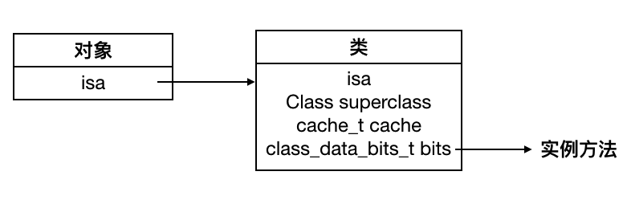
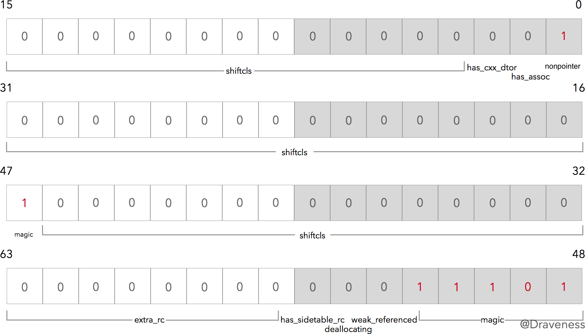
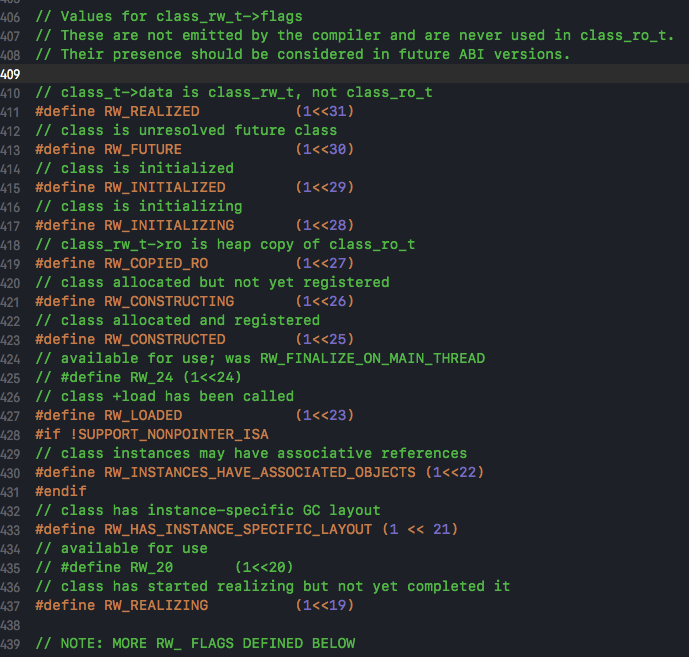
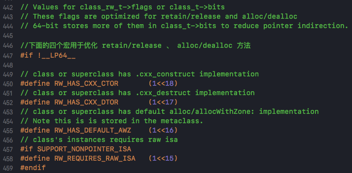
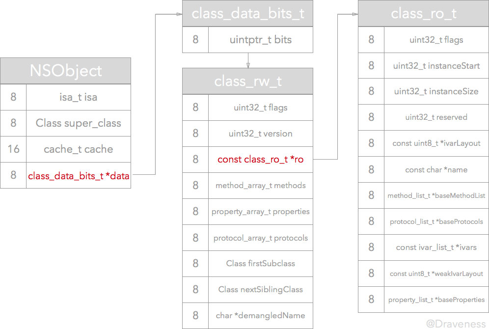
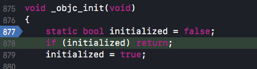
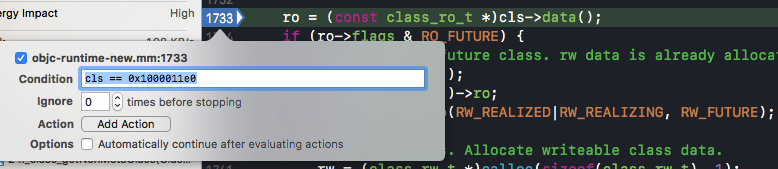
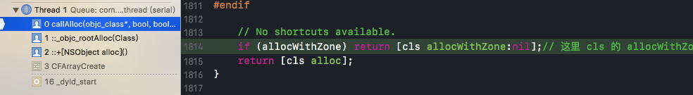
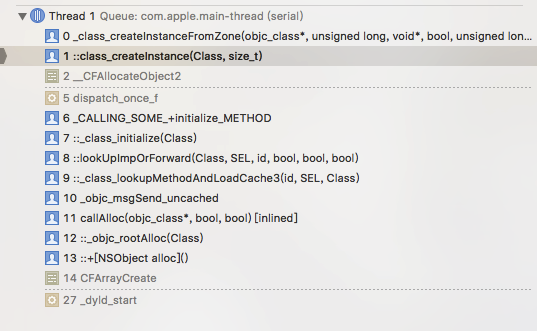

本文基于objc4-709源码进行分析。关于源码编译：[objc - 编译Runtime源码objc4-706](http://blog.csdn.net/WOTors/article/details/54426316?locationNum=7&fps=1)

# objc中的类和对象

## 1.类和对象的结构概要

NSObject是所有类的基类，NSObject在源码中的定义：

在NSObject.mm文件中找到

```objc
@interface NSObject <NSObject> {
    Class isa  OBJC_ISA_AVAILABILITY;
}
```
NSObject类的第一个成员变量就是Class类型的isa。

Object.mm文件：

```cpp
typedef struct objc_class *Class; //类
typedef struct objc_object *id;	

@interface Object { 
    Class isa; 
} 
```
Class就是c语言定义的objc_class结构体类型的指针，objc中的类实际上就是objc_class。

而id类型就是objc_object结构体类型的指针（就是我们平时经常用到的id类型），我们平时用的id可以用来声明一个对象，说明objc中的对象实际上就是objc_object。

objc-runtime-new.h

```cpp
struct objc_class : objc_object {
    // Class ISA;
    Class superclass;           //父类的指针
    cache_t cache;             // formerly cache pointer and vtable 方法缓存
    class_data_bits_t bits;    // class
    ...
}
```

objc_class继承于objc_object，objc中的类也是一个对象。

objc-private.h

```cpp
struct objc_object {
private:
    isa_t isa;//objc_object唯一成员变量
public:
    Class ISA();
    Class getIsa();
    void initIsa(Class cls /*nonpointer=false*/);
    
    ...
private:
    void initIsa(Class newCls, bool nonpointer, bool hasCxxDtor);
}
```

```cpp
union isa_t 
{
    isa_t() { }
    isa_t(uintptr_t value) : bits(value) { }

    Class cls;
    uintptr_t bits;
    
    ...
}
```
objc_object是objc中对象的定义。isa 是 objc_object的唯一成员变量。我们经常说，所有的objc对象都包含一个isa指针，从源码上来看，现在准确说应该是isa_t结构体（isa指针应该是isa_t联合体中的`Class cls`指针）。当objc为一个对象分配内存，初始化实例变量后，在这些**对象**的实例变量的结构体中的第一个就是isa。

为了方便阅读，我把objc_class写成：

```cpp
struct objc_class : objc_object {
    isa_t isa;
    Class superclass;           //父类的指针
    cache_t cache;             // formerly cache pointer and vtable 方法缓存
    class_data_bits_t bits;    // class
    ...
}
```

在objc中，**对象**的方法的实现不会存储在每个对象的结构体中，而是在相应的类里（如果每一个对象都要维护一个实例方法列表，那么开销太大了）。当一个**实例方法**被调用时，会通过对象的isa，在对应的类中找到方法的实现（具体是在class_data_bits_t结构体中查找，里面有一个方法列表）。


同时我们还从源码中看到，objc_class结构体中还有一个Class类型的superclass成员变量，指向了父类。通过这个指针可以查找从父类继承的方法。

然而，对于类对象来说，它的isa又是什么呢？objective-c里面有一种叫做meta class元类的东西。


为了让我们能够调用类方法，类的isa“指针”必须指向一个类结构，并且该类结构必须包含我们可以调用的类方法列表。这就导致了元类的定义：元类是类对象的类。

类方法调用时，通过类的isa“指针”在元类中获取方法的实现。元类中存储了一个类的所有类方法。

从上图中总结以下几个信息：
- root class(class)就是NSObject，由于它是基类，所以它没有父类。
- 实例对象的isa指向其类，类的isa指向其元类。每个元类的isa都指向根元类root class(meta)，根元类的isa指向自己。
- 根元类的父类指针指向基类（NSObject）。

[What is a meta-class in Objective-C?](http://www.cocoawithlove.com/2010/01/what-is-meta-class-in-objective-c.html)

ps:isa指针并不总是指向实例对象所属的类，不能依靠它来确定类型，而应用class方法。（KVO的实现中，将被观察的对象的isa指针指向一个中间类而非真实的类）。

## 2.isa_t结构体的分析
通过源码，我们可以知道isa_t实际上是一个union联合体。其中的方法、成员变量、结构体公用一块空间。取决于其中的结构体，最终isa_t共占64位内存空间

```cpp
union isa_t 
{
    isa_t() { }
    isa_t(uintptr_t value) : bits(value) { }

    Class cls;//指针
    uintptr_t bits;

#if SUPPORT_PACKED_ISA

//-------------------arm64上的实现
# if __arm64__
#   define ISA_MASK        0x0000000ffffffff8ULL//ISA_MAGIC_MASK 和 ISA_MASK 分别是通过掩码的方式获取MAGIC值 和 isa类指针
#   define ISA_MAGIC_MASK  0x000003f000000001ULL
#   define ISA_MAGIC_VALUE 0x000001a000000001ULL
    struct {
        uintptr_t nonpointer        : 1;    //0：普通isa指针，1：优化的指针用于存储引用计数
        uintptr_t has_assoc         : 1;    //表示该对象是否包含associated object，如果没有，析构时会更快
        uintptr_t has_cxx_dtor      : 1;    //表示对象是否含有c++或者ARC的析构函数，如果没有，析构更快
        uintptr_t shiftcls          : 33;   // MACH_VM_MAX_ADDRESS 0x1000000000 类的指针
        uintptr_t magic             : 6;    //用于在调试时分辨对象是否未完成初始化（用于调试器判断当前对象是真的对象还是没有初始化的空间）
        uintptr_t weakly_referenced : 1;    //对象是否有过weak对象
        uintptr_t deallocating      : 1;    //是否正在析构
        uintptr_t has_sidetable_rc  : 1;    //该对象的引用计数值是否过大无法存储在isa指针
        uintptr_t extra_rc          : 19;   //存储引用计数值减一后的结果。对象的引用计数超过 1，会存在这个这个里面，如果引用计数为 10，extra_rc的值就为 9。
#       define RC_ONE   (1ULL<<45)
#       define RC_HALF  (1ULL<<18)
    };

//-------------------__x86_64__上的实现
# elif __x86_64__
#   define ISA_MASK        0x00007ffffffffff8ULL
#   define ISA_MAGIC_MASK  0x001f800000000001ULL
#   define ISA_MAGIC_VALUE 0x001d800000000001ULL
    struct {
        uintptr_t nonpointer        : 1;
        uintptr_t has_assoc         : 1;
        uintptr_t has_cxx_dtor      : 1;
        uintptr_t shiftcls          : 44; // MACH_VM_MAX_ADDRESS 0x7fffffe00000
        uintptr_t magic             : 6;  //值为0x3b
        uintptr_t weakly_referenced : 1;
        uintptr_t deallocating      : 1;
        uintptr_t has_sidetable_rc  : 1;
        uintptr_t extra_rc          : 8;
#       define RC_ONE   (1ULL<<56)
#       define RC_HALF  (1ULL<<7)
    };

# else
#   error unknown architecture for packed isa
# endif

#endif

...略
```

由于源码要在mac os下才能编译，因此接下来都基于__x86_64__分析，arm64其实大同小异。

源码中遇到的编译宏的说明：

`SUPPORT_PACKED_ISA`：表示平台是否支持在 isa 指针中插入除 Class 之外的信息。如果支持就会将 Class 信息放入 isa_t 定义的 struct 内（shiftcls），并附上一些其他信息，比如引用计数，析构状态；如果不支持，那么不会使用 isa_t 内定义的 struct，这时 isa_t 只使用 cls成员变量(Class 指针，经常说的“isa指针”就是这个)。在 iOS 以及 MacOSX 上，SUPPORT_PACKED_ISA 定义为 1（支持）。

struct结构体的成员含义：

```
参数					   含义
nonpointer		0 表示普通的 isa 指针，1 表示使用优化，存储引用计数
has_assoc		表示该对象是否包含 associated object 关联对象，如果没有，则析构时会更快
has_cxx_dtor		表示该对象是否有 C++ 或 ARC 的析构函数，如果没有，则析构时更快
shiftcls		类的指针
magic			__x86_64__环境初始化值为 0x3b，用于在调试时分辨对象是否未完成初始化。
weakly_referenced	表示该对象是否有过 weak 对象，如果没有，则析构时更快
deallocating		表示该对象是否正在析构
has_sidetable_rc	表示该对象的引用计数值是否过大无法存储在 isa 指针
extra_rc		存储引用计数值减一后的结果。19位将保存对象的引用计数，这样对引用计数的操作只需要原子的修改这个指针即可，如果引用计数超出19位，才会将引用计数保存到外部表，而这种情况往往是很少的，因此效率将会大大提高。
```
在初始化一节会对其中一些参数继续谈谈。

### 初始化
在我们调用alloc来实例化对象时，会调用到```objc_object::initInstanceIsa(Class cls, bool hasCxxDtor)``` 方法。方法的具体实现：

```cpp
inline void 
objc_object::initInstanceIsa(Class cls, bool hasCxxDtor)
{
    initIsa(cls, true, hasCxxDtor);
}

inline void 
objc_object::initIsa(Class cls, bool nonpointer, bool hasCxxDtor) 
{     
    if (!nonpointer) {
        isa.cls = cls;
    } else {
        isa_t newisa(0);

#if SUPPORT_INDEXED_ISA
        newisa.bits = ISA_INDEX_MAGIC_VALUE;
        newisa.has_cxx_dtor = hasCxxDtor;
        newisa.indexcls = (uintptr_t)cls->classArrayIndex();
#else
//__x86_64__和arm64会进入这个条件分支
        newisa.bits = ISA_MAGIC_VALUE;
        newisa.has_cxx_dtor = hasCxxDtor;
        newisa.shiftcls = (uintptr_t)cls >> 3;
#endif
        isa = newisa;
    }
}
```

`initInstanceIsa`方法实际上调用了`initIsa`方法，并且传入`nonpointer=true`参数。

由于isa_t是一个联合体，所以`newisa.bits = ISA_MAGIC_VALUE;`把isa_t中的struct结构体初始化为：

实际上只设置了nonpointer和magic的值。

#### nonpointer
nonpointer 表示是否对isa开启指针优化。

先介绍一种称为Tagged Pointer的技术，这是苹果为64位设备提出的节省内存和提高执行效率的一种优化方案。

> 假设我们要存储一个NSNumber对象，其值是一个整数。正常情况下，如果这个整数只是一个NSInteger的普通变量，那么它所占用的内存是与CPU的位数有关，在32位CPU下占4个字节，在64位CPU下是占8个字节的。而指针类型的大小通常也是与CPU位数相关，一个指针所占用的内存在32位CPU下为4个字节，在64位CPU下也是8个字节。
> 
> 如果没有Tagged Pointer对象，从32位机器迁移到64位机器中后，虽然逻辑没有任何变化，但这种NSNumber、NSDate一类的对象所占用的内存会翻倍。
> 
> 为了改进上面提到的内存占用和效率问题，苹果提出了Tagged Pointer对象。由于NSNumber、NSDate一类的变量本身的值需要占用的内存大小常常不需要8个字节，拿整数来说，4个字节所能表示的有符号整数就可以达到20多亿。所以我们可以将一个对象的指针拆成两部分，一部分直接保存数据，另一部分作为特殊标记，表示这是一个特别的指针，不指向任何一个地址。

技术详细可以查看以下两个链接。

[深入理解Tagged Pointer](http://www.infoq.com/cn/articles/deep-understanding-of-tagged-pointer/)

[64位与Tagged Pointer](http://blog.xcodev.com/posts/tagged-pointer-and-64-bit/)

虽然Tagged Pointer专门用来存储小的对象，例如NSNumber和NSDate。但在isa指针优化上用到了tagged Pointer的概念。

使用整个指针大小的内存来存储isa有些浪费，在arm64上运行的iOS只用了33位（和结构体中shiftcls的33无关，Mac OS用了47位），剩下的31位用于其他目的。

nonpointer = 0 ，raw isa，表示isa_t不使用struct结构体，访问对象的 isa 会直接返回 cls 指针，cls 会指向对象所属的类的结构。这是在 iPhone 迁移到 64 位系统之前时 isa 的类型。

nonpointer = 1，isa_t使用了struct结构体，此时 isa 不再是指针，不能直接访问 objc_object 的 isa 成员变量，但是其中也有 cls 的信息，只是其中关于类的指针都是保存在 shiftcls 中。

`bool hasNonpointerIsa();`这个函数就是用来判断当前对象的isa是否启用tagged pointer的。

#### magic
用于判断当前对象是否已经完成初始化。

#### has_cxx_dtor
接着设置has_cxx_dtor，这一位表示当前对象是否有 C++ 或者 ObjC 的析构器，如果没有析构器就会快速释放内存。

#### shiftcls
`newisa.shiftcls = (uintptr_t)cls >> 3;` 将对象对应的类的指针存入结构体的shiftcls成员中。

将cls（地址）右移三位的原因：字节对齐。类的指针按照8字节对齐。

[为什么需要字节对齐](http://blog.csdn.net/qq_25077833/article/details/53454958)

[C语言字节对齐问题详解](https://www.cnblogs.com/clover-toeic/p/3853132.html)
> 对象的内存地址必须对齐到字节的倍数，这样可以提高代码运行的性能，在 iPhone5s 中虚拟地址为 33 位，所以用于对齐的最后三位比特为 000，我们只会用其中的 30 位来表示对象的地址。
> 
> 将cls右移三位，可以将地址中无用的后三位清除减小内存的消耗。

回过头来看，类的isa的shiftcls就指向元类了。

### ISA()
由于开启了指针优化后，isa不再是指针，要获取类指针就要用到 ISA() 方法。

```cpp
#define ISA_MASK 0x00007ffffffffff8ULL

inline Class 
objc_object::ISA() 
{
#if SUPPORT_INDEXED_ISA
    if (isa.nonpointer) {
        uintptr_t slot = isa.indexcls;
        return classForIndex((unsigned)slot);
    }
    return (Class)isa.bits;
#else
    return (Class)(isa.bits & ISA_MASK); //按位与运算获取类指针，__x86_64__是44位
#endif
}
```

### 下面这段代码的输出结果
```objective-c
@interface Sark : NSObject
@end
 
int main(int argc, const char * argv[]) {
	@autoreleasepool {
		BOOL res1 = [(id)[NSObject class] isKindOfClass:[NSObject class]];
		BOOL res2 = [(id)[NSObject class] isMemberOfClass:[NSObject class]];
		BOOL res3 = [(id)[Sark class] isKindOfClass:[Sark class]];
		BOOL res4 = [(id)[Sark class] isMemberOfClass:[Sark class]];
		NSLog(@"%d %d %d %d", res1, res2, res3, res4);
	}
	return 0;
}
```
除了res1输出YES，其他三个都为NO。分析之前先来看一下相关方法的源码实现。

```cpp
//类方法class
+ (Class)class {
    return self;
}

//实例方法class
- (Class)class {
    return object_getClass(self);
}

Class object_getClass(id obj)
{
    if (obj) return obj->getIsa();
    else return Nil;
}

inline Class 
objc_object::getIsa() 
{
    if (!isTaggedPointer()) return ISA();

    uintptr_t ptr = (uintptr_t)this;
    if (isExtTaggedPointer()) {
        uintptr_t slot = 
            (ptr >> _OBJC_TAG_EXT_SLOT_SHIFT) & _OBJC_TAG_EXT_SLOT_MASK;
        return objc_tag_ext_classes[slot];
    } else {
        uintptr_t slot = 
            (ptr >> _OBJC_TAG_SLOT_SHIFT) & _OBJC_TAG_SLOT_MASK;
        return objc_tag_classes[slot];
    }
}


//实例方法
- (BOOL)isMemberOfClass:(Class)cls {
    return [self class] == cls;
}

- (BOOL)isKindOfClass:(Class)cls {
    for (Class tcls = [self class]; tcls; tcls = tcls->superclass) {
        if (tcls == cls) return YES;
    }
    return NO;
}

//类方法
+ (BOOL)isMemberOfClass:(Class)cls {
    return object_getClass((id)self) == cls;
}

+ (BOOL)isKindOfClass:(Class)cls {
    for (Class tcls = object_getClass((id)self); tcls; tcls = tcls->superclass) {
        if (tcls == cls) return YES;
    }
    return NO;
}
```

首先NSObject和Sark都分别调用了class类方法，得到的都是自身。

然后这里调用的都是类方法。`+ isKindOfClass:`（参数下文用“参数cls”指代），这个方法会先使用`object_getClass`获得self的元类（`isKindOfClass`是类方法，所以self是类对象），然后判断参数cls是否等于元类，不相等则沿着继承层次循环判断参数cls是否等于super class。

`[(id)[NSObject class] isKindOfClass:[NSObject class]]`相当于`[NSObject isKindOfClass:NSObject]`，NSObject依次和NSObject的元类、NSObject的元类的父类（也即NSObject自身）进行判断，与后者判断结果必然相等，所以res1输出YES。

`[(id)[Sark class] isKindOfClass:[Sark class]]`相当于`[Sark isKindOfClass:Sark]`，Sark依次和Sark的元类、元类的父类（即NSObject的元类）、元类的父类的父类（即NSObject）、元类的父类的父类的父类（即nil）比较，都不相等，退出循环，返回NO。

`+ isMemberOfClass:`也是使用`object_getClass`获得self的元类，然后与参数cls比较。所以NSObject、Sark和它们各自的元类比较，不相等。都返回NO。


## 3.cache_t 结构体的分析

```cpp
typedef unsigned int uint32_t;
typedef uint32_t mask_t; 
typedef unsigned long uintptr_t;
typedef uintptr_t cache_key_t;

struct cache_t {
    struct bucket_t *_buckets;
    mask_t _mask;
    mask_t _occupied;
    ......
};

struct bucket_t {
private:
    cache_key_t _key;
    IMP _imp;
    ......
};
```
cache 存放着实例方法的缓存，提高方法调用效率。当一个对象调用一个方法时，它会先从缓存里面找这个方法，如果没有找到才会去类的方法列表中去找。

如果一个对象调用一个方法，首先根据对象的isa找到对应的类，再在类的方法列表中寻找这个方法，如果找不到就到父类中的方法列表查找，一旦找到就调用。如果没有找到，有可能转发消息，也可能忽略它。但这样效率太低了，有些方法会经常用到，那么每次调用都要走一遍以上流程，是不是很慢？用cache来缓存方法，优先在 cache 中查找，找到就调用没找到再走正常路子。
cache_t中存储了一个bucket_t结构体指针和两个无符号整形变量。

`bucket_t`结构体中存储了IMP函数指针和`unsigned long` 的 `key`。`_buckets` 用来存储Method的链表。

`_mask` 分配用来缓存bucket的总数。

`_occupied` 当前占用的bucket数。

## 4.class_data_bits_t

之前说过，实例方法被调用时，会通过其持有 isa 指针寻找对应的类，然后在其中的 class_data_bits_t 中查找对应的方法。相对来说 class_data_bits_t 会有点复杂，包含了 class_rw_t 、class_ro_t 等重要的结构体。这一节会对 class_data_bits_t 进行分析，介绍方法是如何在objc中存取的。

```cpp
struct class_data_bits_t {

    uintptr_t bits;
    
    class_rw_t* data() {
        return (class_rw_t *)(bits & FAST_DATA_MASK);
    }
    ......
};

struct objc_class : objc_object {
    // Class ISA;
    Class superclass;           //父类的指针
    cache_t cache;             // formerly cache pointer and vtable 方法缓存
    class_data_bits_t bits;    // class_rw_t * plus custom rr/alloc flags 这个类的实例方法链表

    class_rw_t *data() { 
        return bits.data();
    }
    ......
};
```
class_data_bits_t 结构体只含有一个64bit的bits变量，它存储了类相关的信息，和不同的以'FAST_'开头的flag掩码做按位与运算。

uintptr_t bits存储了一个指向 class_rw_t 结构体的指针和三个标志位。bits在64位兼容版中的内容：

```cpp
// 当前类是swift类
#define FAST_IS_SWIFT           (1UL<<0)
//当前类或者父类含有默认的 retain/release/autorelease/retainCount/_tryRetain/_isDeallocating/retainWeakReference/allowsWeakReference 方法
#define FAST_HAS_DEFAULT_RR     (1UL<<1)
// 当前类的实例需要 raw isa
#define FAST_REQUIRES_RAW_ISA   (1UL<<2)
// 数据指针
#define FAST_DATA_MASK          0x00007ffffffffff8UL
```

```
class_rw_t* data() {
        return (class_rw_t *)(bits & FAST_DATA_MASK);
    }
```
在 objc_class 的 data 方法中，直接调用并返回了 class_data_bits_t 的data方法。bits 和 FAST_DATA_MASK做按位与运算，转换为 class_rw_t *并返回。

Mac OS X 只使用 47 位内存地址，所以bits前 17 位空余出来。bits中最大的一块存储区域用于存储class_rw_t 指针，在 FAST_DATA_MASK 对应的[3,46]位数据段中。[3,46]一共是44位，有没有觉得44很眼熟？由于字节对齐，所以47位的后三位为0，可以用来做标志位，所以就有了另外三个标志位。

除了 FAST_DATA_MASK 是用一段空间做存储外，其他宏都是用1bit。这些数据都有对应的getter、setter封装函数。比如：

```cpp
bool isSwift() {return getBit(FAST_IS_SWIFT);}

void setIsSwift() {setBits(FAST_IS_SWIFT);}

bool hasDefaultRR() {return getBit(FAST_HAS_DEFAULT_RR);}

void setHasDefaultRR() {setBits(FAST_HAS_DEFAULT_RR);}
```

在64非兼容版本下还有更多的宏定义，位于objc-runtime-new.h文件中，如有需要请自行阅读源码。

### class_rw_t

从上面的分析中我们知道，class_data_bits_t 用了大段空间存储了 class_rw_t 指针。class_rw_t 提供了运行时对类扩展的能力，class_rw_t 结构体中保存了 objc 中的属性、方法、协议等信息。

在 objc_class结构体中的注释写到 class_data_bits_t相当于 class_rw_t指针加上 rr/alloc 的标志。

`class_data_bits_t bits; // class_rw_t * plus custom rr/alloc flags`

```cpp
struct class_rw_t {
    // Be warned that Symbolication knows the layout of this structure.
    uint32_t flags;
    uint32_t version;

    const class_ro_t *ro;

    method_array_t methods; //方法
    property_array_t properties;//属性
    protocol_array_t protocols;//协议

    Class firstSubclass;
    Class nextSiblingClass;

    char *demangledName;//是计算机语言用于解决实体名称唯一性的一种方法，做法是向名称中添加一些类型信息，用于从编译器中向连接器传递更多语义信息。
    
    ......
};
```

关于32位 flags 标志，在源码中有这样一段注释：
>  Values for class_rw_t->flags
> These are not emitted by the compiler and are never used in class_ro_t. 
> Their presence should be considered in future ABI versions.

它的值不是由编译器设置的，并且从不在class_ro_t中使用。未来的ABI版本应考虑到他们的存在。

flags 标记了类的一些状态，与生命周期、内存管理有关，有些位目前还没有定义。



class_rw_t 中的 methods、properties、protocols 存放了和类的方法、属性、协议有关的信息。

```cpp
method_array_t methods;
property_array_t properties;
protocol_array_t protocols;

class method_array_t : public list_array_tt<method_t, method_list_t> 
class property_array_t : public list_array_tt<property_t, property_list_t> 
class protocol_array_t : public list_array_tt<protocol_ref_t, protocol_list_t> 
```

method_array_t、property_array_t、protocol_array_t这三种类都继承自 list_array_tt<Element, List>这种结构。

```cpp
template <typename Element, typename List>
class list_array_tt {
    struct array_t {
        uint32_t count;
        List* lists[0];//长度为0的数组，c99的写法，允许在运行期动态申请内存
    };
}
```
list_array_tt 存储一些元数据，是通过c++模板定义的容器类，提供了一些诸如count、迭代器iterator的方法和类。Element表示元数据的类型，比如 method_t 、 property_t 、 protocol_ref_t；List表示存储元数据的容器，理解成是用于存储元数据的一维数组，比如 method_list_t 、 property_list_t 。由于list_array_tt 存储了List指针数组，所以list_array_tt实际上可以看做是元数据的二维数组。list_array_tt 有三种状态：
- 自身为空
- List指针数组只有一个指向元数据数组的指针
- List指针数组有多个指针

一个类创建之初可能处于前两个状态，如果用category或者class_addMethod来添加方法，就变成第三个状态，而且是不可逆的回不去前两个状态

可以对list_array_tt不断进行扩张。比如在通过category添加方法时，就调用到这个方法，把新的方法列表（相当于是装有一个category所有方法的容器）添加到二维数组中：

```cpp
void attachLists(List* const * addedLists, uint32_t addedCount) {
    if (addedCount == 0) return;

	 //调用realloc将原空间扩展，把原数组复制到后面，新数组复制到前面
    if (hasArray()) {
        // many lists -> many lists
        uint32_t oldCount = array()->count;
        uint32_t newCount = oldCount + addedCount;
        setArray((array_t *)realloc(array(), array_t::byteSize(newCount)));
        array()->count = newCount;
        memmove(array()->lists + addedCount, array()->lists, 
                oldCount * sizeof(array()->lists[0]));
        memcpy(array()->lists, addedLists, 
               addedCount * sizeof(array()->lists[0]));
    }
    else if (!list  &&  addedCount == 1) {
        // 0 lists -> 1 list
        list = addedLists[0];
    } 
    
    //List指针数组只有一个指针时
    //malloc重新申请内存，最后一个位置留给原来元数据数组的指针
    else {
        // 1 list -> many lists
        List* oldList = list;
        uint32_t oldCount = oldList ? 1 : 0;
        uint32_t newCount = oldCount + addedCount;
        setArray((array_t *)malloc(array_t::byteSize(newCount)));
        array()->count = newCount;
        if (oldList) array()->lists[addedCount] = oldList;
        memcpy(array()->lists, addedLists, 
               addedCount * sizeof(array()->lists[0]));
    }
}
```
无论是哪一种逻辑，新加的方法列表都会添加到二维数组前面。

有一个名字很类似的结构体 class_ro_t，'rw' 和 ro' 相信很容易就理解是 'readwrite' 和 'readonly'的意思吧。

class_rw_t 的结构体成员中还有一个指向常量的指针`class_ro_t *ro`。因此在编译期间类的结构中的 class_data_bits_t *data 指向的是一个 class_ro_t * 指针。class_ro_t也是一个结构体，下一节我们来讲讲它。

### class_ro_t

class_rw_t 的内容可以在运行时动态修改，而 class_ro_t 存储了在类编译时就确定的信息，比如属性、方法、协议、成员变量。

```cpp
struct class_ro_t {
    uint32_t flags;
    uint32_t instanceStart;
    uint32_t instanceSize;
#ifdef __LP64__
    uint32_t reserved;
#endif

    const uint8_t * ivarLayout;
    
    const char * name;//类名
    method_list_t * baseMethodList;//方法列表
    protocol_list_t * baseProtocols;//协议列表
    const ivar_list_t * ivars;//ivar列表

    const uint8_t * weakIvarLayout;
    property_list_t *baseProperties;//属性列表

    method_list_t *baseMethods() const {
        return baseMethodList;
    }
};
```

在类进行初始化之前，通过object_class 的data()方法得到的实际是一个指向 class_ro_t 结构体的指针。

instanceStart、instanceSize 两个成员变量的存在保证了objc2.0的ABI稳定性。[Non Fragile ivars](https://www.jianshu.com/p/3b219ab86b09)

method_list_t、ivar_list_t、property_list_t 结构体都继承自 entsize_list_tt<Element, List, FlagMask>  , protocol_list_t 的结构则相对简单很多。entsize_list_tt 是通过c++模板定义的容器类，提供了一些诸如count、get、迭代器iterator的方法和类，通过这些方法和类可以方便地遍历并获取容器内的数据。

```cpp
template <typename Element, typename List, uint32_t FlagMask>
struct entsize_list_tt {
    uint32_t entsizeAndFlags;//总大小
    uint32_t count;//个数
    Element first;//第一个元数据
};
```

而在类进行初始化之时，会调用到一个 `static Class realizeClass(Class cls)` 方法。

realizeClass的实现节选：

```cpp
ro = (const class_ro_t *)cls->data();//强制转换
if (ro->flags & RO_FUTURE) {
    // This was a future class. rw data is already allocated.
    rw = cls->data();
    ro = cls->data()->ro;
    cls->changeInfo(RW_REALIZED|RW_REALIZING, RW_FUTURE);
} else {
    // Normal class. Allocate writeable class data.
    rw = (class_rw_t *)calloc(sizeof(class_rw_t), 1);//初始化一个 class_rw_t 结构体,分配可读写数据空间
    rw->ro = ro;//设置结构体 ro 的值以及 flag
    rw->flags = RW_REALIZED|RW_REALIZING;
    cls->setData(rw);//最后设置正确的 data
}
```
这里主要做了几个事：
- 调用 object_class 的 data 方法，把得到的 class_rw_t 指针强制转换成 class_ro_t 指针。
- 新初始化一个 class_rw_t ，分配可读写数据空间。
- 将 class_ro_t 指针赋值给 class_rw_t->ro ，并设置 class_rw_t->flag 。
- 设置 object_class 的正确 data 。

也即由以下图1变成了图2：图片来源[深入解析 ObjC 中方法的结构](https://github.com/Draveness/analyze/blob/master/contents/objc/深入解析%20ObjC%20中方法的结构.md)



但是此时 class_rw_t 中的方法，属性以及协议列表均为空。最后在 realizeClass 方法中 调用了 methodizeClass 方法来将类 class_ro_t 的方法、属性和遵循的协议加载到 methods、 properties 和 protocols 列表中（用到了在 class_rw_t 一节最后提到的 attachLists 方法），但是class_ro_t其中的 ivar 不会被拷贝（不能在运行时给已有的类增加实例变量）。methodizeClass 方法节选：

```cpp
// Install methods and properties that the class implements itself.
method_list_t *list = ro->baseMethods();
if (list) {
    prepareMethodLists(cls, &list, 1, YES, isBundleClass(cls));
    rw->methods.attachLists(&list, 1);
}

property_list_t *proplist = ro->baseProperties;
if (proplist) {
    rw->properties.attachLists(&proplist, 1);
}

protocol_list_t *protolist = ro->baseProtocols;
if (protolist) {
    rw->protocols.attachLists(&protolist, 1);
}
```

可以这样说，经过`realizeClass`函数处理的类才成为了真正的类。

总结：

- 编译器，类的相关方法、属性、实例变量、协议会被添加到class_ro_t这个只读结构体中。
- 运行期，类第一次被调用时，class_rw_t会被初始化。

## 5.验证一下
一下这part的内容基于Draveness大大《深入解析 ObjC 中方法的结构》一文中验证部分进行复现，分析运行时初始化过程的内存变化，作为自己敲一下代码所做的记录。

```objective-c
#import <Foundation/Foundation.h>
@interface XXObject : NSObject
@property (nonatomic, assign) CGFloat test;

- (void)hello;
@end


#import "XXObject.h"
@implementation XXObject
- (void)hello {
    NSLog(@"Hello");
}
@end

主程序代码：
#import <Foundation/Foundation.h>
#import "XXObject.h"

int main(int argc, const char * argv[]) {
    @autoreleasepool {
        Class cls = [XXObject class];
        NSLog(@"%p", cls);
    }
    return 0;
}
```

由于类在内存中的位置是编译期就确定的，在之后修改代码，也不会改变内存中的位置。所以先跑一次代码获取XXObject 在内存中的地址。地址为：0x1000011e0

在运行时初始化之前加入断点：


然后通过lldb验证一下：

```cpp
(lldb) p (objc_class *)0x1000011e0
(objc_class *) $0 = 0x00000001000011e0
(lldb) p (class_data_bits_t *)0x100001200 //偏移32为获取class_data_bits_t指针
(class_data_bits_t *) $1 = 0x0000000100001200
(lldb) p $1->data()
warning: could not find Objective-C class data in the process. This may reduce the quality of type information available.
(class_rw_t *) $2 = 0x0000000100001158
(lldb) p (class_ro_t *)$2	//强制转换类型
(class_ro_t *) $3 = 0x0000000100001158
(lldb) p *$3
(class_ro_t) $4 = {
  flags = 128
  instanceStart = 8
  instanceSize = 16
  reserved = 0
  ivarLayout = 0x0000000000000000 <no value available>
  name = 0x0000000100000f6e "XXObject"
  baseMethodList = 0x00000001000010c8
  baseProtocols = 0x0000000000000000
  ivars = 0x0000000100001118
  weakIvarLayout = 0x0000000000000000 <no value available>
  baseProperties = 0x0000000100001140
}
```

可以看到name、baseMethodList、ivars、baseProperties是有值的，对于后两者有值的原因：因为XXObject类中我添加了`@property (nonatomic, assign) CGFloat test;`属性，而属性也在编译期自动生成了一个对应的ivar(带下划线前缀的原属性名的成员变量)。

```
//获取ivars
(lldb) p $4.ivars
(const ivar_list_t *) $6 = 0x0000000100001118
(lldb) p *$6
//显示count=1只有一个ivar
(const ivar_list_t) $7 = {
  entsize_list_tt<ivar_t, ivar_list_t, 0> = {
    entsizeAndFlags = 32
    count = 1
    first = {
      offset = 0x00000001000011b0
      name = 0x0000000100000f8b "_test"
      type = 0x0000000100000fb2 "d"
      alignment_raw = 3
      size = 8
    }
  }
}
(lldb) p $7.get(0)
(ivar_t) $8 = {
  offset = 0x00000001000011b0
  name = 0x0000000100000f8b "_test"
  type = 0x0000000100000fb2 "d"
  alignment_raw = 3
  size = 8
}

//获取property
(lldb) p $4.baseProperties
(property_list_t *) $10 = 0x0000000100001140
(lldb) p *$10
(property_list_t) $11 = {
  entsize_list_tt<property_t, property_list_t, 0> = {
    entsizeAndFlags = 16
    count = 1
    first = (name = "test", attributes = "Td,N,V_test")
  }
}

```

查看 baseMethodList 中的内容：

```cpp
(lldb) p $4.baseMethodList
(method_list_t *) $14 = 0x00000001000010c8
(lldb) p *$14
(method_list_t) $15 = {
  entsize_list_tt<method_t, method_list_t, 3> = {
    entsizeAndFlags = 24
    count = 3
    first = {
      name = "hello"
      types = 0x0000000100000f97 "v16@0:8"
      imp = 0x0000000100000e20 (debug-objc`-[XXObject hello] at XXObject.m:11)
    }
  }
}
(lldb) p $15.get(0)
(method_t) $16 = {
  name = "hello"
  types = 0x0000000100000f97 "v16@0:8"
  imp = 0x0000000100000e20 (debug-objc`-[XXObject hello] at XXObject.m:11)
}
(lldb) p $15.get(1)
(method_t) $17 = {
  name = "test"
  types = 0x0000000100000f9f "d16@0:8"
  imp = 0x0000000100000e50 (debug-objc`-[XXObject test] at XXObject.h:11)
}
(lldb) p $15.get(2)
(method_t) $18 = {
  name = "setTest:"
  types = 0x0000000100000fa7 "v24@0:8d16"
  imp = 0x0000000100000e70 (debug-objc`-[XXObject setTest:] at XXObject.h:11)
}
```
结果显示 baseMethodList 中有三个方法，打印出来看，第一个是 XXObject 的 hello 方法，其余两个是 test 属性的对应getter和setter方法。所以也就不难理解为什么objc中的property = ivar + getter + setter了。

关于`"v16@0:8"`、`"d16@0:8"`、`"v24@0:8d16"` 请见[Type Encoding](https://developer.apple.com/library/mac/DOCUMENTATION/Cocoa/Conceptual/ObjCRuntimeGuide/Articles/ocrtTypeEncodings.html)

以上这些都是在编译器就生成了的。

接着来看一下如果没有把class_rw_t强转成class_ro_t时的情形：先打印出来留到后面与初始化之后进行对比。

```cpp
(lldb) p *$2
(class_rw_t) $5 = {
  flags = 128
  version = 8
  ro = 0x0000000000000010
  methods = {
    list_array_tt<method_t, method_list_t> = {
       = {
        list = 0x0000000000000000
        arrayAndFlag = 0
      }
    }
  }
  properties = {
    list_array_tt<property_t, property_list_t> = {
       = {
        list = 0x0000000100000f6e
        arrayAndFlag = 4294971246
      }
    }
  }
  protocols = {
    list_array_tt<unsigned long, protocol_list_t> = {
       = {
        list = 0x00000001000010c8
        arrayAndFlag = 4294971592
      }
    }
  }
  firstSubclass = nil
  nextSiblingClass = 0x0000000100001118
  demangledName = 0x0000000000000000 <no value available>
}
```

接着在 realizeClass 方法中的这个地方打一个断点：（直接和地址值进行比较是因为类在编译期就确定了在内存中的地址）

判断当前类是否XXObject，此时还没有进行初始化，类结构体中的布局依旧是上面那样没有变化的。


当这段代码运行完后，再来lldb打印一下：

```cpp
(lldb) p (objc_class *)0x1000011e0
(objc_class *) $19 = 0x00000001000011e0
(lldb) p (class_data_bits_t *)0x0000000100001200
(class_data_bits_t *) $20 = 0x0000000100001200
(lldb) p $20->data()
(class_rw_t *) $21 = 0x0000000100f05030
(lldb) p *$21
(class_rw_t) $22 = {
  flags = 2148007936
  version = 0
  ro = 0x0000000100001158
  methods = {
    list_array_tt<method_t, method_list_t> = {
       = {
        list = 0x0000000000000000
        arrayAndFlag = 0
      }
    }
  }
  properties = {
    list_array_tt<property_t, property_list_t> = {
       = {
        list = 0x0000000000000000
        arrayAndFlag = 0
      }
    }
  }
  protocols = {
    list_array_tt<unsigned long, protocol_list_t> = {
       = {
        list = 0x0000000000000000
        arrayAndFlag = 0
      }
    }
  }
  firstSubclass = nil
  nextSiblingClass = nil
  demangledName = 0x0000000000000000 <no value available>
}
(lldb) p $22.ro
(const class_ro_t *) $23 = 0x0000000100001158
(lldb) p *$23
(const class_ro_t) $24 = {
  flags = 128
  instanceStart = 8
  instanceSize = 16
  reserved = 0
  ivarLayout = 0x0000000000000000 <no value available>
  name = 0x0000000100000f6e "XXObject"
  baseMethodList = 0x00000001000010c8
  baseProtocols = 0x0000000000000000
  ivars = 0x0000000100001118
  weakIvarLayout = 0x0000000000000000 <no value available>
  baseProperties = 0x0000000100001140
}
```
可以看到，`$3`的`class_ro_t *` 已经被设置成`$22` class_rw_t中的 ro 成员了，但	class_rw_t 的 methods、properties、protocols 成员
仍然为空。

等到执行完 methodizeClass 方法：


```cpp
(lldb) p *$21
(class_rw_t) $25 = {
  flags = 2148007936
  version = 0
  ro = 0x0000000100001158
  methods = {
    list_array_tt<method_t, method_list_t> = {
       = {
        list = 0x00000001000010c8
        arrayAndFlag = 4294971592
      }
    }
  }
  properties = {
    list_array_tt<property_t, property_list_t> = {
       = {
        list = 0x0000000100001140
        arrayAndFlag = 4294971712
      }
    }
  }
  protocols = {
    list_array_tt<unsigned long, protocol_list_t> = {
       = {
        list = 0x0000000000000000
        arrayAndFlag = 0
      }
    }
  }
  firstSubclass = nil
  nextSiblingClass = 0x00007fffcd723f50
  demangledName = 0x0000000000000000 <no value available>
}
```
class_ro_t 中 baseMethodList 中的方法被添加到 class_rw_t 中的 methods 数组中，class_ro_t 中 baseProperties 被添加到 class_rw_t 中的 properties。核心都是通过在 methodizeClass 方法中执行 attachLists 方法添加类的方法、属性、协议：

```cpp
auto rw = cls->data();
auto ro = rw->ro;

// Install methods and properties that the class implements itself.
method_list_t *list = ro->baseMethods();
if (list) {
    prepareMethodLists(cls, &list, 1, YES, isBundleClass(cls));
    rw->methods.attachLists(&list, 1);
}

property_list_t *proplist = ro->baseProperties;
if (proplist) {
    rw->properties.attachLists(&proplist, 1);
}

protocol_list_t *protolist = ro->baseProtocols;
if (protolist) {
    rw->protocols.attachLists(&protolist, 1);
}
```

### 总结

- 类的方法、属性以及协议在编译期间存放到了“错误”的位置，直到 realizeClass 执行之后，才放到了 class_rw_t 指向的只读区域 class_ro_t，这样我们即可以在运行时为 class_rw_t 添加方法，也不会影响类的只读结构。

- 在 class_ro_t 中的属性在运行期间就不能改变了，再添加方法时，会修改 class_rw_t 中的 methods 列表，而不是 class_ro_t 中的 baseMethodList

## 6.对象的初始化

创建一个 NSObject 对象的代码：`[[NSObject alloc] init];`

`alloc` 方法的实现：

```cpp
+ (id)alloc {
    return _objc_rootAlloc(self);
}
```

仅仅调用了一个私有方法`_objc_rootAlloc `：

```cpp
id _objc_rootAlloc(Class cls)
{
    return callAlloc(cls, false/*checkNil*/, true/*allocWithZone*/);
}

static ALWAYS_INLINE id
callAlloc(Class cls, bool checkNil, bool allocWithZone=false)
{
    // 检查 cls 信息是否为 nil，如果为 nil，则无法创建新对象，返回 nil。
    if (slowpath(checkNil && !cls)) return nil;

#if __OBJC2__
    //是否有自定义的allocWithZone方法
    if (fastpath(!cls->ISA()->hasCustomAWZ())) {
        //没有alloc / allocWithZone实现。
        
        //是否可以快速分配内存。这里好像是写死了返回false
        if (fastpath(cls->canAllocFast())) {
            bool dtor = cls->hasCxxDtor();//是否有析构器
            id obj = (id)calloc(1, cls->bits.fastInstanceSize());
            if (slowpath(!obj)) return callBadAllocHandler(cls);
            obj->initInstanceIsa(cls, dtor);
            return obj;
        }
        else {
            id obj = class_createInstance(cls, 0);// 创建对象的关键函数
            if (slowpath(!obj)) return callBadAllocHandler(cls);// 分配失败
            return obj;
        }
    }
#endif

    // callAlloc 传入 allocWithZone = true
    if (allocWithZone) return [cls allocWithZone:nil];// 这里 cls 的 allocWithZone 方法里也是调用了 class_createInstance。
    return [cls alloc];
}
```

关于`slowpath`、`fastpath`两个宏，实际上是__builtin_expect()，一个GCC的一个内建函数，用于分支预测优化。[__builtin_expect — 分支预测优化](https://www.cnblogs.com/LubinLew/p/GCC-__builtin_expect.html)。只需要知道` if(fastpath(x))` 与 `if(x) `是相同意思就可以了。

实际上我在执行`[[XXObject alloc] init]`这句代码时，`if (fastpath(!cls->ISA()->hasCustomAWZ())) `并没有进入这个条件分支：


所以也即相当于：

```cpp
static ALWAYS_INLINE id
callAlloc(Class cls, bool checkNil, bool allocWithZone=false)
{
	return [cls allocWithZone:nil];
}
```

但很神奇的是，接下来并没有执行`allocWithZone`方法(打了断点但无事发生)，这是一个让我觉得很迷的地方。最后落入的是这两个方法：


```cpp
id class_createInstance(Class cls, size_t extraBytes)
{
    return _class_createInstanceFromZone(cls, extraBytes, nil);
}

static __attribute__((always_inline)) 
id 
_class_createInstanceFromZone(Class cls, size_t extraBytes, void *zone, 
                              bool cxxConstruct = true, 
                              size_t *outAllocatedSize = nil)
{
    if (!cls) return nil;

    assert(cls->isRealized());

    // Read class's info bits all at once for performance
    bool hasCxxCtor = cls->hasCxxCtor();// 是否有构造函数
    bool hasCxxDtor = cls->hasCxxDtor();// 是否有析构函数
    bool fast = cls->canAllocNonpointer();// 是否使用原始 isa 格式

    size_t size = cls->instanceSize(extraBytes);// 需要分配的空间大小，从 instanceSize 实现可以知道对象至少16字节
        if (outAllocatedSize) *outAllocatedSize = size;

    id obj;
    
    if (!zone  &&  fast) {//跑代码时会执行这个分支
        obj = (id)calloc(1, size);//分配空间
        if (!obj) return nil;
        obj->initInstanceIsa(cls, hasCxxDtor);//看到了一个熟悉的方法~
    } 
    else { //这里不执行
        if (zone) {
            obj = (id)malloc_zone_calloc ((malloc_zone_t *)zone, 1, size);
        } else {
            obj = (id)calloc(1, size);
        }
        if (!obj) return nil;

        // Use raw pointer isa on the assumption that they might be 
        // doing something weird with the zone or RR.
        obj->initIsa(cls);
    }

    if (cxxConstruct && hasCxxCtor) {
        obj = _objc_constructOrFree(obj, cls);
    }

    return obj;
}
```

在上面函数的实现中，执行了 `objc_object::initInstanceIsa(Class cls, bool hasCxxDtor)` 方法。在第二部分讲过，这个方法就是用来初始化isa_t结构体的。

初始化 isa 之后，`[NSObject alloc]` 的工作算是做完了，下面就是 `init` 相关逻辑：

```cpp
- (id)init {
    return _objc_rootInit(self);
}

id _objc_rootInit(id obj)
{
    return obj;
}
```

可以看到， `init` 实际上只是返回了当前对象。(所以其实只写alloc不写init好像没啥影响？？？)

总结一下对象的初始化过程主要做了两个事：1.分配需要的内存空间 2.初始化isa_t结构体。

## 7.对象的销毁
对象的销毁会调用dealloc方法。当对象的引用计数=0，这个方法会被调用。

```cpp
- (void)dealloc {
    _objc_rootDealloc(self);
}

void _objc_rootDealloc(id obj) {
    obj->rootDealloc();
}

inline void objc_object::rootDealloc() {
    if (isTaggedPointer()) return;  // 判断是否TaggedPointer

    if (fastpath(isa.nonpointer  &&  
                 !isa.weakly_referenced  &&  
                 !isa.has_assoc  &&  
                 !isa.has_cxx_dtor  &&  
                 !isa.has_sidetable_rc))
    {
        free(this);
    } 
    else {
        object_dispose((id)this);
    }
}
```
dealloc方法最终由`rootDealloc`函数进行实现。首先会判断是否TaggedPointer，如果是就直接返回。接下来根据isa的5个标志位判断对象能否快速释放，如果开启了isa指针优化、对象不曾被一个weak变量指向、没有关联对象、没有析构函数、引用计数不会过大需要用到sideTable来存储，符合以上条件就可以快速释放。

快速释放的条件还是很苛刻的，所以一般都会用`object_dispose`进行慢速释放。`object_dispose`会调用`objc_destructInstance`。

```cpp
void *objc_destructInstance(id obj) 
{
    if (obj) {
        bool cxx = obj->hasCxxDtor();
        bool assoc = obj->hasAssociatedObjects();

        if (cxx) object_cxxDestruct(obj);//调用对象的析构函数
        if (assoc) _object_remove_assocations(obj);//移除所有关联对象
        obj->clearDeallocating();//清空引用计数和weak表
    }

    return obj;
}
```
销毁对象需要用到底层的c++析构函数，对实例变量进行释放。`object_cxxDestruct`的具体细节可以阅读[这篇孙源的文章](http://blog.sunnyxx.com/2014/04/02/objc_dig_arc_dealloc/)

还需要调用`_object_remove_assocations`函数释放关联对象，有关关联对象的知识请阅读[我之前写的笔记](https://github.com/huixinHu/Personal-blog/blob/master/content/About%20Runtime/Runtime源码中的Category和Associated%20Object.md)

最后就是用`clearDeallocating`方法进行引用计数表和weak表的清空，并且把weak对象全部置为nil。

参考文章：

[从 NSObject 的初始化了解 isa](https://github.com/Draveness/analyze/blob/master/contents/objc/从%20NSObject%20的初始化了解%20isa.md#从-nsobject-的初始化了解-isa)

[深入解析 ObjC 中方法的结构](https://github.com/Draveness/analyze/blob/master/contents/objc/深入解析%20ObjC%20中方法的结构.md)

[Objc 对象的今生今世](https://www.jianshu.com/p/f725d2828a2f)

[ARC下dealloc过程及.cxx_destruct的探究](http://blog.sunnyxx.com/2014/04/02/objc_dig_arc_dealloc/)