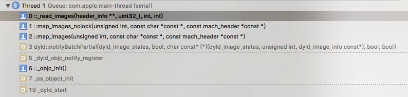
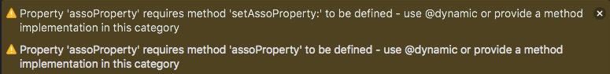

本文基于objc4-709源码进行分析。

# Runtime源码中的Category和Associated Object

## 1.数据结构
在 objc-private.h 文件中，可以看到 category 是 category_t 结构体的指针。

```cpp
typedef struct category_t *Category;
```

```cpp
struct category_t {
    const char *name;//类的名字
    classref_t cls;//要扩展的类对象
    struct method_list_t *instanceMethods;//实例方法
    struct method_list_t *classMethods;//类方法
    struct protocol_list_t *protocols;//协议
    struct property_list_t *instanceProperties;//实例属性
    // Fields below this point are not always present on disk.
    struct property_list_t *_classProperties;//类属性
	
	//根据当前类是否元类返回实例方法或者类方法
    method_list_t *methodsForMeta(bool isMeta) {
        if (isMeta) return classMethods;
        else return instanceMethods;
    }

	//根据当前类是否元类返回实例属性或者类属性
    property_list_t *propertiesForMeta(bool isMeta, struct header_info *hi);
};
```
可以看到，其中存储了可以扩展的实例方法、类方法、协议、实例属性、类属性。其中类属性是2016年Xcode8后开始新增的特性，为了与swift中的 type property 相互操作而引入的，类属性如何创建、使用这里不做展开。

category_list结构体用于存储所有的category。

```cpp
typedef locstamped_category_list_t category_list;

struct locstamped_category_list_t {
    uint32_t count;//category的数量
#if __LP64__
    uint32_t reserved;
#endif
    locstamped_category_t list[0]; //动态申请内存的写法
};

struct locstamped_category_t {
    category_t *cat;
    struct header_info *hi;
};
```
locstamped_category_t 存储 category_t 以及对应的 header_info。header_info 存储了实体在镜像中的加载和初始化状态，以及一些偏移量，在加载 Mach-O 文件相关函数中经常用到。


## 2.category 的加载
找到runtime的加载入口函数：

```cpp
void _objc_init(void)
{
    static bool initialized = false;
    if (initialized) return;
    initialized = true;
    
    // fixme defer initialization until an objc-using image is found?
    environ_init();
    tls_init();
    static_init();
    lock_init();
    exception_init();

    _dyld_objc_notify_register(&map_images, load_images, unmap_image);
}
```

在方法的最后一行，runtime 通过 dyld 动态加载，调用栈如下：

加载镜像文件时`map_images`函数最终会调用`_read_images`函数， `_read_images`函数间接调用到`attachCategories`函数，完成向类中添加 category 的工作。

节选 `_read_images` 函数中加载 Category 的代码段（删掉部分不太重要的代码和注释）：

```cpp
// Discover categories. 查找category
for (EACH_HEADER) {
	//获取category列表，但怎么得到的没看懂
    category_t **catlist = _getObjc2CategoryList(hi, &count);
    //是否有类属性
    bool hasClassProperties = hi->info()->hasCategoryClassProperties();

    for (i = 0; i < count; i++) {
        category_t *cat = catlist[i];
        Class cls = remapClass(cat->cls);


        //处理这个category。 首先，将category注册到目标类。 然后，如果类实现了，重建类的方法列表（等）。
        bool classExists = NO;
        if (cat->instanceMethods ||  cat->protocols  
            ||  cat->instanceProperties) 
        {
        	//把category的实例方法、协议、实例属性添加到类上
            addUnattachedCategoryForClass(cat, cls, hi);
            if (cls->isRealized()) {
                remethodizeClass(cls);
                classExists = YES;
            }
        }

        if (cat->classMethods  ||  cat->protocols  
            ||  (hasClassProperties && cat->_classProperties)) 
        {
            //把category的类方法、协议、类属性添加到元类上
            addUnattachedCategoryForClass(cat, cls->ISA(), hi);//注意这里是cls->ISA()
            if (cls->ISA()->isRealized()) {
                remethodizeClass(cls->ISA());
            }
        }
    }
}
```

这里主要做了几个事情：

- 获取category列表

- 将category及其类（或元类）建立映射

- 如果类、元类已经实现，重建它的方法、协议、属性列表
 - 把实例对象相关的category实例方法、协议、实例属性添加到类上
 - 把类相关的category类方法、协议、类属性添加到元类上
 - 对协议的处理：同时附加到类、元类中
 
`addUnattachedCategoryForClass`函数实际上把类（元类）和category做一个关联映射，把category及其类、元类注册到哈希表中。把category的方法、协议、属性附加到类上交给了 `remethodizeClass` 函数去做。

```cpp
static void remethodizeClass(Class cls)
{
    category_list *cats;
    bool isMeta;

    runtimeLock.assertWriting();

    isMeta = cls->isMetaClass();

    // Re-methodizing: check for more categories
    //unattachedCategoriesForClass获取类中还未添加的category列表
    if ((cats = unattachedCategoriesForClass(cls, false/*not realizing*/))) {          
        attachCategories(cls, cats, true /*flush caches*/);        
        free(cats);
    }
}
```
`remethodizeClass`先找出类中还没添加的category列表，接着交给核心函数 `attachCategories` 来完成向类中添加category的工作。`attachCategories`的实现代码有一点点长，这里稍微简化一下单独拿出添加category method 的实现简单讲一下，添加协议、属性的过程其实差不多。

```cpp
static void 
attachCategories(Class cls, category_list *cats, bool flush_caches)
{
    if (!cats) return;
    bool isMeta = cls->isMetaClass();

    // fixme rearrange to remove these intermediate allocations
    //动态分配内存
    method_list_t **mlists = (method_list_t **)malloc(cats->count * sizeof(*mlists));
    
    // Count backwards through cats to get newest categories first
    int mcount = 0;
    int i = cats->count;
    bool fromBundle = NO;
    while (i--) {
        auto& entry = cats->list[i];
		
		//methodsForMeta得到category的类方法或者实例方法，根据是否metaclass来判断
        method_list_t *mlist = entry.cat->methodsForMeta(isMeta);
        if (mlist) {
            mlists[mcount++] = mlist;
            fromBundle |= entry.hi->isBundle();
        }
    }

    //获取类的数据字段
    auto rw = cls->data();

    //通过attachLists把category中的内容添加到类
    prepareMethodLists(cls, mlists, mcount, NO, fromBundle);
    rw->methods.attachLists(mlists, mcount);
    free(mlists);
    if (flush_caches  &&  mcount > 0) flushCaches(cls);
}
```

涉及到的一些数据结构：method_array_t 、method_list_t 、 list_array_tt 、 entsize_list_tt 以及函数：`attachLists`，在
[Rumtime源码中的类和对象](https://github.com/huixinHu/Personal-blog/blob/master/content/About%20Runtime/objc中的类和对象.md#class_rw_t)的`class_rw_t`、`class_ro_t`一节中，已经分析过。

分析上面这段代码。while遍历取出所有`category_list *cats`的category，根据当前类是否是元类，每一个category获取得到它的类方法或者实例方法列表`method_list_t *mlist`，存入`method_list_t **mlists`中，也即把category的方法拼接到一个二维数组中。要注意这里是倒序添加的，新生成的category的方法会先于旧的category的方法插入。

接着获取类的数据字段`class_rw_t`，通过`attachLists`函数把上述`method_list_t *mlist`方法列表添加到类的`class_rw_t`中的`method_array_t methods`（method_array_t也相当与是一个二维数组）。

**新加的方法列表都会添加到`method_array_t`前面**。即原来类的方法列表方法顺序是A、B、C，category的方法列表方法顺序是D、E，插入之后的类方法列表的顺序是D、E、A、B、C。category 的方法被放到了新的方法列表的前面，runtime在查找方法的时候是沿着着方法列表从前往后查找的，一找到目标名字的方法就不会继续往后找了，这也就是为什么category 会“覆盖”类的同名方法，对原方法的调用实际上会调用 category 中的方法。

由于在category_t中只有 property_list_t 没有 ivar_list_t （无法添加实例变量），并且在class_ro_t 中的ivar_list_t又是只读的，在category中的属性是不会生成实例变量。苹果这么做的目的是为了保护class在编译时期确定的内存空间的连续性，防止runtime增加的变量造成内存重叠。

## Associated Object

在category中无法添加实例变量。平时我们在类中使用@property，编译器会为我们生成带下划线的实例变量、getter和setter方法。但是在 category 中就不会这样。

```objective-c
@interface HXObject : NSObject
@property (nonatomic, strong) NSString *name;
@end


@interface HXObject (AssociateOJ)
@property (nonatomic, strong) NSString *assoProperty;

- (void)hello;
@end


@implementation HXObject (AssociateOJ)
- (void)hello{
    self.assoProperty = @"asso";
    NSLog(@"%@", self.assoProperty);
}
@end
```

```objective-c
int main(int argc, const char * argv[]) {
    @autoreleasepool {

        HXObject * hxoj = [[HXObject alloc] init];
        [hxoj hello];
    }
    return 0;
}
```

其实 Xcode 已经给了警告：


运行这段代码，控制台报找不到 category 属性的 setter 方法：
> Terminating app due to uncaught exception 'NSInvalidArgumentException', reason: '-[HXObject setAssoProperty:]: unrecognized selector sent to instance 0x100b17710'

category 的属性存取方法需要手动实现，又或者用@dynamic实现。

一般情况下，我们会使用关联对象来为已经存在的类添加“属性”。

```objective-c
@implementation HXObject (AssociateOJ)

- (void)setAssoProperty:(NSString *)assoProperty {
    objc_setAssociatedObject(self, @selector(assoProperty), assoProperty, OBJC_ASSOCIATION_COPY_NONATOMIC);
}

- (NSString *)assoProperty {
    return objc_getAssociatedObject(self, _cmd);
}

- (void)hello {
    self.assoProperty = @"123";
}
@end
```

参考文章：
[深入理解Objective-C：Category](https://tech.meituan.com/DiveIntoCategory.html)

[结合 category 工作原理分析 OC2.0 中的 runtime](http://www.cocoachina.com/ios/20160804/17293.html)