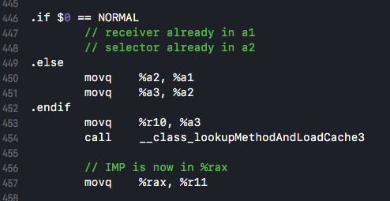

```cpp
OBJC_EXPORT id objc_msgSend(id self, SEL op, ...)
    OBJC_AVAILABLE(10.0, 2.0, 9.0, 1.0);
```

### SEL
selector 是方法选择器，
`objc_msgSend`函数的第二个参数类型是SEL， 
`typedef struct objc_selector *SEL;`

SEL其实就是一个映射到方法的c字符串，可以用objc编译器命令`@selector()`或者runtime的`sel_registerName`函数来获得。即使参数变量类型不同，不同类中相同名字的方法所对应的SEL是相同的。


###Method

```cpp
typedef struct method_t *Method;

struct method_t {
    SEL name;
    const char *types;
    IMP imp;

    struct SortBySELAddress :
        public std::binary_function<const method_t&,
                                    const method_t&, bool>
    {
        bool operator() (const method_t& lhs,
                         const method_t& rhs)
        { return lhs.name < rhs.name; }
    };
};
```

### IMP
```cpp
typedef void (*IMP)(void /* id, SEL, ... */ ); 
```

## objc_msgSend

`objc_msgSend`的具体实现并没有开源，它是用汇编来写的，针对不同架构有不同的实现。使用汇编的原因，在[这篇文章-Objective-C 消息发送与转发机制原理](http://yulingtianxia.com/blog/2016/06/15/Objective-C-Message-Sending-and-Forwarding/)中写到：
> 在 objc-msg-x86_64.s 中包含了多个版本的 `objc_msgSend` 方法，它们是根据返回值的类型和调用者的类型分别处理的：`objc_msgSendSuper`:向父类发消息，返回值类型为 id；`objc_msgSend_stret`:返回值为结构体；`objc_msgSend_fpret`:返回值类型为 `floating-point`。
> 
> 因为单独一个方法定义满足不了多种类型返回值，有的方法返回 id，有的返回 int。考虑到不同类型参数返回值排列组合映射不同方法签名（method signature）的问题，那 switch 语句得老长了。。。这些原因可以总结为 Calling Convention，也就是说函数调用者与被调用者必须约定好参数与返回值在不同架构处理器上的存取规则，比如参数是以何种顺序存储在栈上，或是存储在哪些寄存器上。除此之外还有其他原因，比如其可变参数用汇编处理起来最方便，因为找到 IMP 地址后参数都在栈上。要是用 C++ 传递可变参数那就悲剧了，prologue 机制会弄乱地址（比如 i386 上为了存储 ebp 向后移位 4byte），最后还要用 epilogue 打扫战场。而且汇编程序执行效率高，在 Objective-C Runtime 中调用频率较高的函数好多都用汇编写的。

在x86_64架构下的源码（objc_msg-x86_64.s文件）：

```
//	1.-------------------_objc_msgSend
	ENTRY _objc_msgSend
	UNWIND _objc_msgSend, NoFrame
	MESSENGER_START

	NilTest	NORMAL			//判断被发送消息的对象是否为nil。

	GetIsaFast NORMAL		// r10 = self->isa 快速获取对象的isa
	CacheLookup NORMAL, CALL	// calls IMP on success 在缓存中查找selector对应的IMP

	NilTestReturnZero NORMAL

	GetIsaSupport NORMAL

// cache miss: go search the method lists
LCacheMiss:
	// isa still in r10
	MESSENGER_END_SLOW
	jmp	__objc_msgSend_uncached

	END_ENTRY _objc_msgSend
	
	
//	2.-------------------__objc_msgSend_uncached
	STATIC_ENTRY __objc_msgSend_uncached
	UNWIND __objc_msgSend_uncached, FrameWithNoSaves
	
	// THIS IS NOT A CALLABLE C FUNCTION
	// Out-of-band r10 is the searched class

	// r10 is already the class to search
	MethodTableLookup NORMAL	// r11 = IMP
	jmp	*%r11			// goto *imp

	END_ENTRY __objc_msgSend_uncached
```
根据编译文件中的注释：

`NilTest` 判断发送消息的对象是否为nil，如果为nil，就直接返回nil。所以在oc中可以对nil发送消息。

`GetIsaFast` 快速获取对象的isa。

`CacheLookup` 在类的缓存中查找selector对应的IMP并执行，如果没有命中缓存，就要去方法列表中查找了。

`MethodTableLookup` 没有命中缓存时在方法列表中查找IMP。在`MethodTableLookup`的汇编实现中，主要调用了`_class_lookupMethodAndLoadCache3`函数查找IMP。

找到IMP后回到`objc_msgSend`（实际上是`_objc_msgSend_uncached `）中调用IMP。

#### 验证

先在`[hxoj test]`这里打一个断点，运行代码，到了这一行时再去 `_class_lookupMethodAndLoadCache3` 函数中添加一个断点。


留意以下调用栈，确实是和上述过程一致。而且变量区域的SEL为`test`，对应的类是`HXObject`，确实是调用`[hxoj test]`执行的函数。


## lookUpImpOrForward 查找IMP
在 `_class_lookupMethodAndLoadCache3` 函数中只调用了`lookUpImpOrForward`，所以接下来重点研究这个函数。

```cpp
IMP _class_lookupMethodAndLoadCache3(id obj, SEL sel, Class cls)
{
    return lookUpImpOrForward(cls, sel, obj, 
                              YES/*initialize*/, NO/*cache*/, YES/*resolver*/);
}
```

函数的具体实现比较长，先配合注释大概看看总体实现。

```cpp
IMP lookUpImpOrForward(Class cls, SEL sel, id inst, 
                       bool initialize, bool cache, bool resolver)
{
    IMP imp = nil;
    bool triedResolver = NO;

    runtimeLock.assertUnlocked();//runtimeLock 是对Darwin提供的线程读写锁pthread_rwlock_t的封装

    //无锁的缓存查找
    // Optimistic cache lookup
    if (cache) {
        imp = cache_getImp(cls, sel); //cache_getImp是用汇编写的 从缓存查找IMP
        if (imp) return imp;
    }

    //runtimeLock在isRealized和isInitialized检查期间被保持，以防止竞争对手并发实现。

    //在方法搜索期间保持runtimeLock，保证方法查找以及缓存填充（cache-fill）的原子性，保证在运行以下代码时不会有新方法添加导致缓存被冲洗（flush）。
    //加锁
    runtimeLock.read();//读操作加锁

    //类的实现和初始化
    if (!cls->isRealized()) {
        runtimeLock.unlockRead();
        runtimeLock.write();

        realizeClass(cls);

        runtimeLock.unlockWrite();
        runtimeLock.read();
    }

    //第一次用到这个类且initialize参数=YES，需要进行初始化工作
    if (initialize  &&  !cls->isInitialized()) {
        runtimeLock.unlockRead();
        _class_initialize (_class_getNonMetaClass(cls, inst));
        runtimeLock.read();
        //即使sel是initialize也没关系
    }

    
 retry:    
    runtimeLock.assertReading();

    //在当前类中查找实现
    imp = cache_getImp(cls, sel);//汇编 从缓存查找IMP
    if (imp) goto done;//第一次调用方法时，无缓存，不会跳到done

    {
        //在当前类中的方法列表中查找（根据sel找Method，获取IMP）
        Method meth = getMethodNoSuper_nolock(cls, sel);
        if (meth) {
            //把IMP填入缓存
            log_and_fill_cache(cls, meth->imp, sel, inst, cls);//cache_fill_nolock方法
            imp = meth->imp;
            goto done;
        }
    }

    //在父类中寻找实现
    {
        unsigned attempts = unreasonableClassCount();
        //遍历找父类
        for (Class curClass = cls;
             curClass != nil;
             curClass = curClass->superclass)
        {
            // 继承链中有环
            if (--attempts == 0) {
                _objc_fatal("Memory corruption in class list.");
            }
            
            imp = cache_getImp(curClass, sel);//找缓存
            if (imp) {
                //_objc_msgForward_impcache汇编程序入口，缓存中消息转发的标记，如果在缓存中找到了IMP，但内容却是_objc_msgForward_impcache就停止在继承层次中递归查找
                if (imp != (IMP)_objc_msgForward_impcache) {
                    log_and_fill_cache(cls, imp, sel, inst, curClass);
                    goto done;
                }
                else {
                    // Found a forward:: entry in a superclass.
                    // Stop searching, but don't cache yet; call method 
                    // resolver for this class first.
                    break;
                }
            }
            
            //在方法列表中查找
            Method meth = getMethodNoSuper_nolock(curClass, sel);
            if (meth) {
                log_and_fill_cache(cls, meth->imp, sel, inst, curClass);
                imp = meth->imp;
                goto done;
            }
        }
    }

    //在当前类和父类中都没有找到选择子的实现
    //方法决议
    //resolver参数为YES且是第一次走到这一步（第一次triedResolver=NO），动态解析方法。是消息转发前的最后一次机会。
    if (resolver  &&  !triedResolver) {
        runtimeLock.unlockRead();//解放读入锁，不会缓存结果
        _class_resolveMethod(cls, sel, inst);//_class_resolveInstanceMethod、_class_resolveClassMethod
        runtimeLock.read();
        triedResolver = YES;
        goto retry;
    }

    //没找到IMP也没法动态解析
    imp = (IMP)_objc_msgForward_impcache;//将_objc_msgForward_impcache当做IMP写入缓存
    cache_fill(cls, sel, imp, inst);

 done:
    runtimeLock.unlockRead();

    return imp;//返回之前找到的IMP
}
```

接下来将会分成几个部分对这个函数进行具体分析。

### 1.无锁的缓存优化查找
```
runtimeLock.assertUnlocked();//runtimeLock 是对Darwin提供的线程读写锁pthread_rwlock_t的封装

//无锁的缓存查找
// Optimistic cache lookup
if (cache) {
    imp = cache_getImp(cls, sel); //cache_getImp是用汇编写的 从缓存查找IMP
    if (imp) return imp;
}
```
untimeLock 是对Darwin提供的线程读写锁pthread_rwlock_t的封装。

如果参数`cache = YES`使用缓存，就调用`cache_getImp`函数从缓存中查找IMP。`cache_getImp`也是使用汇编实现的，也是用到了objc_msgSend汇编实现中提到过的`CacheLookup`进行查找。

```
	STATIC_ENTRY _cache_getImp
// do lookup
	movq	%a1, %r10		// move class to r10 for CacheLookup
	CacheLookup NORMAL, GETIMP	// returns IMP on success
LCacheMiss:
// cache miss, return nil
	xorl	%eax, %eax
	ret
	END_ENTRY _cache_getImp
```

但是在`_class_lookupMethodAndLoadCache3`传入的`cache = NO`，所以这一步跳过，因为在`objc_msgSend`中使用汇编做过同样的事情了。

### 2.上锁
```
runtimeLock.read();//读操作加锁
```
根据源码中的英文注释：
由于运行时类中的方法可能会增加，在方法搜索期间保持runtimeLock，保证方法查找以及缓存填充（cache-fill）的原子性，保证在运行代码时不会有新方法添加导致缓存被冲洗（flush）。

锁会在接下来检查类是否已经实现和初始化的过程中一直保持。

### 3.类的实现和初始化
1.检查类的实现

```cpp
if (!cls->isRealized()) {
    runtimeLock.unlockRead();
    runtimeLock.write();

    realizeClass(cls);

    runtimeLock.unlockWrite();
    runtimeLock.read();
}
```
在objc运行时初始化时会对其中的类进行第一次初始化执行`realizeClass`方法。

此处先检查类的实现，如果类还没有实现则解开读操作锁然后给写操作加锁，接着再调用`realizeClass`函数。在[Rumtime源码中的类和对象](https://github.com/huixinHu/Personal-blog/blob/master/content/About%20Runtime/Rumtime源码中的类和对象.md)中已经简要分析过 `realizeClass` 函数，它会给 `class_rw_t` 结构体分配控件，设置 `class_rw_t->ro` ，将类编译期 `class_ro_t` 的方法、属性和遵循的协议加载到`class_rw_t `的 methods、 properties 和 protocols 列表中，添加 category等等。

2.类的初始化

```cpp
//第一次用到这个类且initialize参数=YES，需要进行初始化工作
if (initialize  &&  !cls->isInitialized()) {
    runtimeLock.unlockRead();
    _class_initialize (_class_getNonMetaClass(cls, inst));
    runtimeLock.read();
    //即使sel是initialize也没关系
}
```
？？？

### 4.在当前类中查找
```cpp
imp = cache_getImp(cls, sel);//汇编 从缓存查找IMP
if (imp) goto done;//第一次调用方法时，无缓存，不会跳到done

{
    //在当前类中的方法列表中查找（根据sel找Method，获取IMP）
    Method meth = getMethodNoSuper_nolock(cls, sel);
    if (meth) {
        //把IMP填入缓存
        log_and_fill_cache(cls, meth->imp, sel, inst, cls);//cache_fill_nolock方法
        imp = meth->imp;
        goto done;
    }
}
```
首先也是调用`cache_getImp`从缓存中查找IMP，如果命中缓存就跳到`done`标签处。因为这里是第一次调用`[hxoj test]`，所以没有缓存。然后在当前的类的方法列表中查找IMP：根据`SEL`找到`Method`，如果找得到就取出`Method`中的`IMP`并填入缓存，最后跳到`done`标签。

首先是通过调用`getMethodNoSuper_nolock`函数查找到对应的方法的结构体指针`method_t *`也即`Method`：

```cpp
static method_t *getMethodNoSuper_nolock(Class cls, SEL sel)
{
    runtimeLock.assertLocked();
    assert(cls->isRealized());
    
    //查找对应的方法的结构体指针method_t
    for (auto mlists = cls->data()->methods.beginLists(), 
              end = cls->data()->methods.endLists(); 
         mlists != end;
         ++mlists)
    {
        method_t *m = search_method_list(*mlists, sel);//对有序方法列表进行二分查找,对无序列表进行线性探测
        if (m) return m;
    }

    return nil;
}
```
遍历整个方法列表(`class_rw_t`中的`method_array_t methods`成员实际上相当于是一个二维数组)，通过调用`search_method_list`函数查找到SEL对应的方法结构体指针。

```cpp
static method_t *search_method_list(const method_list_t *mlist, SEL sel)
{
    int methodListIsFixedUp = mlist->isFixedUp();
    int methodListHasExpectedSize = mlist->entsize() == sizeof(method_t);
    //对有序方法列表进行二分查找，返回方法结构体method_t
    if (__builtin_expect(methodListIsFixedUp && methodListHasExpectedSize, 1)) {
        return findMethodInSortedMethodList(sel, mlist);
    } else {
        //对未排序列表进行线性探测
        for (auto& meth : *mlist) {
            if (meth.name == sel) return &meth;
        }
    }
    return nil;
}
```

找到了`Method`就会调用`log_and_fill_cache`函数把IMP填入缓存，最终是通过`cache_fill_nolock`函数来实现的。如果缓存中的已有内容大于容量的3/4就会扩充缓存（翻倍）。

### 5.在继承体系中递归向父类查找
```cpp
unsigned attempts = unreasonableClassCount();
//遍历找父类
for (Class curClass = cls;
     curClass != nil;
     curClass = curClass->superclass)
{
    // Halt if there is a cycle in the superclass chain.继承链中有环
    if (--attempts == 0) {
        _objc_fatal("Memory corruption in class list.");
    }
    
    // Superclass cache.
    imp = cache_getImp(curClass, sel);//找缓存
    if (imp) {
        //_objc_msgForward_impcache汇编程序入口，缓存中消息转发的标记，如果在缓存中找到了IMP，但内容却是_objc_msgForward_impcache就停止在继承层次中递归查找
        if (imp != (IMP)_objc_msgForward_impcache) {
            log_and_fill_cache(cls, imp, sel, inst, curClass);
            goto done;
        }
        else {
            break;
        }
    }
    
    //在方法列表中查找
    Method meth = getMethodNoSuper_nolock(curClass, sel);
    if (meth) {
        log_and_fill_cache(cls, meth->imp, sel, inst, curClass);
        imp = meth->imp;
        goto done;
    }
}
```

在实现上和上一步差不多，都是先在缓存中找如果没找到然后在方法列表中找，但会通过一个for循环对继承链上每一个祖先类都进行查找。有一个小小的不同之处，这里有一个`_objc_msgForward_impcache`，它汇编中的静态入口，作为缓存中消息转发标记，如果在缓存中找到IMP，且内容是`_objc_msgForward_impcache`，就会终止在继承链中递归查找，首先在当前类中调用方法的解析器进行处理。

### 6.动态方法解析
在缓存、类及其继承层次中的父类中都没有找到IMP

```cpp
//resolver参数为YES且是第一次走到这一步（第一次triedResolver=NO），动态解析方法。是消息转发前的最后一次机会。
if (resolver  &&  !triedResolver) {
    runtimeLock.unlockRead();//解放读入锁，不会缓存结果
    _class_resolveMethod(cls, sel, inst);//_class_resolveInstanceMethod、_class_resolveClassMethod
    runtimeLock.read();
    // Don't cache the result; we don't hold the lock so it may have 
    // changed already. Re-do the search from scratch instead.
    triedResolver = YES;
    goto retry;
}
```

### 7.消息转发
没有找到IMP也不可以动态解析，就将`_objc_msgForward_impcache`作为IMP并且放入缓存中。

```cpp
imp = (IMP)_objc_msgForward_impcache;//将_objc_msgForward_impcache当做IMP写入缓存
cache_fill(cls, sel, imp, inst);
```

### 8.done标签
读操作解锁，并返回之前找到的IMP（包括`_objc_msgForward_impcache`）。