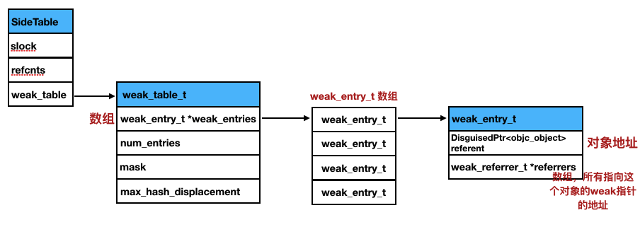

## 1.数据结构
```cpp
struct SideTable {
    spinlock_t slock;       //保证原子操作的自旋锁
    RefcountMap refcnts;    //保存引用计数的散列表
    weak_table_t weak_table;//保存weak引用的全局散列表
};
```
在上一篇文章中讲过，SideTable结构中的一个成员`weak_table_t weak_table`，是苹果使用一个全局的 weak 表来保存所有的 weak 引用。

```cpp
struct weak_table_t {
    weak_entry_t *weak_entries;//是一个weak_entry_t数组
    size_t    num_entries;//维护数组的size
    uintptr_t mask; //辅助计算量
    uintptr_t max_hash_displacement; //最大偏移量
};
```
`weak_table_t`实际上是一个hash表，使用对象的地址作为key，`weak_entry_t`类型结构体数组作为value，`weak_entry_t`字面意思是弱引用表入口。这里用到的Hash算法：

```cpp
static inline uintptr_t hash_pointer(objc_object *key) {
    return ptr_hash((uintptr_t)key);
}

static inline uint32_t ptr_hash(uint64_t key) {
    key ^= key >> 4;
    key *= 0x8a970be7488fda55;
    key ^= __builtin_bswap64(key);
    return (uint32_t)key;
}
```

`weak_entry_t`结构体，负责维护对象以及指向这个对象的所有weak指针的映射关系。它也是一个Hash表，用对象的地址作为key，`weak_referrer_t`数组作为value。所以weak表实际上是hash表套hash表。

```cpp
struct weak_entry_t {
    DisguisedPtr<objc_object> referent;//对象地址
    union {
        struct {
            weak_referrer_t *referrers;//可变数组，保存所有指向这个对象的weak指针的地址。
            uintptr_t        out_of_line_ness : 2;
            uintptr_t        num_refs : PTR_MINUS_2;
            uintptr_t        mask;
            uintptr_t        max_hash_displacement;
        };
        struct {
            // out_of_line_ness field is low bits of inline_referrers[1]
            weak_referrer_t  inline_referrers[WEAK_INLINE_COUNT];//大小为4的数组，默认情况下用来存储弱引用的指针
        };
    };
};

typedef DisguisedPtr<objc_object *> weak_referrer_t;    
```
由于`DisguisedPtr<objc_object>`是对对象地址做的封装。而`weak_referrer_t`是`DisguisedPtr<objc_object *>`对象指针的指针，是weak指针的地址。`weak_entry_t`结构体中有一个union联合体，`referrers`是一个可变数组，保存了所有指向这个对象的weak指针的地址。当对象被释放时，`referrers`中的所有指针都会被置为nil。
`inline_referrers`是一个大小为4的数组，默认情况下用来存储弱引用指针，如果数量大于4的时候就改用`referrers`来存储。



备注：weak指针的地址

```objective-c
NSObject *obj = [[NSObject alloc] init];
__weak id wobj = obj;
```
weak指针的地址就是&wobj。

## 2.weak的生命周期
### 初始化，objc_initWeak
```objective-c
NSObject *obj = [[NSObject alloc] init];
__weak id wobj = obj;//此时调用objc_initWeak
```

当初始化一个weak变量时，runtime会调用`objc_initWeak`函数：

```cpp
//location是weak指针的地址。 __weak id wobj = obj; 那么location = &wobj;
id objc_initWeak(id *location, id newObj) 
{
    //指向的对象是否有效
    if (!newObj) {
        *location = nil;
        return nil;
    }

    //使用模板进行常量传参：性能优化
    return storeWeak<DontHaveOld, DoHaveNew, DoCrashIfDeallocating>(location, (objc_object*)newObj);
}
```
这个函数的参数中的location就是weak变量（指针）的**地址**，newObj就是weak指针所指的对象。在这个函数中，先判断所指的对象是否有效，如果无效就给weak指针赋nil值，并返回。否则，就调用`storeWeak`函数添加弱引用。

### 添加引用，storeWeak
当把一个已有的weak指针指向另一个对象时：

```objective-c
NSObject *obj = [[NSObject alloc] init];//原指向对象
NSObject *obj2 = [[NSObject alloc] init];//新指向对象
__weak id wobj = obj;//此时调用objc_initWeak
wobj = obj2;//此时调用objc_storeWeak
```

会调用`objc_storeWeak`函数，这个函数中只干了一件事，就是调用`storeWeak`函数。

```cpp
id objc_storeWeak(id *location, id newObj)
{
    return storeWeak<DoHaveOld, DoHaveNew, DoCrashIfDeallocating>(location, (objc_object *)newObj);
}
```

由此看来，无论是`objc_initWeak`还是`objc_storeWeak`的核心还是`storeWeak`函数。下面来看一下这个函数的实现：

```cpp
//模板参数
enum HaveOld { DontHaveOld = false, DoHaveOld = true };
enum HaveNew { DontHaveNew = false, DoHaveNew = true };

template <HaveOld haveOld, HaveNew haveNew,
          CrashIfDeallocating crashIfDeallocating>
static id storeWeak(id *location, objc_object *newObj)
{
    assert(haveOld  ||  haveNew);
    if (!haveNew) assert(newObj == nil);

    Class previouslyInitializedClass = nil;
    id oldObj;//旧对象
    SideTable *oldTable;
    SideTable *newTable;

 retry:
 	//1.如果存在旧对象
    if (haveOld) {
        oldObj = *location;//获得weak指针原来所指对象
        oldTable = &SideTables()[oldObj];//获得原对象所在的sideTable
    } else {
        oldTable = nil;
    }
    //2.如果需要指向新对象
    if (haveNew) {
        newTable = &SideTables()[newObj];//获得新对象所在的sideTable
    } else {
        newTable = nil;
    }
	//3.锁操作
    SideTable::lockTwo<haveOld, haveNew>(oldTable, newTable);//加锁操作
    //如果*location != oldObj就说明可能被其他线程改动过
    if (haveOld  &&  *location != oldObj) {
        SideTable::unlockTwo<haveOld, haveNew>(oldTable, newTable);
        goto retry;
    }
    
	 //4.
    //防止弱引用间死锁。以及，通过+initialize方法保证所有的弱引用的对象都有一个已经初始化的isa
    if (haveNew  &&  newObj) {
        Class cls = newObj->getIsa();//获取新对象的isa
        //isa非空且已经初始化
        if (cls != previouslyInitializedClass  &&  
            !((objc_class *)cls)->isInitialized()) 
        {
            SideTable::unlockTwo<haveOld, haveNew>(oldTable, newTable);
            _class_initialize(_class_getNonMetaClass(cls, (id)newObj));

            previouslyInitializedClass = cls;

            goto retry;
        }
    }

    //5.清除旧对象的weak指针
    if (haveOld) {
        weak_unregister_no_lock(&oldTable->weak_table, oldObj, location);
    }

    //6.给新对象分配weak指针
    if (haveNew) {
        newObj = (objc_object *)
            weak_register_no_lock(&newTable->weak_table, (id)newObj, location, 
                                  crashIfDeallocating);//如果新对象正在释放(deallocing)，那么weak_register_no_lock返回nil
        //如果不是taggedPointer，那么根据是否开启了isa指针优化对一些标记位进行设置
        if (newObj  &&  !newObj->isTaggedPointer()) {
            newObj->setWeaklyReferenced_nolock();
        }

        //把weak指针指向新对象
        *location = (id)newObj;
    }
    else {
    }
    
    SideTable::unlockTwo<haveOld, haveNew>(oldTable, newTable);

    return (id)newObj;
}
```

HaveOld这个枚举类分别代表weak指针是否有原指向对象。而HaveNew代表weak指针是否需要指向新对象。（结合调用`objc_initWeak`、`objc_storeWeak`函数时`storeWeak`的参数理解一下）

1. 判断HaveOld的值，如果true，代表存在原指向对象，那么取得该对象以及其对应的SideTable —— oldTable。
2. 判断HaveNew的值，如果为true，代表weak指针需要指向新对象。取得该对象对应的SideTable —— newTable。
3. 处理多线程竞争冲突，对sideTable进行必要的加锁操作。
4. 如果weak指针需要指向新对象，取得该对象的isa指针，判断它是否已经初始化了，如果还没初始化就调用`_class_initialize`进行初始化。
5. 如果存在原指向对象，那么调用`weak_unregister_no_lock`函数，解除旧对象与weak指针的绑定关系。

 ```cpp
void weak_unregister_no_lock(weak_table_t *weak_table, id referent_id, 
                        id *referrer_id)
{
    objc_object *referent = (objc_object *)referent_id;//对象
    objc_object **referrer = (objc_object **)referrer_id;//weak指针地址

    weak_entry_t *entry;

    if (!referent) return;

    if ((entry = weak_entry_for_referent(weak_table, referent))) {//找到对象的weak_entry_t
        remove_referrer(entry, referrer);//从weak_entry_t中移除该weak指针地址
        bool empty = true;
        if (entry->out_of_line()  &&  entry->num_refs != 0) {
            empty = false;
        }
        else {
            for (size_t i = 0; i < WEAK_INLINE_COUNT; i++) {
                if (entry->inline_referrers[i]) {
                    empty = false; 
                    break;
                }
            }
        }

        //如果weak_entry_t已经完全没有weak指针了，就从weak_table中移除该weak_entry_t
        if (empty) {
            weak_entry_remove(weak_table, entry);
        }
    }
}
```

6. 把weak指针绑定到新对象，主要通过`weak_register_no_lock`函数来完成。在`weak_register_no_lock`函数中会先判断新对象是否正在被释放，如果是就返回nil不会进行绑定，否则会把weak指针的地址添加到新对象的`weak_entry_t`中的`referrers`weak指针地址数组中。最后`*location = (id)newObj`把weak指针指向新对象。

在这一节可以看到，弱引用的实现相当于是借助了第三方`weak_entry_t`来管理对象和weak指针之间的关系。

### 释放
```objective-c
NSObject *obj = [[NSObject alloc] init];
{
__weak id wobj = obj;
}
```

编译器模拟代码：
```cpp
id wobj;
objc_initWeak(&wobj, obj);
objc_destroyWeak(&weak);
```
当变量作用域结束时，weak指针变量将要销毁时会调用`objc_destroyWeak`解除weak指针和对象之间的引用关系。

```cpp
void objc_destroyWeak(id *location) {
    (void)storeWeak<DoHaveOld, DontHaveNew, DontCrashIfDeallocating>
        (location, nil);
}
```
可以看到`objc_destroyWeak`函数实际上也是通过`storeWeak`来完成的。通过上面的源码实现可知，如果`storeWeak`函数的第二个参数传入nil，把weak变量的地址从weak表中删除。因此本节开始的代码也相当于：

```cpp
编译器模拟代码：
id wobj;
objc_storeWeak(&wobj, obj);
objc_storeWeak(&wobj, nil);
```

在上一篇讲release源码时说到，当对象的引用计数为0，向对象发送dealloc消息。该对象**所有**的弱引用就是在这里被赋值为nil的。此时runtime会调用到`objc_destructInstance`函数，其中又会调用`clearDeallocating`函数清空引用计数表和weak表。（调用栈最终是通过`clearDeallocating_slow`来实现清空）

```cpp
void objc_object::clearDeallocating_slow() {
    SideTable& table = SideTables()[this];
    table.lock();
    //清空weak表
    if (isa.weakly_referenced) {//isa指针的weakly_referenced标志位true，表示有weak表
        weak_clear_no_lock(&table.weak_table, (id)this);
    }
    //清空引用计数
    if (isa.has_sidetable_rc) {
        table.refcnts.erase(this);
    }
    table.unlock();
}
```
其中清空weak表是由`weak_clear_no_lock`函数来完成的。

```cpp
void weak_clear_no_lock(weak_table_t *weak_table, id referent_id) 
{
    objc_object *referent = (objc_object *)referent_id;//对象地址

    weak_entry_t *entry = weak_entry_for_referent(weak_table, referent);//入口
    if (entry == nil) {
        return;
    }

    weak_referrer_t *referrers;//weak指针地址数组
    size_t count;
    
    //获取weak指针的数量
    if (entry->out_of_line()) {
        referrers = entry->referrers;
        count = TABLE_SIZE(entry);
    } 
    else {
        referrers = entry->inline_referrers;
        count = WEAK_INLINE_COUNT;
    }
    
    for (size_t i = 0; i < count; ++i) {
        objc_object **referrer = referrers[i];//weak指针地址
        if (referrer) {
            if (*referrer == referent) {//如果weak指向该对象
                *referrer = nil;//置为nil
            }
            else if (*referrer) {
                _objc_inform("__weak variable at %p holds %p instead of %p. "
                             "This is probably incorrect use of "
                             "objc_storeWeak() and objc_loadWeak(). "
                             "Break on objc_weak_error to debug.\n", 
                             referrer, (void*)*referrer, (void*)referent);
                objc_weak_error();
            }
        }
    }
    
    weak_entry_remove(weak_table, entry);//在weak表中移除该入口
}
```
这个函数先从weak表中获取以对象地址为key的`weak_entry_t`哈希表，接着获得该对象的weak指针地址数组，把数组中每一个weak指针赋值为nil。最后在weak表中删除该`weak_entry_t`。

## 3.其他
`__unsafe_unretained`和`__weak`很相似，但不同之处在于，使用`__unsafe_unretained`修饰的的变量，在所指对象已经被废弃后不会自动置为nil。


参考文章：

[iOS 底层解析weak的实现原理（包含weak对象的初始化，引用，释放的分析）](http://www.cocoachina.com/ios/20170328/18962.html)

《Objective-C高级编程》