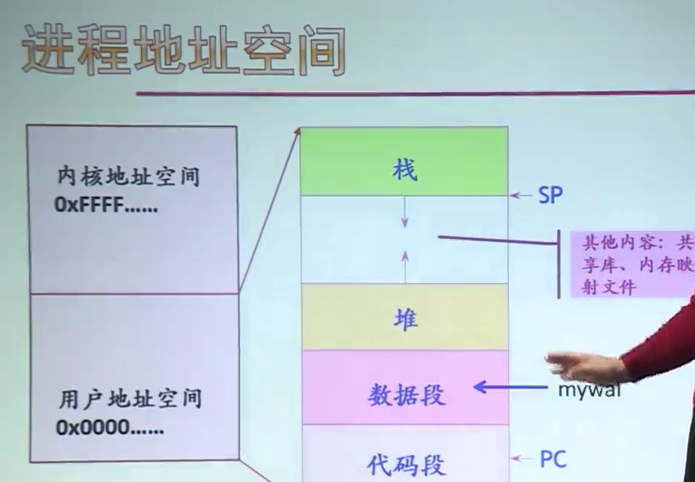
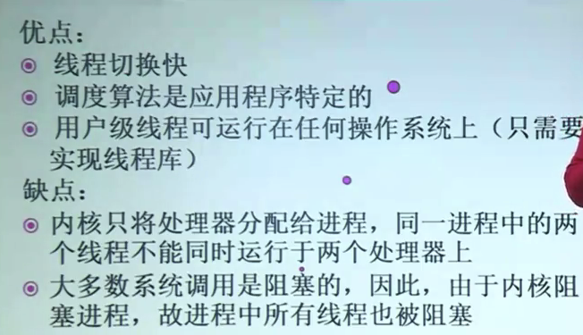

## 进程

### 多道程序设计

允许多个程序**同时**进入内存并运行，目的是为了提高系统效率。

### 并发环境

并发环境：一段时间间隔内，单处理器上有两个或以上的程序同时处于开始运行但尚未结束的状态，并且次序不是事先确定的。

并发程序：在并发环境中执行的程序

### 进程

进程是具有独立功能的程序关于某个数据集合上的**一次**运行活动，**是系统进行资源分配和调度的独立单位**。是对CPU的抽象

- 程序的一次执行过程
- 是正在运行程序的抽象
- 将一个CPU变换成多个虚拟CPU
- 系统资源以进程为单位分配，如内存、文件...**每个进程具有独立的地址空间**
- 操作系统将CPU**调度**给需要的进程，将CPU的控制权交给进程

### PCB进程控制块

- process control block 又称**进程描述符**、**进程属性**
- 操作系统用于管理控制进程的一个专门数据结构。
- 记录进程的各种属性，描述进程的动态变化过程

PCB是系统感知进程存在的唯一标志，进程与PCB一一对应

进程表：所有进程的PCB集合。固定大小 —— 并发度

**PCB的内容：**

- 进程描述：进程标识符（PID），唯一；进程名，基于可执行文件名，不唯一；用户标识符（UID），进程组关系
- 进程控制：当前状态、优先级、代码执行入口地址、程序磁盘地址、运行统计信息、进程间同步和通信、进程的队列指针、进程的消息队列指针
- 所拥有的资源和使用情况：虚拟地址空间的状况、打开文件列表
- CPU的现场信息（进程不运行时操作系统要保存的硬件执行状态）：寄存器值、指向该进程页表的指针。

### 进程状态及转换

#### 三种基本状态：运行、就绪、等待

- 运行：占有cpu，并在cpu上运行
- 就绪：已经运行条件，但由于没有空闲cpu，不能运行
- 等待：因等待某一时间而暂时不能运行。又称：阻塞态、封锁态、睡眠态

三态模型及状态转换

1. 就绪->运行

 调度程序选择一个新的进程运行
 
2. 运行->就绪

 ①运行进程用完了时间片。②一个高优先级进程进入就绪状态，枪占正在运行的进程

3. 运行->等待

 当一个进程等待某个事件发生时（请求OS服务、对资源的访问尚不能进行，等待I/O结果，等待另一个进程提供信息）

4. 等待->就绪
 
 等待的事件发生了。
 
没有从就绪态进入等待态的这样一个转换，也没有从等待态直接进入运行态的转换

### 进程控制

进程控制操作，主要是完成了进程的各状态之间的转换。那么进程控制操作实际上就是具有特定功能的程序 那么这个程序执行的时候呢，由于不允许被中断，我们把它称之为**原语**

进程控制原语有这么一些：进程创建原语、进程撤销原语、阻塞原语、唤醒原语、挂起原语、激活原语、改变进程优先级......

原语：又称之为原子操作，那么它是完成某种特定功能的一段程序。完成了某种特定功能，但是这个程序在执行过程中呢，是具有不可分割性，或者是**不可中断**的，它必须持续地执行。当然实现原语，需要操作系统通过屏蔽中断的一些措施来达到这样一个结果

#### 进程创建

1. 给每一个新的进程分配一个标识ID以及空的、 没有用过的进程控制块
2. 为进程分配地址空间。如果在虚拟存储机制之下，这个空间假设给了它，但是不真正给它内存，只是给了一个**虚拟地址空间**
3. 初始化进程控制块，设定一些默认值，比如进程的状态设定为 New 等等 
4. 创建好了进程控制块之后，要把它插入到相应的队列当中。要设置相应的**队列指针**，比如它进入的是就绪队列

创建进程：

- UNIX：fork、exec
- Windows：CreateProcess

#### 进程撤销

进程的撤销实际上就是结束进程

- 回收进程所占资源：关闭打开的文件、断开网络、回收内存
- 撤销进程PCB

创建撤销：

- UNIX：exit
- Windows：TerminateProcess

#### 进程阻塞

处于运行状态的进程，在其运行过程中，会期待、 等待某个事件的发生 比如等待键盘的输入，或者是等待磁盘的数据传输完成，或者是等待其他进程给它发来一些消息。在这些事件未发生时，进程需要自己执行阻塞原语，使自己的状态由**运行态**变为**阻塞态**

创建阻塞：

- UNIX：wait
- Windows：WaitForSingleObject

### Unix的几个进程控制操作

- fork() 通过复制调用进程（父进程）来创建新的进程
- exec() 包括一系列系统调用，通过用一段新的程序来覆盖原来的地址空间，实现进程**执行代码的转换**。（父进程，原来是把自己的所有内容复制给子进程。子进程用一些新的程序代码，把父进程拷贝过来的内容覆盖掉）
- wait() 初级的一个同步操作，它能使得一个进程等待另外一个进程的结束
- exit() 终止一个进程的运行

它们都是以**系统调用**的形式作为一个接口，呈现给用户程序，由用户程序来调用。

#### fork的实现

- 为子进程分配一个空闲的进程描述符，也就是PCB。在Unix里面一般叫proc结构
- 分配一个唯一的标识 pid 给紫禁城
- 以**一次一页**的方式，把父进程的地址空间内容完全地拷贝给子进程
- 从父进程继承各种共享资源，比如打开的文件、当前工作目录等等
- 子进程的状态设置为就绪态，并且把它插入到了就绪队列
- 对子进程返回一个标识符 0
- 向父进程返回子进程pid

一次一页复制父进程地址空间 这一步的分析：

父进程创建子进程是让子进程做与父进程所不同的工作。如果把所有内容拷贝给子进程，实际上子进程也不需要。子进程会接着执行 exec 函数用新的一段代码来把父进程拷贝过来的这些地址空间给覆盖掉。之前的这种复制工作，实际上就是无用功了，而且还花了很多的时间和空间，因此在 UNIX 里头实现 fork 花费的时间比较长。

**Linux的改善：**

Linux 使用了一个技术，叫做写时复制技术Copy-On-Write。是在存储管理这个模块当中提供的一个支持。这个技术用在了 Linux 的 fork 的实现过程中，加快了fork速度。

原来是要复制父进程的地址空间，而现在只需要父进程把地址空间的**指针传递给**子进程，再把地址空间设置为只读。当子进程要往地址空间里写东西的时候，被操作系统接受，操作系统会为子进程单独再开辟一块空间，把相应的内容放进去。

### 进程相关概念

1.分类

- 系统进程、用户进程
- 前台进程、后台进程
- CPU密集型进程、I/O密集型进程

2.进程层次结构

- UNIX进程家族树：init为根
- windows：地位平等

3.进程和程序的区别

- 进程能够更准确地来刻画并发，而程序不可以
- 程序通常是静态的不改变它，它不会有变化。而进程是动态的，它会时时刻刻地去变化，因为它要往前执行
- 进程有声明周期，短暂的。而程序相对长久的
- 一个程序可以对应多个进程
- 进程具有创建其他进程的功能

4.“操作系统给每个进程都分配了一个地址空间”

两个进程，两个相对独立的地址空间。不是实际的内存地址，是一个**相对地址**，如果支持许村的系统当中，那么这个地址就是虚拟地址（逻辑地址）

进程地址空间:

5.进程映像（image）

对进程执行活动全过程的静态描述。由进程地址空间内容、硬件寄存器内容以及与该进程相关的内核数据结构、内核栈组成。

- 用户相关：进程地址空间，包括代码段、数据段、堆、栈、共享库等等
- 寄存器相关：程序计数器、指令寄存器、程序状态字、栈指针、通用寄存器
- 内核相关：
 - 静态部分：PCB以及各种资源数据结构
 - 动态部分：内核栈（不同进程在进入内核后使用不同的内核栈）

6.上下文（context）切换

将CPU硬件状态从一个进程换到另一个进程的过程。

那么进程在运行的时候呢，它的硬件状态会推送到若干 CPU 上的寄存器当中。当它不运行的时候，那么所有相关的硬件状态就不能放在这些寄存器中了，因为只有一套寄存器。这些内容呢就要把它保存在一个安全的地方，那么这就是进程控制块PCB的现场部分。如果一个操作系统又选中了一个新的进程，让它上 CPU 运行，那就要把保存在 PCB 当中的这些硬件状态把它推送到相应的寄存器当中。这就完成了上下文切换的一个过程。

## 线程

为什么要在进程当中派生出线程？

1.应用的需要。 2.开销考虑。 3.性能

开销考虑：

- 进程相关操作时间/空间开销大，限制了并发度的提高
- 线程开销小。创建、撤销、切换线程花费时间少。线程之间相互通信不用调用内核（统一进程内的线程共享内存和文件）

线程：进程中的一个运行实体，是**CPU的调度单位**（这是从进程继承来的属性）。而进程是资源的拥有者。

线程的属性：

- 有标识符ID
- 有状态及状态转换->需要提供一些操作
- 不运行时需要保存上下文。有上下文环境：程序计数器等寄存器
- 有自己的栈和栈指针
- **共享所在进程的地址空间和其他资源**
- 可以创建、撤销另一个线程。一开始创建进程以后就只有一个主线程

### 线程的实现

1.用户级线程

- 在用户空间建立线程库：提供一组管理线程的过程
- 运行时系统：完成线程的管理工作
- 内核管理的还是进程，不知道线程的存在
- 线程切换不需要内核态特权
- UNIX就是采用这种方式支持线程（POSIX规范，pthread线程库）

2.核心级线程

- 内核管理所有线程，并向用户程序提供API接口
- 内核维护进程和线程的上下文
- 线程切换需要内核支持
- 以线程为基础进行调度
- 例子：windows

3.混合模型

- 线程创建在用户空间完成
- 线程调度等在核心态完成
- 例子：solaris

