### 一、什么是runloop
字面意思是**消息循环、运行循环**。它不是线程，但它和线程息息相关。

一般来讲，一个线程一次只能执行一个任务，执行完成后线程就会退出。比如在c语言程序中，main函数执行完程序就退出了，因此有时候需要一个while死循环来让程序不死。而当我们打开一个IOS应用之后，什么也不做，这时候看起来是没有代码在执行的，但程序并没有退出。iOS这种没有任务时仍然可以让程序维持运行的现象，都是得益于runloop。

**runloop内部实际上就是一个do-while循环**，它在循环监听着各种事件源、消息，对他们进行管理并分发给线程来执行。
> RunLoop 实际上就是一个对象，这个对象管理了其需要处理的事件和消息，并提供了一个入口函数来执行上面 Event Loop 的逻辑。线程执行了这个函数后，就会一直处于这个函数内部 "接受消息->等待->处理" 的循环中，直到这个循环结束（比如传入 quit 的消息），函数返回。

iOS程序main.m文件中会有这样一段代码：

```objective-c
int main(int argc, char * argv[]) {
    @autoreleasepool {
        return UIApplicationMain(argc, argv, nil, NSStringFromClass([AppDelegate class]));
    }
}
```

其中，`UIApplicationMain`函数内部启动了runloop，因此`UIApplicationMain`函数是一直都没有返回的，保持了程序的持续运行。而这个默认启动的runloop是和主线程相关的。

**总结runloop的作用：**

- 保证程序不退出
- 负责处理各种事件（source、timer、observer）
- 如果没有事件发生，会让程序进入休眠状态。这样可以节省cup资源，提高程序性能，有事做就去处理，没事做就休息。

**API**

iOS 中提供了两套API来访问和使用runloop：

- `CFRunLoopRef（CoreFoundation 框架）`，纯 C 函数 API，所有API都是线程安全的。
- `NSRunLoop（Foundation框架）`， 是基于 CFRunLoopRef 的oc封装，提供了面向对象的 API，但是这些 API 不是线程安全的。

### 二、runloop与线程
CFRunLoop 是基于 pthread 来管理的，而pthread和NSThread是一一对应的。

主线程的runloop自动创建，子线程的runloop默认不创建。

runloop是不能够通过`alloc init`来创建。要获取runloop可以通过这两个函数`CFRunLoopGetMain()`和`CFRunLoopGetCurrent()`来**获得**主线程、当前线程runloop（实质是一种懒加载）。（在NSRunloop中对应就是`- mainRunloop`和`- currentRunloop`方法）

由苹果源码，这两个函数的内部实现看出线程和runloop是一一对应的，这种对应关系用一个字典保存起来，key是pthread，value是CFRunLoopRef：

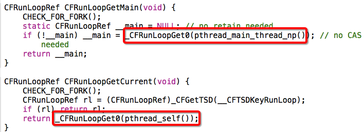

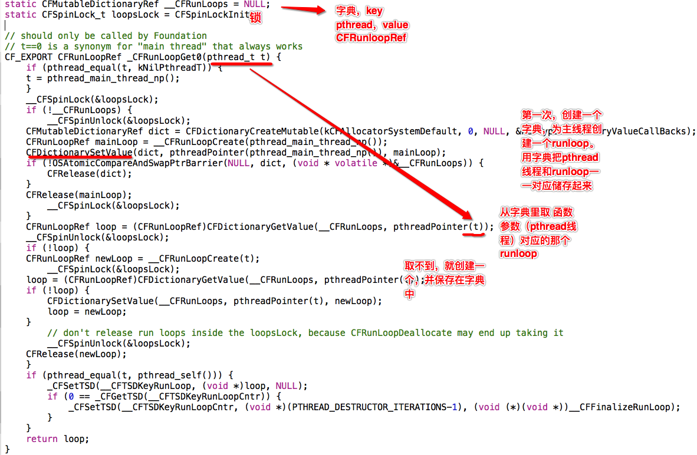

runloop在第一次**获取**时创建，然后在线程结束时销毁。所以，在子线程如果不手动获取runloop，它是一直都不会有的。

### 三、RunLoop相关类
在 CoreFoundation 里面关于 RunLoop 有5个类:`CFRunLoopRef`、`CFRunLoopModeRef`、`CFRunLoopSourceRef`、`CFRunLoopTimerRef`、`CFRunLoopObserverRef`

其关系如下：

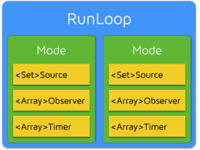

- 一个 RunLoop可以有多个Mode，每个 Mode 又包含若干个 Source/Timer/Observer。
- Source/Timer/Observer又叫mode item。不同mode下的mode item互不影响
- 一个 item可被加入不同的mode。但一个 item 被重复加入同一个 mode 时是不会有效果的。**如果一个 mode 中一个 item 都没有，RunLoop退出。**（不过如果仅仅依赖没有mode item来让runloop退出，这做法是不可靠的）

#### Mode Item
A、 source。`CFRunLoopSourceRef`事件源

按照官方文档`CFRunLoopSourceRef`为3类，但数据结构只有两类(source0、source1)

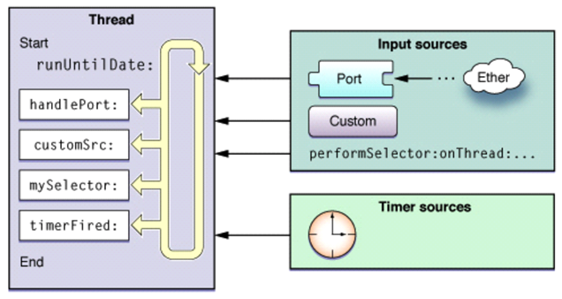

 一、官方文档版分类：
 
RunLoop只处理两种源：输入源、时间源。

而输入源又可以分为：NSPort、自定义源、`performSelector:OnThread:delay:`

 - **基于端口的源:**与内核端口相关。只需要简单的创建端口对象，并使用NSPort的方法将端口对象加入到run loop。端口对象会处理创建以及配置输入源。对应的是source1.
 - **自定义源**：使用CFRunLoopSourceRef类型相关的函数来创建自定义输入源，比如```CFRunLoopSourceCreate？```。一般用不到
 - **selector** :执行完后会自动清除出runloop（这是文档的说法，和实际测试不一样。基于端口的源不会）。
 
关于Selector Sources要说的几点：

一般有这么几种performxxx

```
/// 主线程
performSelectorOnMainThread:withObject:waitUntilDone:
performSelectorOnMainThread:withObject:waitUntilDone:modes:
/// 指定线程
performSelector:onThread:withObject:waitUntilDone:
performSelector:onThread:withObject:waitUntilDone:modes:
/// 针对当前线程
performSelector:withObject:afterDelay:         
performSelector:withObject:afterDelay:inModes:
/// 取消，在当前线程，和上面两个方法对应
cancelPreviousPerformRequestsWithTarget:
cancelPreviousPerformRequestsWithTarget:selector:object:
```

经过测试：

1. 对于`onMainThread`和`onthread`这两种情况，创建的是source0任务。

 **如果调用线程和指定线程为同一线程:**

 1.1 wait参数设为YES（阻塞当前线程直到selector执行完），那么aSelector会直接在指定线程运行，不会添加到runloop。（其实就有点类似于线程死锁）

 1.2 wait参数为NO，selector源添加到runloop且执行完不会自动清除出runloop。

 **如果调用线程和指定线程不是同一线程:**

 selector源添加到runloop且执行完不会自动清除出runloop。

2. 而`performSelector:withObject:afterDelay`则不是source0而是timer，使用是添加到runloop，执行完会自动移除出runloop。

还有一些方法：

```
- (id)performSelector:(SEL)aSelector;
- (id)performSelector:(SEL)aSelector withObject:(id)object;
- (id)performSelector:(SEL)aSelector withObject:(id)object1 withObject:(id)object2;
```
他们是同步执行的，和线程无关，主线程子线程都可以用。不会添加到runloop，而是直接执行，相当于是`[self xxx]`这样调用，只不过是编译期、运行期处理的不同。

时间源：基于时间的触发器，上层对应NSTimer。

二、源码版（source0/source1）：

- source0 非基于port的：负责App内部事件，由App负责管理触发，例如UIEvent、UITouch事件。包含了一个回调，不能主动触发事件。使用时，你需要先调用 `CFRunLoopSourceSignal(source)`，将这个 Source 标记为待处理，然后手动调用 `CFRunLoopWakeUp(runloop) `来唤醒 RunLoop，让其处理这个事件。
` -performSelector:onThread:withObject:waitUntilDone: inModes:`创建的是source0任务。
- source1 基于port的：包含一个 mach_port 和一个回调，可监听系统端口和通过内核和其他线程发送的消息，能主动唤醒runloop，接收分发系统事件。

Source1和Timer都属于端口事件源，不同的是所有的Timer都共用一个端口(Timer Port)，而每个Source1都有不同的对应端口。

Source0属于input Source中的一部分，Input Source还包括cuntom自定义源，由其他线程手动发出。

B、 timer

CFRunLoopTimerRef是基于时间的触发器，基本上说的就是NSTimer。在预设的时间点唤醒runloop执行回调。因为它是基于RunLoop的，因此它**不是实时的**（就是NSTimer 是不准确的。 因为RunLoop只负责分发源的消息。如果线程当前正在处理繁重的任务，就有可能导致Timer本次延时，或者少执行一次）。

C、 observer

CFRunLoopObserverRef观察者，监听runloop的状态。通过回调接收状态变化。它不属于runloop的事件源。

```c
typedef CF_OPTIONS(CFOptionFlags, CFRunLoopActivity) {
    kCFRunLoopEntry         = (1UL << 0), // 即将进入Loop
    kCFRunLoopBeforeTimers  = (1UL << 1), // 即将处理 Timer
    kCFRunLoopBeforeSources = (1UL << 2), // 即将处理 Source
    kCFRunLoopBeforeWaiting = (1UL << 5), // 即将进入休眠
    kCFRunLoopAfterWaiting  = (1UL << 6), // 刚从休眠中唤醒
    kCFRunLoopExit          = (1UL << 7), // 即将退出Loop
};
```

Mode 暴露的管理 mode item 的接口有下面几个：

```objective-c
CFRunLoopAddSource(CFRunLoopRef rl, CFRunLoopSourceRef source, CFStringRef modeName);
CFRunLoopAddObserver(CFRunLoopRef rl, CFRunLoopObserverRef observer, CFStringRef modeName);
CFRunLoopAddTimer(CFRunLoopRef rl, CFRunLoopTimerRef timer, CFStringRef mode);
CFRunLoopRemoveSource(CFRunLoopRef rl, CFRunLoopSourceRef source, CFStringRef modeName);
CFRunLoopRemoveObserver(CFRunLoopRef rl, CFRunLoopObserverRef observer, CFStringRef modeName);
CFRunLoopRemoveTimer(CFRunLoopRef rl, CFRunLoopTimerRef timer, CFStringRef mode);
```

#### Mode
CFRunLoopModeRef。每次启动RunLoop时，只能指定其中一个 Mode，这个就是CurrentMode。要切换 Mode，只能退出 Loop，再重新指定一个 Mode 进入。

数据结构：

```cpp
 struct __CFRunLoopMode {
    CFRuntimeBase _base;
    pthread_mutex_t _lock;  /* must have the run loop locked before locking this */
//mode名
    CFStringRef _name;
    Boolean _stopped;
    char _padding[3];
//source0 源
    CFMutableSetRef _sources0;
//source1 源
    CFMutableSetRef _sources1;
//observer 源
    CFMutableArrayRef _observers;
//timer 源
    CFMutableArrayRef _timers;

//mach port 到 mode的映射,为了在runloop主逻辑中过滤runloop自己的port消息。
    CFMutableDictionaryRef _portToV1SourceMap;

//记录了所有当前mode中需要监听的port，作为调用监听消息函数的参数。
    __CFPortSet _portSet;
    CFIndex _observerMask;
#if USE_DISPATCH_SOURCE_FOR_TIMERS
    dispatch_source_t _timerSource;
    dispatch_queue_t _queue;
    Boolean _timerFired; // set to true by the source when a timer has fired
    Boolean _dispatchTimerArmed;
#endif
#if USE_MK_TIMER_TOO
//使用 mk timer， 用到的mach port，和source1类似，都依赖于mach port
    mach_port_t _timerPort;
    Boolean _mkTimerArmed;
#endif
//timer触发的理想时间
    uint64_t _timerSoftDeadline; /* TSR */
//timer触发的实际时间，理想时间加上tolerance（偏差）
    uint64_t _timerHardDeadline; /* TSR */
};
```

系统默认注册了5个mode，以下两个是比较常用的：

1. `kCFRunLoopDefaultMode （NSDefaultRunLoopMode）`，默认模式
2. `UITrackingRunLoopMode`， scrollview滑动时就是处于这个模式下。保证界面滑动时不受其他mode影响

CFRunLoop对外暴露的管理 Mode 接口只有下面2个:

```cpp
CFRunLoopAddCommonMode(CFRunLoopRef runloop, CFStringRef modeName);
CFRunLoopRunInMode(CFStringRef modeName, ...);
```
对于传入的 mode name 如果runLoop 内部没有对应 mode 时，runLoop会自动创建对应的 CFRunLoopModeRef。mode只能添加不能删除

##### kCFRunLoopCommonModes（NSRunLoopCommonModes）
它是一个占位用的mode，它不是真正意义上的mode。
如果要在线程中开启runloop，这样写是不对的：`[[NSRunLoop currentRunLoop] runMode:NSRunLoopCommonModes beforeDate:[NSDate distantFuture]];`

下面来看看CFRunLoop中有关CommonMode的结构:

```c
struct __CFRunLoop {
    CFMutableSetRef _commonModes;     // Set
    CFMutableSetRef _commonModeItems; // Set<Source/Observer/Timer>
    CFRunLoopModeRef _currentMode;    // Current Runloop Mode
    CFMutableSetRef _modes;           // Set
    ...
};
```

有两个要说明的地方：

1. 关于mode：一个mode可以标记为common属性（用`CFRunLoopAddCommonMode`函数），然后它就会保存在`_commonModes`。主线程已有的两个mode`kCFRunLoopDefaultMode` 和`UITrackingRunLoopMode`都已经是CommonModes了。
2. 关于item：`_commonModeItems`里面存放的source, observer, timer等，在每次runLoop运行的时候都会被同步到具有Common标记的Modes里。比如这样：`[[NSRunLoop currentRunLoop] addTimer:_timer forMode:NSRunLoopCommonModes];`就是把timer放到commonItem里。

### 四、runloop的实现
在这一部分会涉及到比较多的源码。源码比较长（两三百行，后来我还写了注释。。），如果只想了解runloop大致流程可以跳过，后面有图表总结。

当然..源码我也并不是完完全全每一句都读懂了，如果有写得不对的地方请指正。

```cpp
SInt32 CFRunLoopRunSpecific(CFRunLoopRef rl, CFStringRef modeName, CFTimeInterval seconds, Boolean returnAfterSourceHandled) {    
    CHECK_FOR_FORK();
    if (__CFRunLoopIsDeallocating(rl)) return kCFRunLoopRunFinished;
    __CFRunLoopLock(rl);
    //根据mode name找到对应的mode
    CFRunLoopModeRef currentMode = __CFRunLoopFindMode(rl, modeName, false);
    //如果mode里没有source/timer/observer,直接返回。
    if (NULL == currentMode || __CFRunLoopModeIsEmpty(rl, currentMode, rl->_currentMode)) {
	Boolean did = false;
	if (currentMode) __CFRunLoopModeUnlock(currentMode);
	__CFRunLoopUnlock(rl);
	return did ? kCFRunLoopRunHandledSource : kCFRunLoopRunFinished;
    }
    volatile _per_run_data *previousPerRun = __CFRunLoopPushPerRunData(rl);
    CFRunLoopModeRef previousMode = rl->_currentMode;
    rl->_currentMode = currentMode;
    int32_t result = kCFRunLoopRunFinished;

    //1.通知 Observers:即将进入runloop。
	if (currentMode->_observerMask & kCFRunLoopEntry ) __CFRunLoopDoObservers(rl, currentMode, kCFRunLoopEntry);
    //内部函数，进入loop
	result = __CFRunLoopRun(rl, currentMode, seconds, returnAfterSourceHandled, previousMode);
    //10.通知 Observers:RunLoop 即将退出。
	if (currentMode->_observerMask & kCFRunLoopExit ) __CFRunLoopDoObservers(rl, currentMode, kCFRunLoopExit);

        __CFRunLoopModeUnlock(currentMode);
        __CFRunLoopPopPerRunData(rl, previousPerRun);
	rl->_currentMode = previousMode;
    __CFRunLoopUnlock(rl);
    return result;
}
```

```cpp
static int32_t __CFRunLoopRun(CFRunLoopRef rl, CFRunLoopModeRef rlm, CFTimeInterval seconds, Boolean stopAfterHandle, CFRunLoopModeRef previousMode) {
    uint64_t startTSR = mach_absolute_time();//获取系统启动之后 的内核时间

    //如果当前runLoop或者runLoopMode为停止状态的话直接返回
    if (__CFRunLoopIsStopped(rl)) {
        __CFRunLoopUnsetStopped(rl);
	return kCFRunLoopRunStopped;
    } else if (rlm->_stopped) {
	rlm->_stopped = false;
	return kCFRunLoopRunStopped;
    }

    mach_port_name_t dispatchPort = MACH_PORT_NULL;//用来保存主队列（mainQueue）的端口。mach端口--线程之间通信
    //判断当前线程是否主线程（当前runloop是否主线程runloop），如果是就分发一个队列调度端口
    Boolean libdispatchQSafe = pthread_main_np() && ((HANDLE_DISPATCH_ON_BASE_INVOCATION_ONLY && NULL == previousMode) || (!HANDLE_DISPATCH_ON_BASE_INVOCATION_ONLY && 0 == _CFGetTSD(__CFTSDKeyIsInGCDMainQ)));
    // 只有在MainRunLoop，才会有下面这行赋值，否则 dispatchPort 为NULL
    if (libdispatchQSafe && (CFRunLoopGetMain() == rl) && CFSetContainsValue(rl->_commonModes, rlm->_name))
        dispatchPort = _dispatch_get_main_queue_port_4CF();
    
    
#if USE_DISPATCH_SOURCE_FOR_TIMERS
    //给当前mode分发队列端口
    mach_port_name_t modeQueuePort = MACH_PORT_NULL;
    if (rlm->_queue) {
        modeQueuePort = _dispatch_runloop_root_queue_get_port_4CF(rlm->_queue);
        if (!modeQueuePort) {
            CRASH("Unable to get port for run loop mode queue (%d)", -1);
        }
    }
#endif
    //gcd有关的东西，实现runloop超时管理。
    /*
     struct __timeout_context {
     dispatch_source_t ds;
     CFRunLoopRef rl;//runloop
     uint64_t termTSR;//超时时间点？
     };
     */
    //对gcd的一些api不是很熟悉，但大概看懂是主要通过dispatch_source_t创建计时器；精度很高，系统自动触发，是系统级别的源
    dispatch_source_t timeout_timer = NULL;
    struct __timeout_context *timeout_context = (struct __timeout_context *)malloc(sizeof(*timeout_context));//超时上下文
    if (seconds <= 0.0) { //seconds：设置的runloop超时时间
        seconds = 0.0;
        timeout_context->termTSR = 0ULL;
    } else if (seconds <= TIMER_INTERVAL_LIMIT) {//设置的超时时间在最大限制内，才创建timeout_timer
        dispatch_queue_t queue = dispatch_get_global_queue(DISPATCH_QUEUE_PRIORITY_HIGH, DISPATCH_QUEUE_OVERCOMMIT);
        timeout_timer = dispatch_source_create(DISPATCH_SOURCE_TYPE_TIMER, 0, 0, queue);
        dispatch_retain(timeout_timer);
        timeout_context->ds = timeout_timer;
        timeout_context->rl = (CFRunLoopRef)CFRetain(rl);
        timeout_context->termTSR = startTSR + __CFTimeIntervalToTSR(seconds);
        dispatch_set_context(timeout_timer, timeout_context); //绑定// source gets ownership of context
        dispatch_source_set_event_handler_f(timeout_timer, __CFRunLoopTimeout);
        dispatch_source_set_cancel_handler_f(timeout_timer, __CFRunLoopTimeoutCancel);
        uint64_t ns_at = (uint64_t)((__CFTSRToTimeInterval(startTSR) + seconds) * 1000000000ULL);
        dispatch_source_set_timer(timeout_timer, dispatch_time(1, ns_at), DISPATCH_TIME_FOREVER, 1000ULL);
        dispatch_resume(timeout_timer);
    } else { // infinite timeout 超时时间无穷尽
        seconds = 9999999999.0;
        timeout_context->termTSR = UINT64_MAX;
    }

    Boolean didDispatchPortLastTime = true;
    int32_t retVal = 0;
    do {
        uint8_t msg_buffer[3 * 1024];
        mach_msg_header_t *msg = NULL;
        mach_port_t livePort = MACH_PORT_NULL;
        __CFPortSet waitSet = rlm->_portSet;//_portSet：记录了所有当前mode中需要监听的port，作为调用监听消息函数的参数。

        __CFRunLoopUnsetIgnoreWakeUps(rl);//不忽略端口唤醒
        //2. 通知Observers:通知即将处理timer
        if (rlm->_observerMask & kCFRunLoopBeforeTimers) __CFRunLoopDoObservers(rl, rlm, kCFRunLoopBeforeTimers);
        //3. 通知Observers:通知即将处理Source0(非port)。
        if (rlm->_observerMask & kCFRunLoopBeforeSources) __CFRunLoopDoObservers(rl, rlm, kCFRunLoopBeforeSources);

        //处理加入到runLoop中的block。（非延迟的主线程？）
        __CFRunLoopDoBlocks(rl, rlm);
        //4.处理source0事件
        Boolean sourceHandledThisLoop = __CFRunLoopDoSources0(rl, rlm, stopAfterHandle);
        //处理block
        if (sourceHandledThisLoop) {
            __CFRunLoopDoBlocks(rl, rlm);
        }

        //poll标志着有没有处理source0的消息，如果没有则为false，反之为true
        //poll=NO的情况：没有source0且超时时间!=0
        Boolean poll = sourceHandledThisLoop || (0ULL == timeout_context->termTSR);//(后一条件似乎是必然为false的)
        
        //主线程runloop 端口存在、didDispatchPortLastTime为假（首次执行不会进入判断，因为didDispatchPortLastTime为true）
        if (MACH_PORT_NULL != dispatchPort && !didDispatchPortLastTime) {
            msg = (mach_msg_header_t *)msg_buffer;
            //__CFRunLoopServiceMachPort用于接受指定端口(一个也可以是多个)的消息,最后一个参数代表当端口无消息的时候是否休眠,0是立刻返回不休眠,TIMEOUT_INFINITY代表休眠
            //处理通过GCD派发到主线程的任务,这些任务优先级最高会被最先处理
            //5.如果有Source1，就直接跳转去处理消息。（文档说是检测source1，不过源码看来是检测dispatchPort---gcd端口事件）
            if (__CFRunLoopServiceMachPort(dispatchPort, &msg, sizeof(msg_buffer), &livePort, 0)) {
                goto handle_msg;//如果端口有事件则跳转至handle_msg
            }
        }

        didDispatchPortLastTime = false;
        
        //之前没有处理过source0，也没有source1消息，就让线程进入睡眠。
        //6.通知 Observers: RunLoop 的线程即将进入休眠
        if (!poll && (rlm->_observerMask & kCFRunLoopBeforeWaiting))
            __CFRunLoopDoObservers(rl, rlm, kCFRunLoopBeforeWaiting);
        // 标志当前runLoop为休眠状态
        __CFRunLoopSetSleeping(rl);

        __CFPortSetInsert(dispatchPort, waitSet);
        
        __CFRunLoopModeUnlock(rlm);
        __CFRunLoopUnlock(rl);

#if USE_DISPATCH_SOURCE_FOR_TIMERS
        //  进入循环开始不断的读取端口信息，如果端口有唤醒信息则唤醒当前runLoop
        do {
            if (kCFUseCollectableAllocator) {
                objc_clear_stack(0);
                memset(msg_buffer, 0, sizeof(msg_buffer));
            }
            msg = (mach_msg_header_t *)msg_buffer;
            //7. 调用 mach_msg 等待接受 mach_port 的消息。线程将进入休眠, 直到被下面某一个事件唤醒。
            /// • 一个基于 port 的Source 的事件。
            /// • 一个 Timer 到时间了
            /// • RunLoop 自身的超时时间到了
            /// • 被其他什么调用者手动唤醒
            
            //如果poll为no，且waitset中无port有消息,线程进入休眠；否则唤醒
            __CFRunLoopServiceMachPort(waitSet, &msg, sizeof(msg_buffer), &livePort, poll ? 0 : TIMEOUT_INFINITY);
            //livePort是modeQueuePort，则代表为当前mode队列的端口
            if (modeQueuePort != MACH_PORT_NULL && livePort == modeQueuePort) {
                //不太懂
                while (_dispatch_runloop_root_queue_perform_4CF(rlm->_queue));
                //知道Timer被激活了才跳出二级循环继续循环一级循环
                if (rlm->_timerFired) {
                    rlm->_timerFired = false;
                    break;
                } else {
                    if (msg && msg != (mach_msg_header_t *)msg_buffer) free(msg);
                }
            }
            //如果livePort不为modeQueuePort，runLoop被唤醒。这代表__CFRunLoopServiceMachPort给出的livePort只有两种可能：一种情况为MACH_PORT_NULL，另一种为真正获取的消息的端口。
            else {
                // Go ahead and leave the inner loop.
                break;
            }
        } while (1);
#else
        if (kCFUseCollectableAllocator) {
            objc_clear_stack(0);
            memset(msg_buffer, 0, sizeof(msg_buffer));
        }
        msg = (mach_msg_header_t *)msg_buffer;
        __CFRunLoopServiceMachPort(waitSet, &msg, sizeof(msg_buffer), &livePort, poll ? 0 : TIMEOUT_INFINITY);
#endif
        
        __CFRunLoopLock(rl);
        __CFRunLoopModeLock(rlm);
        __CFPortSetRemove(dispatchPort, waitSet);
        //忽略端口唤醒
        __CFRunLoopSetIgnoreWakeUps(rl);
        // user callouts now OK again
        __CFRunLoopUnsetSleeping(rl);
        //8.通知 Observers:RunLoop的线程刚刚被唤醒了。
        if (!poll && (rlm->_observerMask & kCFRunLoopAfterWaiting))
            __CFRunLoopDoObservers(rl, rlm, kCFRunLoopAfterWaiting);
        
        //处理端口消息
        handle_msg:;
        __CFRunLoopSetIgnoreWakeUps(rl);//设置此时runLoop忽略端口唤醒（保证线程安全）

  
        // 9.处理待处理的事件
        if (MACH_PORT_NULL == livePort) {//什么都不做（超时或..?
            CFRUNLOOP_WAKEUP_FOR_NOTHING();
            // handle nothing
        } 
        //struct __CFRunLoop中有这么一项：__CFPort _wakeUpPort，用于手动将当前runloop线程唤醒，通过调用CFRunLoopWakeUp完成，CFRunLoopWakeUp会向_wakeUpPort发送一条消息
        else if (livePort == rl->_wakeUpPort) {//只有外界调用CFRunLoopWakeUp才会进入此分支，这是外部主动唤醒runLoop的接口
            CFRUNLOOP_WAKEUP_FOR_WAKEUP();//唤醒
            // do nothing on Mac OS
        }
#if USE_DISPATCH_SOURCE_FOR_TIMERS
        else if (modeQueuePort != MACH_PORT_NULL && livePort == modeQueuePort) {
            CFRUNLOOP_WAKEUP_FOR_TIMER();
            if (!__CFRunLoopDoTimers(rl, rlm, mach_absolute_time())) {
                // Re-arm the next timer, because we apparently fired early
                __CFArmNextTimerInMode(rlm, rl);
            }
        }
#endif
#if USE_MK_TIMER_TOO
        //处理因timer的唤醒。9.1 如果一个 Timer 到时间了，触发这个Timer的回调。
        else if (rlm->_timerPort != MACH_PORT_NULL && livePort == rlm->_timerPort) {
            CFRUNLOOP_WAKEUP_FOR_TIMER();
            if (!__CFRunLoopDoTimers(rl, rlm, mach_absolute_time())) {
                // Re-arm the next timer
                __CFArmNextTimerInMode(rlm, rl);
            }
        }
#endif
        else if (livePort == dispatchPort) {
            CFRUNLOOP_WAKEUP_FOR_DISPATCH();
            __CFRunLoopModeUnlock(rlm);
            __CFRunLoopUnlock(rl);
            _CFSetTSD(__CFTSDKeyIsInGCDMainQ, (void *)6, NULL);

            //9.2处理异步方法唤醒。处理gcd dispatch到main_queue的block，执行block。
            /*有判断是否是在MainRunLoop，有获取Main_Queue 的port，并且有调用 Main_Queue 上的回调，这只能是是 GCD 主队列上的异步任务。即：dispatch_async(dispatch_get_main_queue(), block)产生的任务。
             */
            __CFRUNLOOP_IS_SERVICING_THE_MAIN_DISPATCH_QUEUE__(msg);
            _CFSetTSD(__CFTSDKeyIsInGCDMainQ, (void *)0, NULL);
	        __CFRunLoopLock(rl);
	        __CFRunLoopModeLock(rlm);
 	        sourceHandledThisLoop = true;
            didDispatchPortLastTime = true;
        } else {
            // 9.3处理Source1 (基于port)
            CFRUNLOOP_WAKEUP_FOR_SOURCE();
            // Despite the name, this works for windows handles as well
            //过滤macPort消息，有一些消息不一定是runloop中注册的，这里只处理runloop中注册的消息，在rlm->_portToV1SourceMap通过macPort找有没有对应的runloopMode
            CFRunLoopSourceRef rls = __CFRunLoopModeFindSourceForMachPort(rl, rlm, livePort);
            if (rls) {
                mach_msg_header_t *reply = NULL;
                // 处理Source1
                sourceHandledThisLoop = __CFRunLoopDoSource1(rl, rlm, rls, msg, msg->msgh_size, &reply) || sourceHandledThisLoop;
                if (NULL != reply) {
                    //当前线程处理完source1，给发消息的线程反馈消息
                    (void)mach_msg(reply, MACH_SEND_MSG, reply->msgh_size, 0, MACH_PORT_NULL, 0, MACH_PORT_NULL);
                    CFAllocatorDeallocate(kCFAllocatorSystemDefault, reply);
                }
            }
        } 
#if DEPLOYMENT_TARGET_MACOSX || DEPLOYMENT_TARGET_EMBEDDED || DEPLOYMENT_TARGET_EMBEDDED_MINI
        if (msg && msg != (mach_msg_header_t *)msg_buffer) free(msg);
#endif
        //block处理
        __CFRunLoopDoBlocks(rl, rlm);
        
        // 进入loop时参数说处理完事件就返回。
	if (sourceHandledThisLoop && stopAfterHandle) {
	    retVal = kCFRunLoopRunHandledSource;
        }
        // 超出传入参数标记的超时时间了
    else if (timeout_context->termTSR < mach_absolute_time()) {
            retVal = kCFRunLoopRunTimedOut;
	}
        // 被外部调用者强制停止了
    else if (__CFRunLoopIsStopped(rl)) {
            __CFRunLoopUnsetStopped(rl);
	    retVal = kCFRunLoopRunStopped;
	} else if (rlm->_stopped) {
	    rlm->_stopped = false;
	    retVal = kCFRunLoopRunStopped;
	}
        // source/timer/observer一个都没有了
    else if (__CFRunLoopModeIsEmpty(rl, rlm, previousMode)) {
	    retVal = kCFRunLoopRunFinished;
	}
        // 如果没超时，mode里没空，loop也没被停止，那继续loop。
    } while (0 == retVal);

    //释放定时器
    if (timeout_timer) {
        dispatch_source_cancel(timeout_timer);
        dispatch_release(timeout_timer);
    } else {
        free(timeout_context);
    }

    return retVal;
}
```

函数内部主要做了一个do-while循环，线程一直处于 "等待消息->接受->处理" 的循环中，直到这个循环结束。

根据苹果官方文档说明，上面的代码归纳起来就是下面这十步：

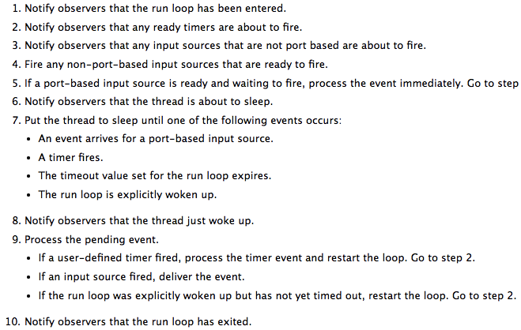

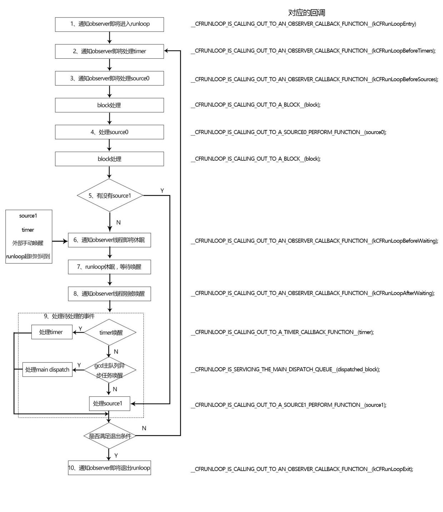

主线程runloop会处理gcd端口事件源。上面第五步从源码来看是检测gcd端口事件..这里还是有点疑惑的。

#### 关于runloop的休眠与唤醒
对于runloop而言最核心的事情就是保证线程在没有消息的时候休眠，在有消息时唤醒，以提高程序性能。runloop这个机制是依靠系统内核来完成的（苹果操作系统核心组件Darwin中的Mach）。

Mach提供了诸如处理器调度、IPC (进程间通信)等基础服务。在 Mach 中，进程、线程和虚拟内存都被称为"对象"。Mach 的对象间只能通过消息传递的方式实现对象间的通信。消息在两个端口 (port) 之间传递，这就是 Mach 的 IPC (进程间通信) 的核心。

**Runloop本质：mach_msg()**

Runloop通过`mach_msg()`函数接收、发送消息。它的本质是调用函数`mach_msg_trap()`，相当于是一个系统调用，会触发内核状态切换。当你在用户态调用`mach_msg_trap()` 时会触发陷阱机制，切换到内核态；内核态中内核实现的 `mach_msg()` 函数会完成实际的工作。

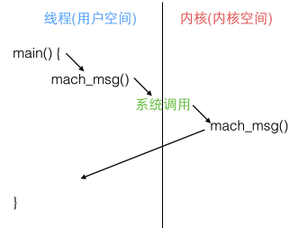

runloop用`mach_msg()`这个函数去接收消息，**如果没有内核发送port 消息过来，内核会将线程置于等待状态 mach_msg_trap() **(当前线程阻塞)。如果有消息返回（内核开新线程返回消息），判断消息类型处理事件，并通过modeItem的callback回调。(总结：基于port的source1，监听端口，端口有消息，触发回调；而source0，要手动标记为待处理和手动唤醒runloop)

例如你在模拟器里跑起一个 iOS 的 App，然后在 App 静止时点击暂停，你会看到主线程调用栈是停留在 mach_msg_trap() 这个地方。

关于Mach消息发送机制，可以看看[这篇文章](http://www.jianshu.com/p/a764aad31847)

**现在回到runloop的休眠与唤醒的讨论上来。**

我们关注于上述十步流程中的第七步：

```
//  进入循环开始不断的读取端口信息，如果端口有唤醒信息则唤醒当前runLoop
do {
    if (kCFUseCollectableAllocator) {
        objc_clear_stack(0);
        memset(msg_buffer, 0, sizeof(msg_buffer));
    }
    msg = (mach_msg_header_t *)msg_buffer;
    //7. 调用 mach_msg 等待接受 mach_port 的消息。线程将进入休眠, 直到被下面某一个事件唤醒。
    /// • 一个基于 port 的Source 的事件。
    /// • 一个 Timer 到时间了
    /// • RunLoop 自身的超时时间到了
    /// • 被其他什么调用者手动唤醒
    
    //如果poll为no，且waitset中无port有消息,线程进入休眠；否则唤醒
    __CFRunLoopServiceMachPort(waitSet, &msg, sizeof(msg_buffer), &livePort, poll ? 0 : TIMEOUT_INFINITY);
    //livePort是modeQueuePort，则代表为当前mode队列的端口
    if (modeQueuePort != MACH_PORT_NULL && livePort == modeQueuePort) {
        //不太懂
        while (_dispatch_runloop_root_queue_perform_4CF(rlm->_queue));
        //知道Timer被激活了才跳出二级循环继续循环一级循环
        if (rlm->_timerFired) {
            rlm->_timerFired = false;
            break;
        } else {
            if (msg && msg != (mach_msg_header_t *)msg_buffer) free(msg);
        }
    }
    //如果livePort不为modeQueuePort，runLoop被唤醒。这代表__CFRunLoopServiceMachPort给出的livePort只有两种可能：一种情况为MACH_PORT_NULL，另一种为真正获取的消息的端口。
    else {
        // Go ahead and leave the inner loop.
        break;
    }
} while (1);
```

runloop的休眠状态也是一个do-while循环。其中的核心处理函数`__CFRunLoopServiceMachPort `：

```
//真正让runloop休眠的地方
static Boolean __CFRunLoopServiceMachPort(mach_port_name_t port, mach_msg_header_t **buffer, size_t buffer_size, mach_port_t *livePort, mach_msg_timeout_t timeout) {
    Boolean originalBuffer = true;
    kern_return_t ret = KERN_SUCCESS;
    for (;;) {		/* In that sleep of death what nightmares may come ... */
        mach_msg_header_t *msg = (mach_msg_header_t *)*buffer;
        msg->msgh_bits = 0;
        msg->msgh_local_port = port;
        msg->msgh_remote_port = MACH_PORT_NULL;
        msg->msgh_size = buffer_size;
        msg->msgh_id = 0;
        //根据timerout参数的值来判断是让runloop 休眠还是继续查询（poll）
        if (TIMEOUT_INFINITY == timeout) { CFRUNLOOP_SLEEP(); } else { CFRUNLOOP_POLL(); }
        //调用mach_msg()函数接收消息
        ret = mach_msg(msg, MACH_RCV_MSG|MACH_RCV_LARGE|((TIMEOUT_INFINITY != timeout) ? MACH_RCV_TIMEOUT : 0)|MACH_RCV_TRAILER_TYPE(MACH_MSG_TRAILER_FORMAT_0)|MACH_RCV_TRAILER_ELEMENTS(MACH_RCV_TRAILER_AV), 0, msg->msgh_size, port, timeout, MACH_PORT_NULL);
        CFRUNLOOP_WAKEUP(ret);//唤醒
        if (MACH_MSG_SUCCESS == ret) {//成功获取到消息
            *livePort = msg ? msg->msgh_local_port : MACH_PORT_NULL;
            return true;
        }
        if (MACH_RCV_TIMED_OUT == ret) {//获取消息超时
            if (!originalBuffer) free(msg);
            *buffer = NULL;
            *livePort = MACH_PORT_NULL;
            return false;
        }
        if (MACH_RCV_TOO_LARGE != ret) break;
        buffer_size = round_msg(msg->msgh_size + MAX_TRAILER_SIZE);
        if (originalBuffer) *buffer = NULL;
        originalBuffer = false;
        *buffer = realloc(*buffer, buffer_size);
    }
    HALT;
    return false;
}
```
`__CFRunLoopServiceMachPort`用于接受指定端口(一个也可以是多个)的消息，最后一个参数代表当端口无消息的时候是否休眠，0是立刻返回不休眠，`TIMEOUT_INFINITY`代表休眠。

然后调用`mach_msg()`函数接收消息（如果没有port 消息，内核会将线程置于等待状态 `mach_msg_trap() `，所以来到这里，runloop如果没事做就休眠了），根据接收消息的结果对`livePort`进行赋值，一种是成功获取到消息后，会根据情况赋值为`msg->msgh_local_port`或者`MACH_PORT_NULL`，而另一种获取消息超时的情况会赋值为`MACH_PORT_NULL`。

然后在do-while循环那，对`livePort`为`modeQueuePort (当前mode队列端口)`这一情况的if处理那几行代码看得不太懂，如果有知道那几行代码是做什么的同学请联系我~。如果`livePort`不是`modeQueuePort`那么就是唤醒runloop的消息端口或者`MACH_PORT_NULL`。

接着来到第九步，就会看到对`livePort`不同情况的处理了：

```
        if (MACH_PORT_NULL == livePort) {//什么都不做（超时或..?
            CFRUNLOOP_WAKEUP_FOR_NOTHING();
            // handle nothing
        }
        //struct __CFRunLoop中有这么一项：__CFPort _wakeUpPort，用于手动将当前runloop线程唤醒，通过调用CFRunLoopWakeUp完成，CFRunLoopWakeUp会向_wakeUpPort发送一条消息
        else if (livePort == rl->_wakeUpPort) {//只有外界调用CFRunLoopWakeUp才会进入此分支，这是外部主动唤醒runLoop的接口
            CFRUNLOOP_WAKEUP_FOR_WAKEUP();//唤醒
        }
#if USE_DISPATCH_SOURCE_FOR_TIMERS
        else if (modeQueuePort != MACH_PORT_NULL && livePort == modeQueuePort) {
            CFRUNLOOP_WAKEUP_FOR_TIMER();
            ......
        }
#endif
#if USE_MK_TIMER_TOO
        //处理因timer的唤醒。9.1 如果一个 Timer 到时间了，触发这个Timer的回调。
        else if (rlm->_timerPort != MACH_PORT_NULL && livePort == rlm->_timerPort) {
            CFRUNLOOP_WAKEUP_FOR_TIMER();
            ......
        }
#endif
        else if (livePort == dispatchPort) {
            CFRUNLOOP_WAKEUP_FOR_DISPATCH(); 
            //9.2处理异步方法唤醒。处理gcd dispatch到main_queue的block，执行block。
        } else {
            // 9.3处理Source1 (基于port)
            CFRUNLOOP_WAKEUP_FOR_SOURCE();
            ......
            if (rls) {
                __CFRunLoopDoSource1(rl, rlm, rls, msg, msg->msgh_size, &reply) || sourceHandledThisLoop;
                ......
        } 
```

#### runloop的CallOut

runloop的回调，一般都是通过一个名字很长的函数，比如下面六个：打断点调试的时候可以在调用栈中看到他们的身影(换句话说你的代码其实最终都是通过下面几个函数来负责调用的，即使你自己监听Observer也会先调用下面的函数然后间接通知你)：

```
    static void __CFRUNLOOP_IS_CALLING_OUT_TO_AN_OBSERVER_CALLBACK_FUNCTION__();
    static void __CFRUNLOOP_IS_CALLING_OUT_TO_A_BLOCK__();
    static void __CFRUNLOOP_IS_SERVICING_THE_MAIN_DISPATCH_QUEUE__();
    static void __CFRUNLOOP_IS_CALLING_OUT_TO_A_TIMER_CALLBACK_FUNCTION__();
    static void __CFRUNLOOP_IS_CALLING_OUT_TO_A_SOURCE0_PERFORM_FUNCTION__();
    static void __CFRUNLOOP_IS_CALLING_OUT_TO_A_SOURCE1_PERFORM_FUNCTION__();
```

#### runloop退出的条件
一次性执行；app退出；线程关闭；设置最大时间到期；modeItem为空（实际上observer不算是源，所以就算有observer也是会返回的）；

### runloop应用举例

- 当点击app的按钮时（事件响应）

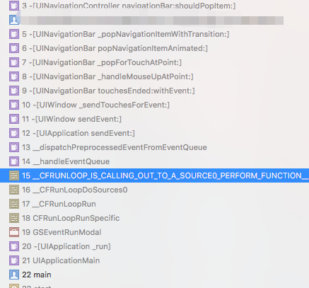

苹果注册了一个 Source1 (基于 mach port 的) 用来接收系统事件，其回调函数为 `__IOHIDEventSystemClientQueueCallback()`。当一个硬件事件(触摸/锁屏/摇晃等)发生后，首先由 `IOKit.framework` 生成一个 `IOHIDEvent` 事件并由 `SpringBoard` 接收。`SpringBoard` 只接收按键(锁屏/静音等)，触摸，加速，接近传感器等几种 `Event`，随后用 `mach port` 转发给需要的App进程。随后苹果注册的那个 `Source1` 就会触发回调，并调用` _UIApplicationHandleEventQueue()` 进行应用内部分发。 `_UIApplicationHandleEventQueue()` 会把 `IOHIDEvent` 处理并包装成 `UIEvent` 进行处理或分发，其中包括识别 UIGesture/处理屏幕旋转/发送给 `UIWindow` 等。通常事件比如 UIButton 点击、touchesBegin/Move/End/Cancel 事件都是在这个回调中完成的。

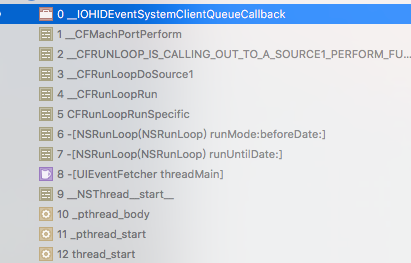

### 五、如何使用
#### 开启和关闭的接口
#### 1.CFRunLoopRef（CoreFoundation 框架）

```objective-c
//运行 CFRunLoopRef
void CFRunLoopRun();
//运行 CFRunLoopRef: 参数为运行模式、时间和是否在处理Input Source后退出标志，返回值是exit原因
SInt32 CFRunLoopRunInMode (mode, seconds, returnAfterSourceHandled);
//停止运行 CFRunLoopRef
void CFRunLoopStop( CFRunLoopRef rl );
```

1.1

```
void CFRunLoopRun();
```
```cpp
源码
void CFRunLoopRun(void) {	/* DOES CALLOUT */
    int32_t result;
    do {
        result = CFRunLoopRunSpecific(CFRunLoopGetCurrent(), kCFRunLoopDefaultMode, 1.0e10, false);
        CHECK_FOR_FORK();
    } while (kCFRunLoopRunStopped != result && kCFRunLoopRunFinished != result);
}
```

- 运行在`NSDefaultRunLoopMode`模式下。直到调用`CFRunLoopStop()`强制停止（kCFRunLoopRunStopped）或者source/timer/一个都没有了（kCFRunLoopRunFinished）。即源码`int32_t __CFRunLoopRun()`（就是之前上面那个几百行的）中的：

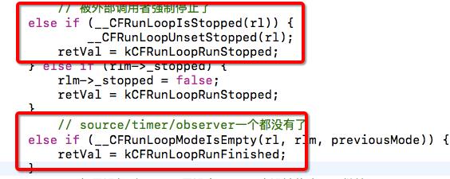

1.2

```
SInt32 CFRunLoopRunInMode (mode, seconds, returnAfterSourceHandled);
```

```cpp
SInt32 CFRunLoopRunInMode(CFStringRef modeName, CFTimeInterval seconds, Boolean returnAfterSourceHandled) {     /* DOES CALLOUT */
    CHECK_FOR_FORK();
    return CFRunLoopRunSpecific(CFRunLoopGetCurrent(), modeName, seconds, returnAfterSourceHandled);
}
```

- 参数。第一个：runloop运行模式。第二个：运行时间（超时时间）。第三个：是否在处理完source(source0\source1)之后让runloop退出返回。
- 接下来要讲的NSRunloop中的两个接口：`- (void)runUntilDate:(NSDate *)limitDate;`和`- (BOOL)runMode:(NSString *)mode beforeDate:(NSDate *)limitDate;`是基于这和函数进行封装的（猜测）。
- 源码上看，和上一个函数一样，都用到`CFRunLoopRunSpecific()`所以最终都是调用`int32_t __CFRunLoopRun()`。因此也即能用`CFRunLoopStop()`来退出runloop。
- 返回值。是导致runloop退出的原因。
```
enum {
    kCFRunLoopRunFinished = 1,
    kCFRunLoopRunStopped = 2,
    kCFRunLoopRunTimedOut = 3,
    kCFRunLoopRunHandledSource = 4
};
```

1.3

```
void CFRunLoopStop( CFRunLoopRef rl );
```
能停掉由上面两个函数启动的runloop。

#### 2.NSRunloop（Foundation框架）
```
//运行模式为默认的NSDefaultRunLoopMode模式，没有超时限制
- (void)run;
//运行模式为默认的NSDefaultRunLoopMode模式 ，参数为运时间期限
- (void)runUntilDate:(NSDate *)limitDate;
//对runloop运行模式、时间期限可以自行设置
- (BOOL)runMode:(NSString *)mode beforeDate:(NSDate *)limitDate;
```

2.1

```
- (void)run;
```

- 循环一旦开启，就关闭不了，并且之后的代码就无法执行。api文档中提到：如果没有输入源和定时源加入到runloop中，runloop就马上退出，否则通过频繁调用`-runMode:beforeDate:`方法来让runloop运行在`NSDefaultRunLoopMode`模式下。
但是！人为地移除输入源、timer不能保证runloop会退出，因为系统有可能会自己添加一些源来处理事件。（下面两种方法也是）
- 无法用`CFRunLoopStop(runloopRef)`退出，这种方式启动的runloop不利于控制，不建议使用。

2.2

```
- (void)runUntilDate:(NSDate *)limitDate;
```

- 运行在NSDefaultRunLoopMode模式，有超时时间限制。它实际上也是不断调用`-runMode:beforeDate:`方法来让runloop运行在`NSDefaultRunLoopMode`模式下，直到到达超时时间。
- 调用`CFRunLoopStop(runloopRef)`无法停止Run Loop的运行。为什么呢..因为这个方法只会结束**当前**`-runMode:beforeDate:`的调用，之后的`-runMode:beforeDate:`该调用的还是会继续。。。直到timeout。

- 对应`CFRunLoopRunInMode(kCFRunLoopDefaultMode,limiteDate,false)`

2.3
```
- (BOOL)runMode:(NSString *)mode beforeDate:(NSDate *)limitDate;
```

- 相比上一种方法可以指定运行模式。
- 对应`CFRunLoopRunInMode(mode,limiteDate,true)方法`,只执行一次，执行完就退出。
- 可以用`CFRunLoopStop(runloopRef)`退出runloop。
- api文档里面提到：在第一个input source（非timer）被处理或到达limitDate之后runloop退出。

```objective-c
 - (void)viewDidLoad {
    [super viewDidLoad];
    self.view.backgroundColor = [UIColor whiteColor];
    
    UIButton *btn = [[UIButton alloc]initWithFrame:CGRectMake(0, 80, 50, 50)];
    btn.backgroundColor = [UIColor redColor];
    [self.view addSubview:btn];
    [btn addTarget:self action:@selector(clicked) forControlEvents:UIControlEventTouchUpInside];
    
    NSThread *thread = [[NSThread alloc]initWithTarget:self selector:@selector(threadMethod) object:nil];
    self.thread = thread;
    [self.thread start];
}

 - (void)threadMethod{
    @autoreleasepool {   
        [[NSRunLoop currentRunLoop]addPort:[NSMachPort port] forMode:NSDefaultRunLoopMode];
        [[NSRunLoop currentRunLoop] runMode:NSDefaultRunLoopMode beforeDate:[NSDate distantFuture]];
        NSLog(@"thread end");
    }
}

 - (void)clicked{
    [self performSelector:@selector(doSomething) onThread:self.thread withObject:nil waitUntilDone:NO];
    }
}

 - (void)doSomething{
    NSLog(@"doSomething");
}
```
```
2017-06-04 21:05:55.316 Test[61381:5557174] doSomething
2017-06-04 21:05:55.317 Test[61381:5557174] thread end
```

给runloop添加源`[NSMachPort port]`保活，执行完perform selector（重温一下，这里会给runloop添加一个源） runloop就退出了。

这里可以从源码上解释一下：

回顾上面那几百行的源码，我们可以看到其实这个runloop 的do-while循环是由一个变量retVal的值来控制的，也即代码的最后几行：

```cpp
        // 进入loop时参数说处理完事件就返回。
    if (sourceHandledThisLoop && stopAfterHandle) {
        retVal = kCFRunLoopRunHandledSource;
        }
        // 超出传入参数标记的超时时间了
    else if (timeout_context->termTSR < mach_absolute_time()) {
            retVal = kCFRunLoopRunTimedOut;
    }
        // 被外部调用者强制停止了
    else if (__CFRunLoopIsStopped(rl)) {
            __CFRunLoopUnsetStopped(rl);
        retVal = kCFRunLoopRunStopped;
    } else if (rlm->_stopped) {
        rlm->_stopped = false;
        retVal = kCFRunLoopRunStopped;
    }
        // source/timer/observer一个都没有了
    else if (__CFRunLoopModeIsEmpty(rl, rlm, previousMode)) {
        retVal = kCFRunLoopRunFinished;
    }
        // 如果没超时，mode里没空，loop也没被停止，那继续loop。
    } while (0 == retVal);
```

`- (BOOL)runMode:(NSString *)mode beforeDate:(NSDate *)limitDate;`，对应`CFRunLoopRunInMode(mode,limiteDate,true)`。因此

```cpp
  if (sourceHandledThisLoop && stopAfterHandle) {
      retVal = kCFRunLoopRunHandledSource;
      }
```

中的stopAfterHandle值就是true。由于这里的perform源是source0，因此也即：

```
//4.处理source0事件
        Boolean sourceHandledThisLoop = __CFRunLoopDoSources0(rl, rlm, stopAfterHandle);
```
sourceHandledThisLoop在这里赋值为true。

如果是source1源也是同理分析，所以在第一个input source被处理之后runloop退出。

#### 一些比较基本的常见问题
基本使用三步骤

添加事件到runloop中：1.创建事件（源） 2.指定该事件（源）在runloop中的运行模式，并加入到runloop中 3.在与runloop的模式匹配时，事件（源）运行

##### 1.ModeItem要在对应的Mode下才会被runloop处理
主线程中执行以下代码：

```objective-c
- (void)viewDidLoad {
    [super viewDidLoad];
    //创建timer
//    参数1：间隔时间   参数2：对象   参数3：方法   参数4：自定义   参数5：是否重复执行
    NSTimer *timer = [NSTimer timerWithTimeInterval:1 target:self selector:@selector(task) userInfo:nil repeats:YES];
    //把定时源加入到当前线程下的消息循环中
    [[NSRunLoop currentRunLoop]addTimer:timer forMode:NSDefaultRunLoopMode];
}
 - (void)task{
//    输出当前循环模式
    NSLog(@"%@",[[NSRunLoop currentRunLoop]currentMode]);
    NSLog(@"task is running");
}
```

设置timer在NSDefaultRunLoopMode模式下运行。一开始什么也不做，timer正常运行；当对屏幕界面进行滚动时，timer停止运行。这是因为：没有拖动界面时是kCFRunLoopDefaultMode，拖动界面则是UITrackingRunLoopMode模式，与设置的模式不匹配所以无法运行。

如果需要在两个 Mode 中都能得到运行，一种办法就是将这个 Timer 分别加入这两个 Mode。还有一个方法，就是将 Timer 加入到顶层的 RunLoop 的 commonItem中，在每次runLoop运行的时候都会被同步到具有Common标记的Modes里。

```
[[NSRunLoop currentRunLoop] addTimer:timer forMode:NSRunLoopCommonModes];
```

ps:`[NSTimer scheduledTimerWithTimeInterval:2.0 target:self selector:@selector(run) userInfo:nil repeats:YES];`就相当于：上面viewDidLoad里面的两句代码，自动添加到当前runloop且在default mode模式下。如果要修改模式，调用一次addTimer:forMode:方法就可以了`[[NSRunLoop currentRunLoop] addTimer:timer forMode:NSRunLoopCommonModes];`

##### 2.子线程的runloop要手动开启
往指定线程的runloop中加入源：performSelector...

```objective-c
- (void)viewDidLoad {
    [super viewDidLoad];
//创建子线程
    NSThread *thread = [[NSThread alloc] initWithTarget:self selector:@selector(task2) object:nil];
    [thread start];
    //往指定线程的消息循环中加入源
    //参数1:方法   参数2:指定线程   参数3:对象   参数4:等待方法执行完成
    [self performSelector:@selector(addtask) onThread:thread withObject:nil waitUntilDone:NO];
    }
 -(void)task2{
    NSLog(@"task2 is running %@",[NSThread currentThread]);
}
 -(void)addtask{
    NSLog(@"addtask is running");
}
```

performSelector中的方法addtask不会执行，因为线程的方法瞬间就执行完了，线程就结束被回收了而且线程也不会监听是否有方法继续交给它执行。

每个线程有自己的runLoop, 我们可以通过`[NSRunLoop currentRunLoop]`或`CFRunLoopGetCurrent()`来获取。 不过只有主线程的runLoop是默认启动的，其他线程的runloop就需要我们手动启动。

需要在子线程中开启runloop：

```objective-c
 - (void)task2{
    NSLog(@"task2 is running %@",[NSThread currentThread]);
//方式一
//    [[NSRunLoop currentRunLoop]run];
//    NSLog(@"over");//不会打印，因为一直在循环，没有退出 
//方式二
//    [[NSRunLoop currentRunLoop]runUntilDate:[NSDate dateWithTimeIntervalSinceNow:2.0]];
//    NSLog(@"over");    
//方式三，apple推荐
//    BOOL shouldKeepRunning = YES;        // global
    NSRunLoop *theRL = [NSRunLoop currentRunLoop];
    while (shouldKeepRunning && [theRL runMode:NSDefaultRunLoopMode beforeDate:[NSDate distantFuture]]);//通过全局变量控制runloop的开关
    NSLog(@"over");//这句不会执行
}
```

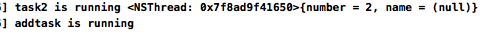

如果想runloop可以终止的，官方推荐：`- (BOOL)runMode:(NSString *)mode beforeDate:(NSDate *)limitDate;`官方example:

```
BOOL shouldKeepRunning = YES;        //全局变量
  NSRunLoop *theRL = [NSRunLoop currentRunLoop];
  while (shouldKeepRunning && [theRL runMode:NSDefaultRunLoopMode beforeDate:[NSDate distantFuture]]);
```
通过全局变量控制runloop的开关。

##### 3.要给runloop添加modeItem，否则runloop退出
如果mode中一个item都没有，runloop退出。下面稍微修改一下上面2的代码：把performSelector方法放到touchesBegan中

```objective-c
- (void)viewDidLoad {
    [super viewDidLoad];
    //创建子线程
    self.thread = [[NSThread alloc] initWithTarget:self selector:@selector(task2) object:nil];
    [self.thread start];
    //往指定线程的消息循环中加入源
    //参数1:方法   参数2:指定线程   参数3:对象   参数4:等待方法执行完成
//    [self performSelector:@selector(addtask) onThread:thread withObject:nil waitUntilDone:NO];
}
-(void)task2{
    NSLog(@"task2 is running %@",[NSThread currentThread]);
//    [[NSRunLoop currentRunLoop] addPort:[NSPort port] forMode:NSDefaultRunLoopMode];
    while (YES && [[NSRunLoop currentRunLoop] runMode:NSDefaultRunLoopMode beforeDate:[NSDate distantFuture]]);
    NSLog(@"over");
}
-(void)addtask{
    NSLog(@"addtask is running");
}

- (void)touchesBegan:(NSSet *)touches withEvent:(UIEvent *)event
{
    [self performSelector:@selector(addtask) onThread:self.thread withObject:nil waitUntilDone:NO];
}
```

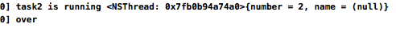

运行，"over"被打印出来了，证明runloop退出。点击屏幕，addtask方法没有执行。
这个方法创建Source 0 任务，并分发到指定线程的 RunLoop 中。

```objective-c
- (void)performSelector:(SEL)aSelector
               onThread:(NSThread *)thr
             withObject:(id)arg
          waitUntilDone:(BOOL)wait
                  modes:(NSArray *)array;
```

那为什么和代码修改前的运行结果不一样？个人理解是这样的，2.中在子线程runloop开启前就已经添加了source0事件源了。而现在修改后的代码，把事件源的添加分离开来了，先开了子线程，而等到用户点击屏幕的时候才会添加事件源；对于子线程，runloop虽然创建并且开启了，但是因为一直没有mode item，因此runloop马上就退出了。

那怎么解决？一种简单粗暴的方法，在runloop开启之前给它加个mode item咯：

```objective-c
-(void)task2{
    NSLog(@"task2 is running %@",[NSThread currentThread]);
//加个端口的源
    [[NSRunLoop currentRunLoop] addPort:[NSPort port] forMode:NSDefaultRunLoopMode];
    while (YES && [[NSRunLoop currentRunLoop] runMode:NSDefaultRunLoopMode beforeDate:[NSDate distantFuture]]);
    NSLog(@"over");
}
```

如果这样子改：

```objective-c
-(void)task2{
    NSLog(@"task2 is running %@",[NSThread currentThread]);
    while (1) {
        [[NSRunLoop currentRunLoop] runMode:NSDefaultRunLoopMode beforeDate:[NSDate distantFuture]];
    }
}
```

在运行上来讲是没问题的，用户点击屏幕的时候addtask方法会执行。不过，runloop一开始没有modeitem的问题还是存在的，这导致在while循环里面runloop不断创建、启动、退出，直到点击屏幕有事件源添加进来为止。

ps:
> 当调用 NSObject 的 performSelecter:afterDelay: 后，实际上其内部会创建一个 Timer 并添加到当前线程的 RunLoop 中。所以如果当前线程没有 RunLoop，则这个方法会失效。

##### 4.observer设置监听runloop状态

```c
// 创建observer
CFRunLoopObserverRef observer = CFRunLoopObserverCreateWithHandler(CFAllocatorGetDefault(), kCFRunLoopAllActivities, YES, 0, ^(CFRunLoopObserverRef observer, CFRunLoopActivity activity) {
        NSLog(@"----监听到RunLoop状态发生改变---%zd", activity);
    });
    // 添加观察者：监听RunLoop的状态
    CFRunLoopAddObserver(CFRunLoopGetCurrent(), observer, kCFRunLoopDefaultMode);   
    // 释放Observer
    CFRelease(observer);
```
创建observer，用`CFRunLoopObserverCreateWithHandler`函数，参数1：分配内存 参数2：要监听哪个runloop状态的标记 参数3：是否重复。这个observer是只调用一次还是runloop每次循环都调 参数4：优先级，一般传0 参数5：回调

可以通过监听runloop状态，从而达到检测是否发生卡顿的目的。
如果 RunLoop 的线程，进入睡眠前方法的执行时间过长而导致无法进入睡眠，或者线程唤醒后接收消息时间过长而无法进入下一步的话，就可以认为是线程受阻了。如果这个线程是主线程的话，表现出来的就是出现了卡顿。所以，如果我们要利用 RunLoop 原理来监控卡顿的话，就是要关注这两个阶段。RunLoop 在进入睡眠之前和唤醒后的两个 loop 状态定义的值，分别是 kCFRunLoopBeforeSources 和 kCFRunLoopAfterWaiting ，也就是要触发 Source0 回调和接收 mach_port 消息两个状态。

将创建好的观察者 runLoopObserver 添加到主线程 RunLoop 的 common 模式下观察。然后，创建一个持续的子线程专门用来监控主线程的 RunLoop 状态。一旦发现进入睡眠前的 kCFRunLoopBeforeSources 状态，或者唤醒后的状态 kCFRunLoopAfterWaiting，在设置的时间阈值内一直没有变化，即可判定为卡顿。接下来，我们就可以 dump 出堆栈的信息，从而进一步分析出具体是哪个方法的执行时间过长。

##### 5.CF的内存管理
1. 凡是带有Create、Copy、Retain等字眼的函数，创建出来的对象，都需要在最后做一次release
2. release函数：CFRelease(对象);

上面这段代码放到vc的viewDidLoad中跑，其他什么也不加不做，会发现控制台打印最后停在“32”的地方：

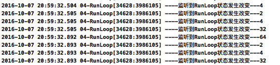

这个就是`kCFRunLoopBeforeWaiting = (1UL << 5), // runloop即将进入休眠`。然后点击一下屏幕上的一个按钮，然后看控制台输出，可知runloop先唤醒，然后处理各种事件（包括点击事件），最后又回到休眠状态

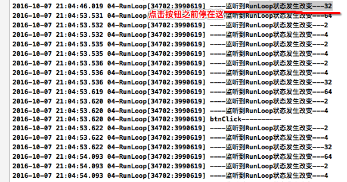


### 其他runloop相关
##### autoreleasepool自动释放池在什么时候释放
先上代码，运行在MRC环境下：

```objective-c
Person.h

@interface Person : NSObject
@property (nonatomic,copy) NSString *name;
+ (instancetype)personInitWithName:(NSString *)name;
@end

Person.m

@implementation Person
+ (instancetype)personInitWithName:(NSString *)name{
//MRC内存管理原则：谁创建谁释放
    Person *person = [[[Person alloc]init]autorelease];//自动释放池 延时释放
    person.name = name;
    return person;
}
@end

vc.m
#import "Person.h"
@property (nonatomic ,assign)Person *person1;
- (void)viewDidLoad{
    ........ 
    self.person1 = [Person personInitWithName:@"name1"];
    NSLog(@"%@",self.person1.name);
}
- (IBAction)clicked:(id)sender {
    NSLog(@"person.name:%@",self.person1.name);//MRC下点击按钮后报野指针错误
}
```
MRC内存管理原则：谁创建谁释放。代码中使用autorelease来对person对象进行释放。自动释放池释放时，对池内所有对象都发送一次release，person对象被释放。

运行结果：在点击完按钮之后报野指针错误，即对象已经被释放掉了。对此，可以从对象释放反推出自动释放池已经被释放了。那为什么会在这个时候释放？

先看下面这张图：

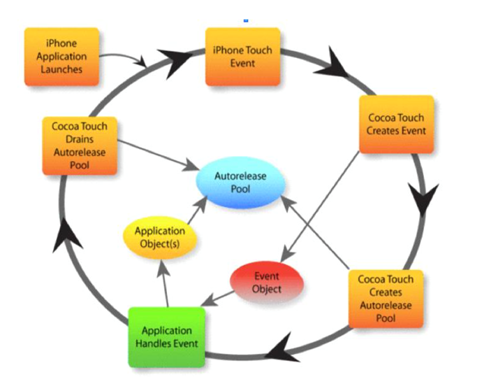

iPhone应用程序运行->有触摸事件->cocoaTouch创建事件，生成事件对象->cocoaTouch创建自动释放池->应用处理事件（就是一些我们自己写的代码，并有可能产生一些中间、临时对象，这些对象放在自动释放池中）->事件处理完毕自动释放池释放

*官方文档：The Application Kit creates an autorelease pool on the main thread at the beginning of every cycle of the event loop, and drains it at the end, thereby releasing any autoreleased objects generated while processing an event. 在主线程事件循环开始的时候创建了自动释放池,在事件循环结束的时候释放自动释放池，因此在处理事件过程中产生的一些自动释放的对象会被释放掉*

实际上,苹果在主线程 RunLoop 里注册了两个 Observer。第一个 Observer 监视的事件是即将进入Loop，其优先级最高，保证创建释放池发生在其他所有回调之前。
第二个 Observer 监视了两个事件：准备进入休眠时**释放旧的池并创建新池**；即将退出Loop时释放自动释放池。优先级最低，保证其释放池子发生在其他所有回调之后。

代码中，viewDidLoad的代码执行完runloop就要进入休眠了，这时候先释放旧池并把person对象释放。点击事件把runloop唤醒，之后再新池里访问释放掉的对象就报野指针错误了。

> 在主线程执行的代码，通常是写在诸如事件回调、Timer回调内的。这些回调会被 RunLoop 创建好的 AutoreleasePool 环绕着，所以不会出现内存泄漏，开发者也不必显示创建 Pool 了。

**什么时候使用自动释放池？**

- 开启子线程的时候要自己创建自动释放池，否则可能会发生内存泄露。

 使用 NSThread 做多线程开发时,需要在线程调度方法中手动添加自动释放池。比如：
 
```objective-c
NSThread *thread = [[NSThread alloc] initWithTarget:self selector:@selector(execute) object:nil];
[thread start];
......
 - (void)execute{
    @autoreleasepool{
        NSTimer *timer ...
        [[NSRunLoop currentRunLoop]addTimer:timer forMode:NSDefaultRunLoopMode];
        [[NSRunLoop currentRunLoop]run];
    }
}
```

- 循环中创建了许多临时对象，在循环里面使用自动释放池，用来减少高内存占用。举例：

```objective-c
 for (int i = 0; i < largeNumber; ++i) {
    NSString *str = @"Hello World";
    str = [str stringByAppendingFormat:@" - %d", i];
    str = [str uppercaseString];
    NSLog(@"%@", str);
 }
```

运行这段代码，将会看到内存占用情况一直在增长，因为循环中的临时对象没有被释放掉。
改进：

```objective-c
 for (int i = 0; i < largeNumber; ++i) {
    @autoreleasepool{
    ......要执行的代码
    }
 }
```

更多有关 **苹果用 RunLoop 实现的功能**比如事件响应、手势识别、界面更新、定时器、performSelector、GCD等本人还没有深入研究，在这里就不展开了，如果以后用到再另外写笔记吧。

参考文章：

[官方文档](https://developer.apple.com/library/content/documentation/Cocoa/Conceptual/Multithreading/RunLoopManagement/RunLoopManagement.html#//apple_ref/doc/uid/10000057i-CH16-SW23)

经典runloop技术文：

[深入理解RunLoop](http://blog.ibireme.com/2015/05/18/runloop/)

runloop源码分析（runloop几个重要的函数源码阅读）：

[Runloop源码分析](http://www.jianshu.com/p/fefe2ba87c68#)

Mach相关：

[Mach消息发送机制](http://www.jianshu.com/p/a764aad31847)
[进程间通信 (OSX/iOS)](https://segmentfault.com/a/1190000002400329)

其他：

runloop嵌套：

[NSRunLoop原理详解——不再有盲点
](http://www.jianshu.com/p/4263188ed940)

[Cocoa深入学习:NSOperationQueue、NSRunLoop和线程安全](https://blog.cnbluebox.com/blog/2014/07/01/cocoashen-ru-xue-xi-nsoperationqueuehe-nsoperationyuan-li-he-shi-yong/)

[源码解析之RunLoop详解](http://www.jianshu.com/p/ec629063390f)

[ios开发－－RunLoop 与GCD 、Autorelease Pool之间的关系](http://lib.csdn.net/article/ios/60437)
