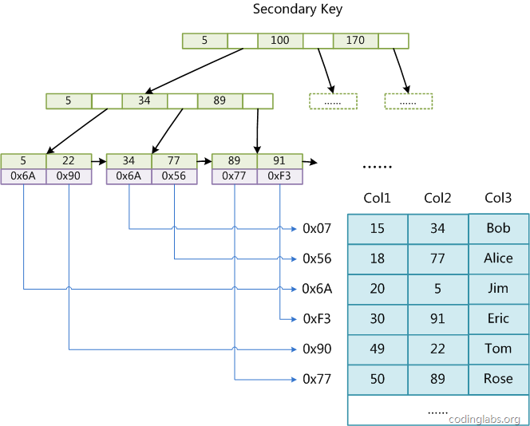

## 索引数据结构设相关的计算机原理

二叉树、红黑树等数据结构也可以用来实现索引，但是文件系统及数据库系统普遍采用B-/+Tree作为索引结构，这一节将结合计算机组成原理相关知识讨论B-/+Tree作为索引的理论基础。

### 1 两种类型的存储

在计算机系统中一般包含两种类型的存储，计算机主存（RAM）和外部存储器（如硬盘、CD、SSD等）。在设计索引算法和存储结构时，我们必须要考虑到这两种类型的存储特点。主存的读取速度快，相对于主存，外部磁盘的数据读取速率要比主从慢好几个数量级，具体它们之间的差别后面会详细介绍。 上面讲的所有查询算法都是假设数据存储在计算机主存中的，计算机主存一般比较小，实际数据库中数据都是存储到外部存储器的。

一般来说，索引本身也很大，不可能全部存储在内存中，因此索引往往以索引文件的形式存储的磁盘上。这样的话，索引查找过程中就要产生磁盘I/O消耗，相对于内存存取，I/O存取的消耗要高几个数量级，所以评价一个数据结构作为索引的优劣最重要的指标就是在查找过程中磁盘I/O操作次数的渐进复杂度。换句话说，索引的结构组织要尽量减少查找过程中磁盘I/O的存取次数。下面详细介绍内存和磁盘存取原理，然后再结合这些原理分析B-/+Tree作为索引的效率。

### 2 主存存取原理

目前计算机使用的主存基本都是随机读写存储器（RAM），现代RAM的结构和存取原理比较复杂，这里本文抛却具体差别，抽象出一个十分简单的存取模型来说明RAM的工作原理。 


从抽象角度看，主存是一系列的存储单元组成的矩阵，每个存储单元存储固定大小的数据。每个存储单元有唯一的地址，现代主存的编址规则比较复杂，这里将其简化成一个二维地址：通过一个行地址和一个列地址可以唯一定位到一个存储单元。上图展示了一个4 x 4的主存模型。

主存的存取过程如下：

当系统需要读取主存时，则将地址信号放到地址总线上传给主存，主存读到地址信号后，解析信号并定位到指定存储单元，然后将此存储单元数据放到数据总线上，供其它部件读取。写主存的过程类似，系统将要写入单元地址和数据分别放在地址总线和数据总线上，主存读取两个总线的内容，做相应的写操作。

这里可以看出，主存存取的时间仅与存取次数呈线性关系，因为**不存在机械操作**，两次存取的数据的“距离”不会对时间有任何影响，例如，先取A0再取A1和先取A0再取D3的时间消耗是一样的。

### 3 磁盘存取原理

上文说过，索引一般以文件形式存储在磁盘上，索引检索需要磁盘I/O操作。与主存不同，**磁盘I/O存在机械运动耗费**，因此磁盘I/O的时间消耗是巨大的。

磁盘的整体结构示意图


一个磁盘由大小相同且同轴的圆形盘片组成，磁盘可以转动（各个磁盘必须同步转动）。在磁盘的一侧有磁头支架，磁头支架固定了一组磁头，每个磁头负责存取一个磁盘的内容。磁头不能转动，但是可以沿磁盘半径方向运动（实际是斜切向运动），每个磁头同一时刻也必须是同轴的，即从正上方向下看，所有磁头任何时候都是重叠的（不过目前已经有多磁头独立技术，可不受此限制）。

磁盘结构的示意图


盘片被划分成一系列同心环，圆心是盘片中心，每个同心环叫做一个磁道，所有半径相同的磁道组成一个柱面。磁道被沿半径线划分成一个个小的段，每个段叫做一个扇区，每个扇区是磁盘的最小存储单元。为了简单起见，我们下面假设磁盘只有一个盘片和一个磁头。

磁盘读取数据靠的是机械运动，当需要从磁盘读取数据时，系统会将数据逻辑地址传给磁盘，磁盘的控制电路按照寻址逻辑将逻辑地址翻译成物理地址，即确定要读的数据在哪个磁道，哪个扇区。为了读取这个扇区的数据，需要将磁头放到这个扇区上方，为了实现这一点，磁头需要移动对准相应磁道，这个过程叫做**寻道**，所耗费时间叫做**寻道时间**，然后磁盘旋转将目标扇区旋转到磁头下，这个过程耗费的时间叫做**旋转时间**，最后便是对读取数据的传输。 所以每次读取数据花费的时间可以分为**寻道时间、旋转延迟、传输时间**三个部分。其中：

- 寻道时间是磁臂移动到指定磁道所需要的时间，主流磁盘一般在5ms以下。
- 旋转延迟就是我们经常听说的磁盘转速，比如一个磁盘7200转，表示每分钟能转7200次，也就是说1秒钟能转120次，旋转延迟就是1/120/2 = 4.17ms。
- 传输时间指的是从磁盘读出或将数据写入磁盘的时间，一般在零点几毫秒，相对于前两个时间可以忽略不计。

那么访问一次磁盘的时间，即一次磁盘IO的时间约等于5+4.17 = 9ms左右，听起来还挺不错的，但要知道一台500 -MIPS的机器每秒可以执行5亿条指令，因为指令依靠的是电的性质，换句话说执行一次IO的时间可以执行40万条指令，数据库动辄十万百万乃至千万级数据，每次9毫秒的时间，显然是个灾难。

### 4 局部性原理与磁盘预读

由于存储介质的特性，磁盘本身存取就比主存慢很多，再加上机械运动耗费，磁盘的存取速度往往是主存的几百分分之一，因此为了提高效率，要**尽量减少磁盘I/O**。为了达到这个目的，**磁盘往往不是严格按需读取，而是每次都会预读，即使只需要一个字节，磁盘也会从这个位置开始，顺序向后读取一定长度的数据放入内存**。这样做的理论依据是计算机科学中著名的局部性原理：**当一个数据被用到时，其附近的数据也通常会马上被使用。程序运行期间所需要的数据通常比较集中。**

由于磁盘顺序读取的效率很高（不需要寻道时间，只需很少的旋转时间），因此对于具有局部性的程序来说，预读可以提高I/O效率。**预读的长度一般为页（page）的整倍数**。页是计算机管理存储器的逻辑块，硬件及操作系统往往将主存和磁盘存储区分割为连续的大小相等的块，每个存储块称为一页（在许多操作系统中，页得大小通常为4k），主存和磁盘以页为单位交换数据。当程序要读取的数据不在主存中时，会触发一个缺页异常，此时系统会向磁盘发出读盘信号，磁盘会找到数据的起始位置并向后连续读取一页或几页载入内存中，然后异常返回，程序继续运行。

## 数据库索引所采用的数据结构B-/+Tree及其性能分析

### 1. B-Tree分析

根据B-Tree的定义，可知检索一次最多需要访问h-1个节点（根节点常驻内存）。数据库系统的设计者巧妙利用了磁盘预读原理，**将一个节点的大小设为等于一个页**，这样每个节点只需要一次I/O就可以完全载入。为了达到这个目的，在实际实现B-Tree还需要使用如下技巧：**每次新建节点时，直接申请一个页的空间，这样就保证一个节点物理上也存储在一个页里**，加之计算机存储分配都是按页对齐的，就实现了一个node只需一次I/O。

**B-Tree中一次检索最多需要h-1次I/O（根节点常驻内存），渐进复杂度为O(h)=O(logdN)。一般实际应用中，出度d是非常大的数字，通常超过100，因此h非常小（通常不超过3）**。

综上所述，如果我们采用B-Tree存储结构，搜索时I/O次数一般不会超过3次，所以用B-Tree作为索引结构效率是非常高的。

### 2. B+树性能分析

B树的搜索复杂度为O(h)=O(logdN)，所以树的出度d越大，深度h就越小，I/O的次数就越少。B+Tree恰恰可以增加出度d的宽度，因为每个节点大小为一个页大小，所以出度的上限取决于节点内key和data的大小：

`dmax = floor(pagesize/(keysize+datasize+pointsize))//floor表示向下取整`

由于B+Tree内节点去掉了data域，因此可以拥有更大的出度，从而拥有更好的性能。

## MySQL索引实现

主要讨论MyISAM和InnoDB两个存储引擎的索引实现方式。

### 1. MyISAM索引实现

MyISAM引擎使用B+Tree作为索引结构，叶节点的data域存放的是数据记录的地址。


这里设表一共有三列，假设我们以Col1为主键。上图中是一个MyISAM表的主索引（Primary key）示意。可以看出MyISAM的索引文件B+Tree的data域仅仅保存数据记录的地址。在MyISAM中，主索引和辅助索引（Secondary key）在结构上没有任何区别，只是**主索引要求key是唯一**的，而辅助索引的key可以重复。如果我们在Col2上建立一个辅助索引，则此索引的结构如下图所示：



同样也是一颗B+Tree，data域保存数据记录的地址。因此，MyISAM中索引检索的算法为首先按照B+Tree搜索算法搜索索引，如果指定的Key存在，则取出其data域的值，然后以data域的值为地址，读取相应数据记录。

**MyISAM的索引方式也叫做“非聚集”的**，之所以这么称呼是为了与InnoDB的聚集索引区分。

### 2. InnoDB索引实现

**InnoDB的数据文件本身就是索引文件**。从上文知道，MyISAM索引文件和数据文件是分离的，索引文件仅保存数据记录的地址。而在InnoDB中，表数据文件本身就是按B+Tree组织的一个索引结构，这棵**树的叶节点data域保存了完整的数据记录**。这个索引的key是数据表的主键，因此**InnoDB表数据文件本身就是主索引**。


上图是InnoDB主索引（同时也是数据文件）的示意图，可以看到叶节点包含了完整的数据记录。**这种索引叫做聚集索引**。因为InnoDB的数据文件本身要按主键聚集，所以**InnoDB要求表必须有主键**（MyISAM可以没有），如果没有显式指定，则MySQL系统会自动选择一个可以唯一标识数据记录的列作为主键，如果不存在这种列，则MySQL自动为InnoDB表生成一个隐含字段作为主键，这个字段长度为6个字节，类型为长整形。

第二个与MyISAM索引的不同是**InnoDB的辅助索引data域存储相应记录主键的值而不是地址**。换句话说，InnoDB的所有辅助索引都引用主键作为data域。下图为定义在Col3上的一个辅助索引：


这里以英文字符的ASCII码作为比较准则。聚集索引这种实现方式使得按主键的搜索十分高效，但是**辅助索引搜索需要检索两遍索引**：首先检索辅助索引获得主键，然后用主键到主索引中检索获得记录。

了解不同存储引擎的索引实现方式对于正确使用和优化索引都非常有帮助，例如知道了InnoDB的索引实现后，就很容易明白为什么**不建议使用过长的字段作为主键**，因为所有辅助索引都引用主索引，过长的主索引会令辅助索引变得过大。再例如，**用非单调的字段作为主键在InnoDB中不是个好主意**，因为InnoDB数据文件本身是一颗B+Tree，非单调的主键会造成在插入新记录时数据文件为了维持B+Tree的特性而频繁的分裂调整，十分低效，而使用自增字段作为主键则是一个很好的选择。

## 索引使用策略及优化

MySQL的优化主要分为**结构优化**（Scheme optimization）和**查询优化**（Query optimization）。本章讨论的高性能索引策略主要属于结构优化范畴。本章的内容完全基于上文的理论基础，实际上一旦理解了索引背后的机制，那么选择高性能的策略就变成了纯粹的推理，并且可以理解这些策略背后的逻辑。

### 1. 联合索引及最左前缀原理

#### 联合索引（复合索引）

首先介绍一下联合索引。联合索引其实很简单，相对于一般索引只有一个字段，联合索引可以为多个字段创建一个索引。它的原理也很简单，比如，我们在（a,b,c）字段上创建一个联合索引，则索引记录会首先按照A字段排序，然后再按照B字段排序然后再是C字段，因此，联合索引的特点就是：

- 第一个字段一定是有序的
- 当第一个字段值相等的时候，第二个字段又是有序的，比如下表中当A=2时所有B的值是有序排列的，依次类推，当同一个B值得所有C字段是有序排列的

```
| A | B | C | 
| 1 | 2 | 3 | 
| 1 | 4 | 2 | 
| 1 | 1 | 4 | 
| 2 | 3 | 5 | 
| 2 | 4 | 4 | 
| 2 | 4 | 6 | 
| 2 | 5 | 5 |
```

其实联合索引的查找就跟查字典是一样的，先根据第一个字母查，然后再根据第二个字母查，或者只根据第一个字母查，但是不能跳过第一个字母从第二个字母开始查。这就是所谓的最左前缀原理。

#### 2. 最左前缀原理

我们再来详细介绍一下联合索引的查询。还是上面例子，我们在（a,b,c）字段上建了一个联合索引，所以这个索引是先按a 再按b 再按c进行排列的，所以：

以下的查询方式都可以用到索引

```
select * from table where a=1；
select * from table where a=1 and b=2；
select * from table where a=1 and b=2 and c=3；
```

上面三个查询按照 （a ）, （a，b ）,（a，b，c ）的顺序都可以利用到索引，这就是最左前缀匹配。

如果查询语句是：

`1select * from table where a=1 and c=3；` 那么只会用到索引a。


如果查询语句是：

`select * from table where b=2 and c=3；` 因为没有用到最左前缀a，所以这个查询是用不到索引的。

如果用到了最左前缀，但是顺序颠倒会用到索引码？

比如：

```
select * from table where b=2 and a=1；
select * from table where b=2 and a=1 and c=3；
```

如果用到了最左前缀而只是颠倒了顺序，也是可以用到索引的，因为mysql查询优化器会判断纠正这条sql语句该以什么样的顺序执行效率最高，最后才生成真正的执行计划。但我们还是最好按照索引顺序来查询，这样查询优化器就不用重新编译了。

#### 3. 索引选择性

既然索引可以加快查询速度，那么是不是只要是查询语句需要，就建上索引？答案是否定的。因为索引虽然加快了查询速度，但索引也是有代价的：索引文件本身要消耗存储空间，同时索引会加重插入、删除和修改记录时的负担，另外，MySQL在运行时也要消耗资源维护索引，因此索引并不是越多越好。一般两种情况下不建议建索引。

第一种情况是表记录比较少，例如一两千条甚至只有几百条记录的表，没必要建索引，让查询做全表扫描就好了。至于多少条记录才算多，这个个人有个人的看法，我个人的经验是以2000作为分界线，记录数不超过 2000可以考虑不建索引，超过2000条可以酌情考虑索引。

另一种不建议建索引的情况是索引的选择性较低。所谓索引的选择性（Selectivity），是指不重复的索引值（也叫基数，Cardinality）与表记录数（#T）的比值：

Index Selectivity = Cardinality / #T

显然选择性的取值范围为(0, 1]，选择性越高的索引价值越大，这是由B+Tree的性质决定的。

#### 4. 前缀索引

[前缀索引，一种优化索引大小的解决方案](https://yq.aliyun.com/articles/39841)

除了联合索引之外，对mysql来说其实还有一种前缀索引。前缀索引就是用列的前缀代替整个列作为索引key，当前缀长度合适时，可以做到既使得前缀索引的选择性接近全列索引，同时因为索引key变短而减少了索引文件的大小和维护开销。

一般来说以下情况可以使用前缀索引：

- 字符串列(varchar,char,text等)，需要进行全字段匹配或者前匹配。也就是=‘xxx’ 或者 like ‘xxx%’
- 字符串本身可能比较长，而且前几个字符就开始不相同。比如我们对中国人的姓名使用前缀索引就没啥意义，因为中国人名字都很短，另外对收件地址使用前缀索引也不是很实用，因为一方面收件地址一般都是以XX省开头，也就是说前几个字符都是差不多的，而且收件地址进行检索一般都是like ’%xxx%’，不会用到前匹配。相反对外国人的姓名可以使用前缀索引，因为其字符较长，而且前几个字符的选择性比较高。同样电子邮件也是一个可以使用前缀索引的字段。
- 前一半字符的索引选择性就已经接近于全字段的索引选择性。如果整个字段的长度为20，索引选择性为0.9，而我们对前10个字符建立前缀索引其选择性也只有0.5，那么我们需要继续加大前缀字符的长度，但是这个时候前缀索引的优势已经不明显，没有太大的建前缀索引的必要了。

一些文章中也提到：

> MySQL 前缀索引能有效减小索引文件的大小，提高索引的速度。但是前缀索引也有它的坏处：MySQL 不能在 ORDER BY 或 GROUP BY 中使用前缀索引，也不能把它们用作覆盖索引(Covering Index)。

#### 5. InnoDB的主键选择与插入优化

在使用InnoDB存储引擎时，如果没有特别的需要，请永远使用一个**与业务无关的自增字段作为主键**。

InnoDB使用聚集索引，数据记录本身被存于主索引（一颗B+Tree）的叶子节点上。这就要求同一个叶子节点内（大小为一个内存页或磁盘页）的各条数据记录按主键顺序存放，因此每当有一条新的记录插入时，MySQL会根据其主键将其插入适当的节点和位置，如果页面达到装载因子（InnoDB默认为15/16），则开辟一个新的页（节点）。

如果表使用自增主键，那么每次插入新的记录，记录就会顺序添加到当前索引节点的后续位置，当一页写满，就会自动开辟一个新的页。如下图所示：


这样就会形成一个紧凑的索引结构，近似顺序填满。由于每次插入时也不需要移动已有数据，因此效率很高，也不会增加很多开销在维护索引上。

如果使用非自增主键（如果身份证号或学号等），由于每次插入主键的值近似于随机，因此每次新纪录都要被插到现有索引页得中间某个位置：


此时MySQL不得不为了将新记录插到合适位置而移动数据，甚至目标页面可能已经被回写到磁盘上而从缓存中清掉，此时又要从磁盘上读回来，这增加了很多开销，同时频繁的移动、分页操作造成了大量的碎片，得到了不够紧凑的索引结构，后续不得不通过OPTIMIZE TABLE来重建表并优化填充页面。

因此，只要可以，请尽量在InnoDB上采用自增字段做主键。

#### 查询优化

[基于索引的SQL语句优化之降龙十八掌](https://blog.csdn.net/lovelion/article/details/8462814)