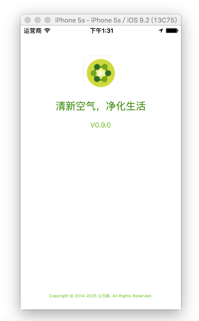
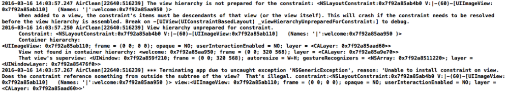
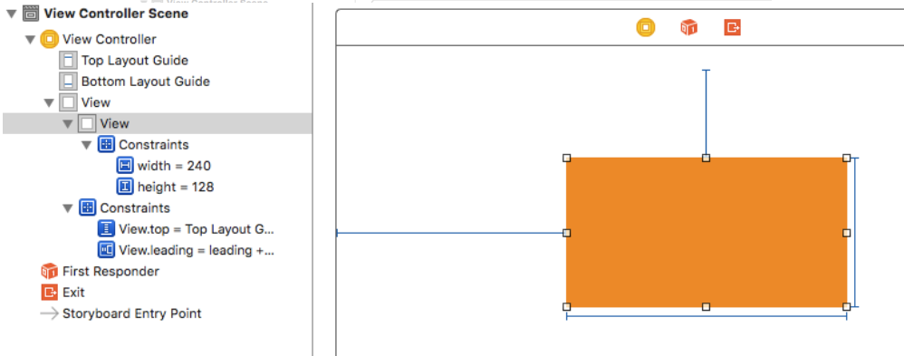

项目要做这样一个效果的启动页。



考虑到版本号是会不断变更的，因此采用动画效果启动页，让版本号动态加载。

考虑到屏幕适配问题，因此采用代码对视图添加约束。在添加约束的过程中遇到了一些问题，在此做一下记录和总结.

## 代码实现autolayout的注意点：

1.要先禁止autoresizing功能，设置 view 的`translatesAutoresizingMaskIntoConstraints` 属性为 NO;

2.添加约束之前，一定要保证相关控件都已经在各自的父控件上。（就是要先`addsubview`，然后再添加约束`addConstraint:`）

3.不用再给view设置frame

先上代码

welcome.h（创建一个继承自UIView的welcome类）

```objective-c
#import@interface welcome :UIView
+ (instancetype)startView;
- (instancetype) initWithBgImage:(UIImage *)bgImage;
- (void) startAnimation;

@end
```

welcome.m

```objective-c
- (instancetype) initWithBgImage:(UIImage *)bgImage{
if (self= [super initWithFrame:[UIApplication sharedApplication].keyWindow.bounds]) {
	self.backgroundColor = [UIColor whiteColor];
	//        _imageView = [[UIImageView alloc]initWithFrame:[UIApplication sharedApplication].keyWindow.bounds];//不用再给view设置frame
	_imageView = [[UIImageView alloc]init];
	_imageView.image = bgImage;
	[self addSubview:_imageView];//先，保证控件已经在父控件上
	[self addPicConstraint];//后


	_lab = [[UILabel alloc]init];
	_lab.font = [UIFont systemFontOfSize:20];
	_lab.textColor = [UIColor colorWithRed:46.0/255 green:168.0/255 blue:23.0/255 alpha:1];//注意：有小数点
	_lab.textAlignment = NSTextAlignmentCenter;
	_lab.text = @"清新空气，净化生活";
	[self addSubview:_lab];
	[self addLabConstraint];
	......

}
```

给图片添加约束

```objective-c
- (void)addPicConstraint{
	//禁用antoresizing
	_imageView.translatesAutoresizingMaskIntoConstraints = NO;
	
	//创建约束
	//添加高约束
	NSLayoutConstraint *picHeight = [NSLayoutConstraint constraintWithItem:_imageView attribute:NSLayoutAttributeHeight relatedBy:NSLayoutRelationEqual toItem:nil attribute:NSLayoutAttributeNotAnAttribute multiplier:1.0 constant:70];
	[_imageView addConstraint:picHeight];
	
	//添加宽约束
	NSLayoutConstraint *picWeight = [NSLayoutConstraint constraintWithItem:_imageView attribute:NSLayoutAttributeWidth relatedBy:NSLayoutRelationEqual toItem:nil attribute:NSLayoutAttributeNotAnAttribute multiplier:1.0 constant:70];
	[_imageView addConstraint:picWeight];
	
	//添加y方向约束
	NSLayoutConstraint *picTop = [NSLayoutConstraint constraintWithItem:_imageView attribute:NSLayoutAttributeTop relatedBy:NSLayoutRelationEqual toItem:_imageView.superview attribute:NSLayoutAttributeTop multiplier:1.0 constant:60];[self addConstraint:picTop];
	
	//添加x方向约束
	NSLayoutConstraint *picVer = [NSLayoutConstraint constraintWithItem:_imageView attribute:NSLayoutAttributeCenterX relatedBy:NSLayoutRelationEqual toItem:_imageView.superview attribute:NSLayoutAttributeCenterX multiplier:1.0 constant:0];
	[self addConstraint:picVer];
}
```

留意上面添加xy方向约束的代码，一开始的时候我是这样写的，以y方向为例

```objective-c
NSLayoutConstraint *picTop = [NSLayoutConstraint constraintWithItem:_bgImageView attribute:NSLayoutAttributeTop relatedBy:NSLayoutRelationEqual toItem:_bgImageView.superview attribute:NSLayoutAttributeTop multiplier:1.0 constant:0];

[_bgImageView addConstraint:picTop];
```

代码运行的时候崩溃

> The view hierarchy is not prepared for the constraint:When added to a view, the constraint's items must be descendants of that view (or the view itself). This will crash if the constraint needs to be resolved before the view hierarchy is assembled. Break on -[UIView(UIConstraintBasedLayout) _viewHierarchyUnpreparedForConstraint:] to debug.
>
> 2016-03-16 14:03:57.250 AirClean[22640:516239] View hierarchy unprepared for constraint.



想了很久也不知道是什么原因。最后再stackoverflow上找到了解决方法[ios - Centering subview's X in autolayout throws "not prepared for the constraint" - Stack Overflow](http://stackoverflow.com/questions/18177262/centering-subviews-x-in-autolayout-throws-not-prepared-for-the-constraint#)

崩溃的原因就是约束没添加到正确的地方。

什么意思呢？看下面的例子


使用storyboard时，我在一个父view上添加了一个橙色的子view。并给它添加了宽高的约束（为固定值）以及相对父view上边距、左边距的约束。从截图中看到，宽高的约束是添加在子控件自己身上的，因为它不依赖于别的控件。而xy方向的约束，则是添加在父控件上。所以上面代码，把相对于父控件的y方向的约束添加到子控件身上，这是不对的，必然会报错。

约束添加规则总结：

1. 约束不依赖于其他控件（添加的约束和其他控件没有关系），会添加到自己身上

2. 如果是父子关系，设置子控件的约束，约束添加到父控件上

3. 如果是兄弟关系，设置两兄弟的约束，约束会添加到第一个共同的父控件上


ps：另外还有一个要注意的地方，用代码给UILable的文字设置颜色，一开始的时候出现了`[UIColor colorWithRed: green: blue: alpha:]` 失效问题。

网上搜索了一下，发现了问题的所在：RGB的颜色值范围都是在0.0~1.0之间的，并不是我们误认为的0~255。


正确的用法：`_lab.textColor = [UIColor colorWithRed:46.0/255 green:168.0/255 blue:23.0/255 alpha:1.0];`而且要注意上面四个参数都是float类型的（所以不能写成46/255）