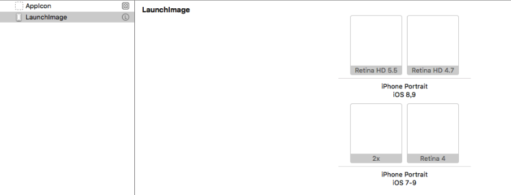
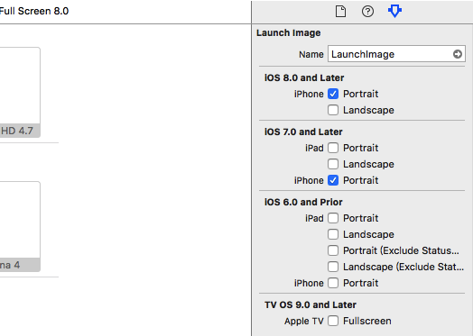
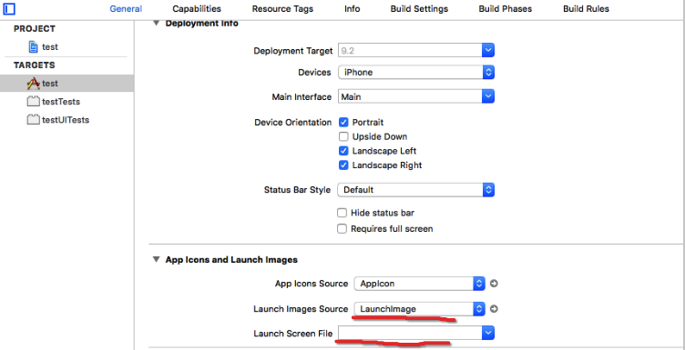
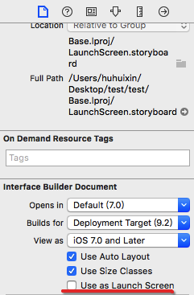
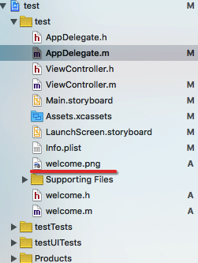

最近项目中要在启动页增加版本号，因为版本号是不断的改变，所以要动态实现把它加到启动页上；在XCode上面配置的Launch Images Source或Launch Screen FIle(IOS8以上会优先调用这个作为启动项)都是保存一张静态图片

> 其实原理也是很简单，启动页还是运用Launch Images Source的内容，然后在做一个视图在最上层，视图的背景用启动项的那张图，让人误以为还在启动中，启动页加载完成后，就显示这层视图，在2秒后再把这层视图删除，产生一个过度的假启动页效果；而我们自定义的动作就可以在这层视图上进行。
[iOS关于启动页自定义特殊处理 - 推酷](http://www.tuicool.com/articles/6VNzumE)

## 添加静态启动页

1.打开assets文件，并点击左下的+按钮，添加LaunchImage。然后按要求，导入不同分辨率的图片（把图片从文件夹拖入到对应的框里，而且图片格式要求为.png）。如下图：



图1 里导入的图片都是透明的（一开始导入图片的时候只导入了Retina 4.7的，系统会报一个警告，而且启动页不能正常显示，把其余的几种也导入之后警告才消失）

这里可选择要导入屏幕的类别（系统版本、横屏竖屏）：



2.将launch images source修改为使用assets,然后设置一下为LaunchImage。

将launch screen file改为空



选中LaunchScreen.storyboard,然后这里也要修改一下。



按照上面的步骤可以设置一般的静态启动页，如果要延长启动页的显示时间，可以在`- application:(UIApplication *)application didFinishLaunchingWithOptions:(NSDictionary *)launchOptions`中加入`[NSThread sleepForTimeInterval:5.0f];`不过如果在第1步（图1）导入的是透明的图片，启动页的效果会是黑屏。

## 为了下面的动画（假启动页）做准备

把一张图片导入到工程文件夹中:



```objective-c
- (BOOL)application:(UIApplication *)application didFinishLaunchingWithOptions:(NSDictionary *)launchOptions {

	// Override point for customization after application launch.
	
	[self.window makeKeyAndVisible];
	
	//设置背景图
	
	UIImageView *welcome = [[UIImageView alloc]initWithFrame:self.window.bounds];
	
	[welcome setImage:[UIImage imageNamed:@"welcome.png"]];
	
	//把背景图放在最上层
	
	[self.window addSubview:welcome];
	[self.window bringSubviewToFront:welcome];
	
	welcome.alpha = 0.99;//这里alpha的值和下面alpha的值不能设置为相同的，否则动画相当于瞬间执行完，启动页之后动画瞬间消失。这里alpha设为0.99，动画就不会有一闪而过的效果，而是一种类似于静态背景的效果。设为0，动画就相当于是淡入的效果了。
	
	[UIView animateWithDuration:3.0f delay:0.0f options:UIViewAnimationOptionTransitionNone animations:^{
	   welcome.alpha = 1;
  } completion:^(BOOL finished) {
	   [welcome removeFromSuperview];  
	}];
	
	return YES;
}
```

添加版本号以及封装

welcome.h

```objective-c
#import@interface welcome : UIView
+ (instancetype)startView;
- (instancetype) initWithBgImage:(UIImage *)bgImage;
- (void) startAnimation;

@end
```

welcome.m

```objective-c
#import "welcome.h"
@interface welcome()
@property (strong , nonatomic)  UIImageView *bgImageView;
@property (strong , nonatomic)  UILabel *lab;

@end

@implementation welcome
+ (instancetype)startView{
	UIImage *splash = [UIImage imageNamed:@"welcome.png"];	return [[self alloc] initWithBgImage:splash];
}

- (instancetype) initWithBgImage:(UIImage *)bgImage{
	if (self= [super initWithFrame:[UIApplication sharedApplication].keyWindow.bounds]) {	
		_bgImageView = [[UIImageView alloc]initWithFrame:[UIApplication sharedApplication].keyWindow.bounds];			_bgImageView.image = bgImage;
		[self addSubview:_bgImageView];	
		_lab = [[UILabel alloc]initWithFrame:CGRectMake(100, 100, 170, 29)];
		_lab.font = [UIFont systemFontOfSize:15];
		_lab.textColor = [UIColor blackColor];
		_lab.textAlignment = NSTextAlignmentCenter;
		//_lab.alpha = 1;
		_lab.text = @"版本号1.0";//这里可设置为根据版本不同做动态更改
		[self addSubview:_lab];
	}
	return self;
}

- (void) startAnimation{
	[[UIApplication sharedApplication].keyWindow addSubview:self];
	[[UIApplication sharedApplication].keyWindow bringSubviewToFront:self];
	_bgImageView.alpha = 0.99f;
	_lab.alpha = 0.99f;
	//    [self.window addSubview:self];
	//    [self.window bringSubviewToFront:self];
	[UIView animateWithDuration:3.0f delay:0.0f options:UIViewAnimationOptionTransitionNone animations:^{
		_bgImageView.alpha = 1;
		_lab.alpha = 1;
	} completion:^(BOOL finished) {
		[self removeFromSuperview];
	}];
}
@end
```

AppDelegate.m

```objective-c
@implementation AppDelegate
UIImageView *splashView;

- (BOOL)application:(UIApplication *)application didFinishLaunchingWithOptions:(NSDictionary *)launchOptions {
	// Override point for customization after application launch.
	[self.window makeKeyAndVisible];
	welcome *welc = [welcome startView];
	[welc startAnimation];
	return YES;
}
```
**后记：**这篇文章是刚入iOS坑时候写的，所以最近把文章搬到github发现代码写的有点不雅观，但原理上大概就是这个意思

参考链接：

[iOS关于启动页自定义特殊处理 - 推酷](http://www.tuicool.com/articles/6VNzumE)

[iOS开发- 启动动画(动态欢迎界面](http://www.2cto.com/kf/201402/277821.html)

[iOS开发UI篇](http://www.cnblogs.com/wendingding/p/3770052.html)