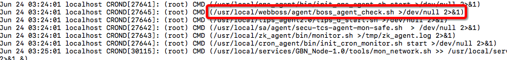

事故：所有crontab任务被清空了。

原因：在ssh远程终端输入`crontab`不带其他参数。

解决办法：通过crontab日志文件，将其中所有的执行内容提取出来，找到执行的时间规律，从而达到恢复的目的。

### 找到最近一周的日志文件

carontab的日志放在`/var/log/`目录下，cron文件中有一部分最近的日志

### 提取执行内容



大致看了一下每一行日志的格式，都比较固定，最后一个`"()"`内就是指令。所以现在要把这些指令提取出来，然后去重。原crontab文件指令数不多，所以写了个很简陋的代码就把所有指令弄出来了。

```cpp
#include <fstream>
#include <string>
#include <iostream>
#include <vector>
#include <set>
#include <map>
using namespace std;

void SplitString(const string& s, vector<string>& v, const string& c)
{
    string::size_type pos1, pos2;
    pos2 = s.find(c);//结束位置
    pos1 = 0;//开始位置
    while(string::npos != pos2)
    {
        v.push_back(s.substr(pos1, pos2-pos1));
        
        pos1 = pos2 + c.size();
        pos2 = s.find(c, pos1);
    }
    if(pos1 != s.length())
        v.push_back(s.substr(pos1));
}
 
int main()
{
    ifstream in;
    in.open("filepath");//日志路径替换
    string line;
    set<string> resultSet;
    map<string, size_t> resultMap;
    
    if(in) {
        while (getline (in, line)) // line中不包括每行的换行符
        {
            vector<string> tmp;
            SplitString(line, tmp, "(");
            vector<string> res;
            SplitString(tmp[2], res, ")");
            string commandString = res[0];
            
            resultSet.insert(commandString);
            
            if (resultMap.find(commandString) != resultMap.end()) {
                ++resultMap[commandString];
            } else {
                resultMap[commandString] = 1;
            }
        }
        for (pair<string, size_t> mapitem : resultMap) {
            cout << mapitem.first << endl;
            cout << mapitem.second << "次" << endl;
            cout << endl;
        }
    }
    else {
        cout <<"no such file" << endl;
    }
    
    return 0;
}
```

### 检验指令执行规律

用在上一步中得到的所有指令，根据日志文件分析执行规律：查看同一指令连续数次的执行时间，从而知道它间隔多久执行一次，然后恢复crontab任务。