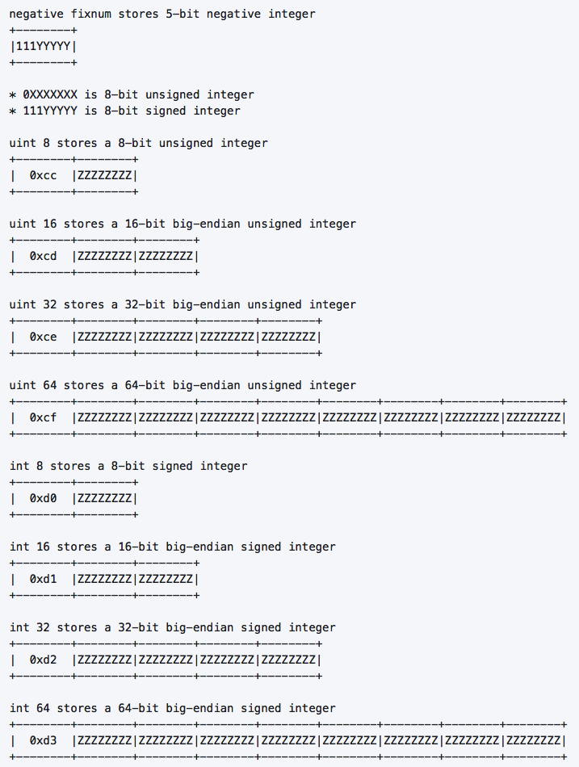
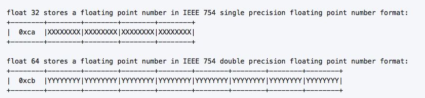

# MsgPack编码原理

这一部分可以参考官方文档：[messagePack specification](https://github.com/msgpack/msgpack/blob/master/spec.md) 其实也够清楚的了。

实际上，MsgPack的编码格式就是`TLV`，即`Tag + Length + Value`。`Tag`负责标记数据的类型，`Length`数据长度，`Value`则是数据值（payLoad）。TLV格式这个概念这里不做详述，这两篇文章写得不错：

[应用层通信协议开发浅析
](https://blog.csdn.net/phunxm/article/details/5086080)

[TLV 格式及编解码示例
](https://blog.csdn.net/chexlong/article/details/6974201)

下面对MsgPack中的几种数据类型编码简单讲讲。

## 简单数据

编码格式：T

`Nil`、`true`、`false`这三种数据，直接用一个一字节TAG来表示，没有L和V。

## 数字

编码格式：T + V

两大类数据：整数和浮点数。MsgPack的设计中，给整数数据又细分了类型：positive fixnum、negative fixnum、uint8、uint16、uint32、uint64、int8、int16、int32、int64。每一类都有自己专属的Tag。

两种fixnum都是 T+V = 1字节，正fixnum的Tag为1个bit的`0`，负fixnum的Tag为3个bit的`111`，剩余的bit用来表示Value。

其余的整数类型，Tag都是1字节，然后为了对数字做了进一步的压缩处理，根据数据值大小选择用更少的字节进行存储，比如一个`值<256`的int，完全可以用一个字节表示（那就没必要再用4字节）。

单双精度浮点数类型，则没有对数据做压缩处理。float类型的Value部分用固定4字节表示，double类型的Value不扥固定用8字节表示。

