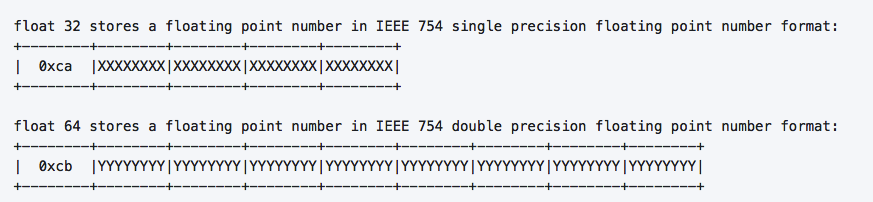

# MsgPack编码原理

先抛出总结：MsgPack对小数值整数有一定的压缩效果，但是对于大的整数、浮点数、字符串数据不进行压缩。针对数字，从统计的角度来说，一般不会所有的消息中的数字都是大数，因此对于msgPack而言，可以用更少的字节数表示数字信息。

msgPack的编码原理可以参考官方文档：[messagePack specification](https://github.com/msgpack/msgpack/blob/master/spec.md) 其实也够清楚的了。

实际上，MsgPack的编码格式就是`TLV`，即`Tag + Length + Value`。`Tag`负责标记数据的类型，`Length`数据长度，`Value`则是数据值（payLoad）。TLV格式这个概念这里不做详述，这两篇文章写得不错：

[应用层通信协议开发浅析
](https://blog.csdn.net/phunxm/article/details/5086080)

[TLV 格式及编解码示例
](https://blog.csdn.net/chexlong/article/details/6974201)

下面对MsgPack中的几种数据类型编码简单讲讲。

## Nil、true、false

**编码格式：T**

这三种数据都比较简单，所以直接用一个一字节TAG来表示，没有L和V。

## 数字

**编码格式：T + V**

两大类数据：整数和浮点数。MsgPack的设计中，给整数数据又细分了类型：positive fixnum、negative fixnum、uint8、uint16、uint32、uint64、int8、int16、int32、int64。每一类都有自己专属的Tag。

两种fixnum都是 T+V = 1字节，正fixnum的Tag为1个bit的`0`，负fixnum的Tag为3个bit的`111`，剩余的bit用来表示Value。

其余的整数类型，Tag都是1字节，然后为了对数字做了进一步的压缩处理，根据数据值大小选择用更少的字节进行存储，比如一个`值<256`的int，完全可以用一个字节表示（那就没必要再用4字节）。

单双精度浮点数类型，则没有对数据做压缩处理。float类型的Value部分用固定4字节表示，double类型的Value部分固定用8字节表示。

## 不定长数据

### 1.字符串

**编码格式：T + L + V**

字符串长度小于32的为fixstr类型，T部分为3个bit`101`，余下5个bit表示实际长度L。字符串长度大于等于32，T固定长1字节，然后依照字符串实际长度，用1、2或4字节来表示L。V部分不进行压缩，直接拼接在最后。

Binary format类型的数据类似处理。

### 2.数组

**编码格式：T + L + V**，而V由一连串`T - (L) - (V)`流组成(括号表示不一定有，L和V要视数据类型)，最终的编码格式：`T - L - T - (L) - (V) - T - (L) - (V) - T - (L) - (V) - ....`

L表示数组元素个数，而不是整个Value部分的长度。

数组元素个数小于16的为fixarray类型，T部分为4bit`1001`，余下4bit表示L。数组元素个数大于等于16，T固定长1字节，然后依照数组实际元素个数，用2或4字节表示L。

V部分依据实际数据类型再进行`T-L-V`格式编码。

### 3.map字典

编码格式和数组类似，也是`T - L - T - (L) - (V) - T - (L) - (V) - T - (L) - (V) - ....`，因为map的每个元素都有key和value，所以这两者都要分别用`T-L-V`格式编码。